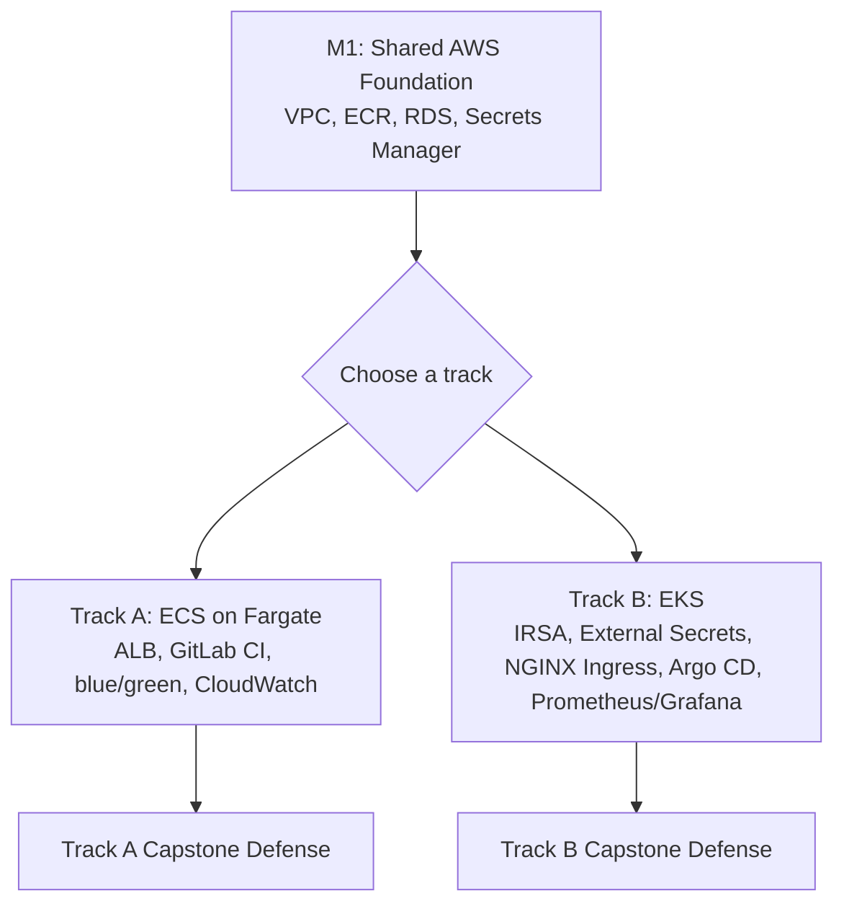
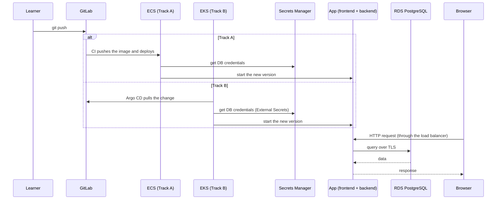

# Containerization in AWS: ECS & EKS Training

This repository contains the **Containerization in AWS** phase of the
DevOps Bootcamp. It picks up where the local phase
([`devops-bootcamp`](https://github.com/stratpoint-engineering/devops-capstone-3tier-app/tree/main))
left off: you take the same 3-tier task-manager app from Minikube to AWS,
build everything with Terraform, and deploy it on one of two tracks.

## Project Overview

### Application Architecture
- **Frontend**: React (served by nginx)
- **Backend**: Node.js/Express REST API
- **Database**: PostgreSQL on Amazon RDS

### What You'll Build



- **Shared foundation (M1):** a VPC with public and private subnets, ECR,
  RDS PostgreSQL and Secrets Manager — built once, reused by both tracks.
- **Track A — AWS ECS & Fargate (M2–M8):** AWS-native containers with
  Fargate Spot, an Application Load Balancer, GitLab CI/CD, blue/green
  releases, CloudWatch and least-privilege IAM.
- **Track B — AWS EKS (M9–M16):** Kubernetes on AWS with a single Spot
  node, IRSA, External Secrets Operator, Helm, NGINX Ingress, Argo CD
  GitOps, Prometheus/Grafana and HPA.

Everything runs in `ap-southeast-1`, and every session follows the same
routine: `terraform apply` at the start, `terraform destroy` at the end.

### How It All Connects



More detail for each track is in its capstone brief:
[Track A](./modules/track-a-capstone-requirements.md) ·
[Track B](./modules/track-b-capstone-requirements.md).

## Quick Start

1. **Finish the local phase first.** You'll reuse your gitlab.com project,
   the reference app and (for Track B) your Helm chart.
2. **Get your AWS sandbox access** and Terraform state bucket name from the
   program.
3. **Start with the shared pack:**
   [`modules/shared-01-aws-foundation.md`](./modules/shared-01-aws-foundation.md)
4. **Pick your track** and read its capstone brief so you know where you're
   heading:
   - Track A: [`modules/track-a-capstone-requirements.md`](./modules/track-a-capstone-requirements.md)
   - Track B: [`modules/track-b-capstone-requirements.md`](./modules/track-b-capstone-requirements.md)
5. **Work through your track's packs in order** (the numbers show the order).

Tools you'll need: Terraform 1.11+, AWS CLI v2, Docker with `buildx`,
`git`, `curl`, `jq` — plus `kubectl`, `helm` and `eksctl` for Track B.

```bash
# Check your tools
terraform version
aws --version
docker buildx version
kubectl version --client   # Track B
helm version --short       # Track B
```

## Project Structure

```
.
├── modules/                          # What learners read, in order
│   ├── shared-01-aws-foundation.md          # M1  — both tracks
│   ├── track-a-02-ecs-fargate-alb-routing.md        # M2–M3
│   ├── track-a-03-gitlab-ci-cloudwatch-autoscaling.md # M4–M5
│   ├── track-a-04-blue-green-iam-task-roles.md      # M6–M7
│   ├── track-a-capstone-requirements.md                          # Track A capstone brief
│   ├── track-b-02-eks-cluster-irsa.md               # M9–M10
│   ├── track-b-03-external-secrets-helm-migration.md # M11–M12
│   ├── track-b-04-nginx-ingress-argocd.md           # M13–M14
│   ├── track-b-05-observability-hpa.md              # M15
│   └── track-b-capstone-requirements.md                          # Track B capstone brief
│
├── capstone/                         # Capstone specs and grading
│   ├── capstone-grading-rubric.md           # Weighted rubric (both tracks)
│   ├── capstone-track-a-ecs-fargate-cohort.md      # Track A spec (learners)
│   ├── capstone-track-a-ecs-fargate-instructor.md  # Track A spec + solution (instructors only)
│   ├── capstone-track-b-eks-gitops-cohort.md       # Track B spec (learners)
│   └── capstone-track-b-eks-gitops-instructor.md   # Track B spec + solution (instructors only)
│
├── docs/                             # Source material (course authors)
│   ├── arch-docs/                    # Architecture document + ADRs
│   ├── curriculum/                   # Original syllabus
│   ├── materials/                    # Moodle page and quizzes
│   └── template/                     # LMS templates
│
├── knowledge/                        # Authoring rules, patterns, references
│   ├── patterns/                     # Content-pack, capstone and rubric templates
│   ├── rules/                        # Coding standards, architecture summary
│   ├── references/                   # Verified source URLs + pinned versions
│   └── prompts/dev/                  # Prompts for authoring new content
│
└── AGENTS.md                         # Project rules for authors and AI agents
```

Each content pack has the same layout: **Objective → Topics → Modules**
(Learning Objective, Core Idea, Why It Matters, How It Works, Supplemental
Reading) → **Hands-on lab** (guided) → **Lab exercise** (unguided) →
**Checkpoint** (self-assessed).

## Implementation Requirements

### Shared Foundation (M1)
- Terraform remote state and stacks you can create and destroy daily
- VPC across 2 Availability Zones, chained security groups
- ECR repositories and `amd64` images tagged with the Git commit
- RDS PostgreSQL in private subnets; credentials in Secrets Manager

### Track A: AWS ECS & Fargate
- ECS services on Fargate and Fargate Spot behind one ALB (M2–M3)
- GitLab CI build and deploy with zero-downtime rollouts (M4)
- CloudWatch logs, dashboard and auto scaling (M5)
- Blue/green deployments for the backend (M6)
- Least-privilege task roles, proven with denied calls (M7)
- Capstone integration and live defense (M8)

### Track B: AWS EKS
- EKS cluster with one Spot node, built with Terraform (M9)
- IAM Roles for Service Accounts (M10)
- External Secrets Operator syncing from AWS (M11)
- Helm chart migrated from Minikube to EKS (M12)
- NGINX Ingress behind one load balancer (M13)
- GitOps with Argo CD (M14)
- Prometheus, Grafana and Horizontal Pod Autoscaling (M15)
- Capstone integration and live defense (M16)

## Documentation

- [Shared foundation (M1)](./modules/shared-01-aws-foundation.md)
- Track A: [capstone brief](./modules/track-a-capstone-requirements.md) ·
  [capstone spec](./capstone/capstone-track-a-ecs-fargate-cohort.md)
- Track B: [capstone brief](./modules/track-b-capstone-requirements.md) ·
  [capstone spec](./capstone/capstone-track-b-eks-gitops-cohort.md)
- [Capstone Grading Rubric](./capstone/capstone-grading-rubric.md)
- [Local phase guides](https://github.com/stratpoint-engineering/devops-capstone-3tier-app/blob/main/docs/README.md) and [reference app](https://github.com/stratpoint-engineering/devops-capstone-3tier-app/tree/main) (`devops-capstone-3tier-app`)

## Timeline

### Week 5: Foundation
- Days 1-2: Shared AWS foundation (M1)
- Days 3-5:
  - Track A: ECS on Fargate and ALB routing (M2–M3), review
  - Track B: EKS cluster, IRSA, External Secrets, Helm on EKS (M9–M12)

### Week 6: Delivery, Operations and Defense
- Days 1-4:
  - Track A: GitLab CI, CloudWatch and auto scaling, blue/green, IAM task roles (M4–M7)
  - Track B: NGINX Ingress, Argo CD, observability and HPA (M13–M15), integration
- Day 5: Capstone defense (M8 / M16)

Day-by-day plans are in each track's capstone brief.

## Evaluation Criteria

Capstones are graded with the [weighted rubric](./capstone/capstone-grading-rubric.md):

| Phase | Weight |
|---|---|
| Technical Execution | 45% |
| Functional Demonstration | 35% |
| Presentation & Defense | 20% |

Plus a pass/fail **Technical Documentation Gate**: real evidence saved in
`docs/capstone/` of your own repository as you build.

- **Not yet passing:** below 75%, or the Documentation Gate not met
- **Proficient:** 75–89%
- **Advanced:** 90–100%

## For Course Authors

- Read [`AGENTS.md`](./AGENTS.md) first — it lists the rules every
  learner-facing file follows.
- Content structure: [`knowledge/patterns/module-content-structure.md`](./knowledge/patterns/module-content-structure.md)
  and [`knowledge/patterns/capstone-documentation-template.md`](./knowledge/patterns/capstone-documentation-template.md).
- Technical conventions and writing voice: [`knowledge/rules/coding-standards.md`](./knowledge/rules/coding-standards.md).
- Architecture decisions and how the course differs from the architecture
  document: [`knowledge/rules/arch-summary.md`](./knowledge/rules/arch-summary.md).
- Only cite URLs and versions from
  [`knowledge/references/aws-containers-sources.md`](./knowledge/references/aws-containers-sources.md).
- Instructor capstone files contain solutions — don't hand them to learners.

## Support

Need help?
1. Check the **If something goes wrong** table at the end of each lab
2. Read the error message and the logs (`aws logs tail`, `kubectl describe`, `kubectl logs`)
3. Ask during lab sessions
4. Refer to the official documentation linked in each pack's **Supplemental Reading**

Remember:
- Apply your stacks at the start of every session, destroy them at the end
- Build one module at a time and test each piece
- Never put a password, key or token in Git
- Save your capstone evidence as you go
