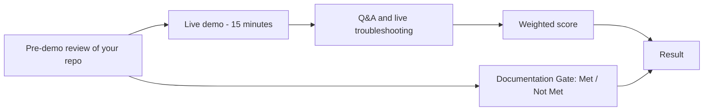

# Capstone Grading Rubric — Containerization in AWS

This rubric is used for both capstones:

- **Track A:** ECS on Fargate capstone (M8)
- **Track B:** EKS & GitOps capstone (M16)

It's a **weighted** rubric: three scored phases add up to 100%, and a
**Technical Documentation Gate** sits on top as a pass/fail check. You
can read this before you start — there are no surprises on defense day.

## 1. Weights

Your capstone spec already gives you the requirements and the
architecture, so planning isn't graded. The three phases are:

| Phase | What's graded | Weight |
| :--- | :--- | :--- |
| **Technical Execution** | How well you built it: Terraform, Helm/manifests, pipeline, security and the practices taught in the modules | **45%** |
| **Functional Demonstration** | A live walkthrough showing every requirement working end to end | **35%** |
| **Presentation & Defense** | Explaining your choices, answering "why", and fixing things live | **20%** |

## 2. Technical Documentation Gate (pass/fail)

On top of the weighted score. **Not Met fails the capstone, whatever the
score.**

What's checked: the **Documentation** section of your capstone spec — the
real evidence you saved while building, in your repo under
`docs/capstone/`. Real output only; placeholder text doesn't count.

| Evidence | Track A | Track B |
|---|---|---|
| `terraform apply` and `terraform destroy` output for every stack you used | ✔ | ✔ |
| Proof the database isn't reachable from the internet (`nc` from your laptop fails) | ✔ | ✔ |
| Proof of routing: app page + `/api/tasks` through your one load balancer | ✔ ALB | ✔ NLB |
| A zero-downtime deployment log (`rollout.log`, only `200`s) | ✔ | — |
| Blue/green: test route vs. normal route, and a rollback | ✔ | — |
| Denied-call proof (IAM probe logs) | ✔ | — |
| IRSA proof: allowed pod vs. denied pod | — | ✔ |
| ESO status (`SecretSynced`) and proof no password is in Git | — | ✔ |
| Argo CD: commit → `Synced`, self-heal, bad commit → `revert` | — | ✔ |
| Scaling proof: scaling activity / HPA events + a dashboard screenshot | ✔ CloudWatch | ✔ Grafana |
| Teardown proof: no load balancer or NAT Gateway left | ✔ | ✔ |
| A short explanation, **in your own words**, of how your daily apply/destroy order works and why | ✔ | ✔ |
| Track B only: your decision matrix | — | ✔ |

## 3. Scoring each phase

Each phase is scored with the criteria below, from 1 to 4.

| Criteria | Below Expectations (1) | Developing (2) | Proficient (3) | Exemplary (4) |
| :--- | :--- | :--- | :--- | :--- |
| **Application of Trained Skills** | Doesn't use the tools taught (Terraform, ECS/EKS, Helm, CI/GitOps). | Right tools, but shallow, incomplete or broken. | **Uses the tools and patterns from the modules correctly.** | Goes beyond the modules with sensible extras (for example OIDC for CI, Pod Identity, extra alarms). |
| **Technical Best Practices** | Hardcoded secrets, open security groups, no structure. | Works, but ignores the standards: `latest` tags, wide IAM, state or secrets handled badly. | **Pinned versions, SHA tags, least-privilege IAM, `/32` ingress, no secrets in Git or state, clean stack layout.** | Production-quality: modular, well-commented, easy to extend. |
| **Functionality & Stability** | Doesn't run, or breaks in the demo. | Major requirements broken. | **All requirements work in the live demo with little or no trouble.** | Flawless, and handles the destructive tests gracefully. |
| **Troubleshooting & Defense** | Can't explain how it works or how to fix a basic error. | Struggles; relies on copied steps without understanding. | **Explains choices clearly and finds where a problem is.** | Explains trade-offs between options with confidence and diagnoses quickly. |

How the phases use the criteria:

- **Technical Execution (45%)** = average of *Application of Trained Skills* and *Technical Best Practices*.
- **Functional Demonstration (35%)** = *Functionality & Stability*.
- **Presentation & Defense (20%)** = *Troubleshooting & Defense*.

**Weighted score** = 45 × (Execution ÷ 4) + 35 × (Demo ÷ 4) + 20 × (Defense ÷ 4).

**Pass** = weighted score of **75% or more** (Proficient everywhere) **and**
Documentation Gate **Met**.

## 4. What the facilitator checks in each phase

### Technical Execution — pre-demo review of your repository

Done **before** your live session.

**Both tracks:**

- Terraform split into the stacks from the modules, with remote state
  (`use_lockfile`), exact provider versions and a committed lock file.
- No password, access key or token anywhere in Git history or Terraform state.
- Every resource tagged; internet access only from your `/32`; the database
  reachable only through the security-group chain.
- Commit history shows the work built up over the two weeks.

**Track A:** task definitions (256/512, `X86_64`, SHA tags, `secrets` not
`environment`); 70/30 Spot strategy; ALB rules; CI role (OIDC, no keys) limited to your
resources; circuit breaker; log groups with retention; target-tracking
policy; blue/green settings; separate task roles.

**Track B:** EKS module and Kubernetes versions pinned; one Spot node with
prefix delegation; IRSA trust pinned to one ServiceAccount; ESO stores and
`ExternalSecret`s; one chart with `values-eks.yaml`; ingress controller with
source ranges and `wait = true`; Argo CD Applications with prune and
self-heal; monitoring stack via Argo CD; HPA without a fixed `replicas`.

### Functional Demonstration — live, 15 minutes

**Track A agenda:**

1. (2 min) Session start: `terraform apply` output for your stacks already
   run; show the app working through the ALB.
2. (5 min) Push a backend change → pipeline → blue/green: show the test
   route, then the switch.
3. (4 min) Load test → CloudWatch dashboard and scaling activity.
4. (2 min) IAM probe: allowed vs. denied.
5. (2 min) `terraform destroy` in reverse order, then show nothing is left.

**Track B agenda:**

1. (2 min) Session start: cluster and platform applied; `kubectl apply -f
   deploy/argocd/`; everything `Synced`/`Healthy`.
2. (4 min) Push a change → Argo CD sync; then delete a Deployment and let
   self-heal restore it.
3. (4 min) Load test → HPA events → Grafana graph.
4. (3 min) Walk through your decision matrix.
5. (2 min) `terraform destroy` in reverse order, then show no load balancer
   is left.

### Live "destructive" tests (the facilitator picks one or two)

**Track A:**

- "Scale the backend to 0 — what does `/api/tasks` return, and why does `/` still work?"
- "Push an image that crashes. Show me what protects users."
- "Run the IAM probe against a secret I name."
- "Your IP just changed. Get back into your app."

**Track B:**

- "Delete the backend Deployment." (Self-heal should restore it.)
- "Point an `ExternalSecret` at a secret you can't read. What happens to the app?"
- "Remove the backend's CPU request in Git. What does the HPA show?"
- "Your Spot node was just reclaimed. What happens next, and what do you do?"

### Presentation & Defense — "why" questions

**Both tracks:**

- "Why is the database in its own stack, and why is it destroyed daily?"
- "Walk me through the security-group chain from your browser to RDS."
- "Where does the DB password live, and how does it reach the app without being in Git or state?"
- "What was the hardest bug you hit, and how did you find it?"

**Track A:**

- "Execution role vs. task role — which one fetched the password in your setup?"
- "Why a 70/30 Spot split instead of 100% Spot?"
- "What exactly does ECS change during a blue/green deployment, and why does Terraform ignore it?"

**Track B:**

- "How does a pod get AWS credentials with IRSA? What stops another pod from using the same role?"
- "Why does the Deployment have no `replicas` field?"
- "What happens to the NLB if you destroy the cluster stack before the platform stack?"
- "If this app had 100× the traffic tomorrow, what breaks first on one node?"
