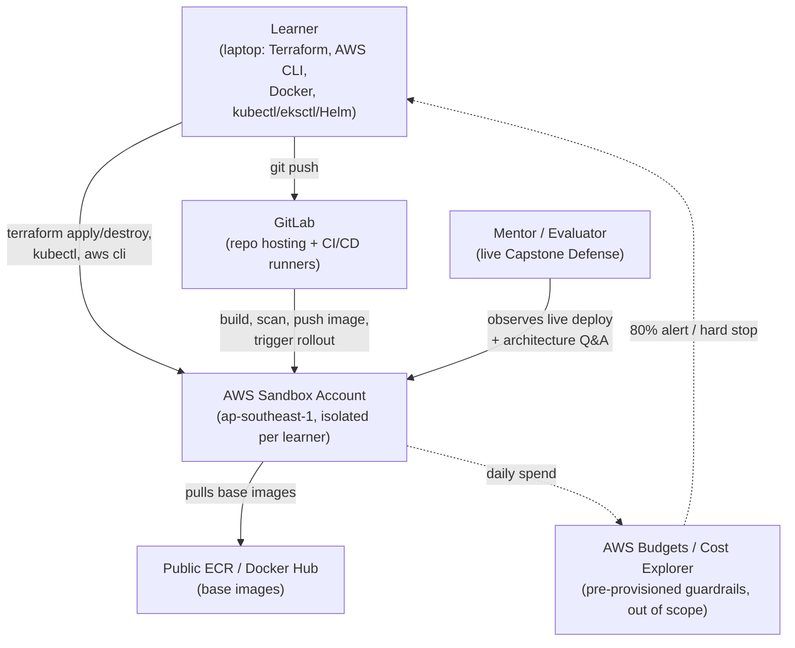
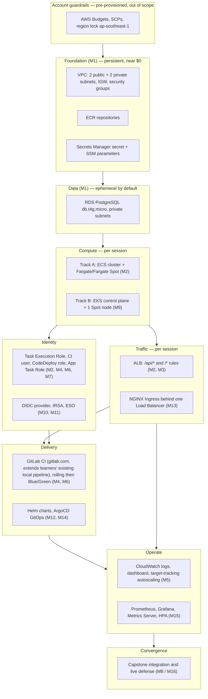
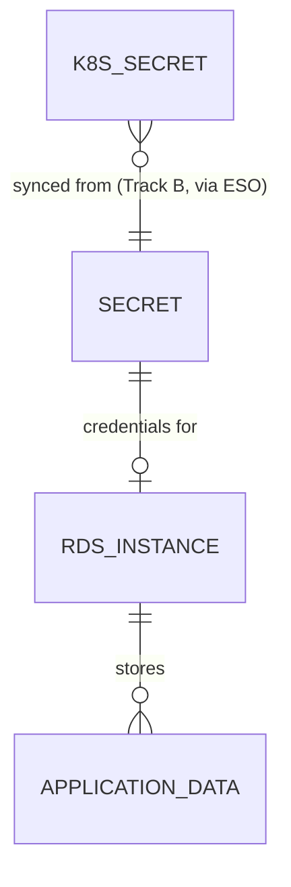
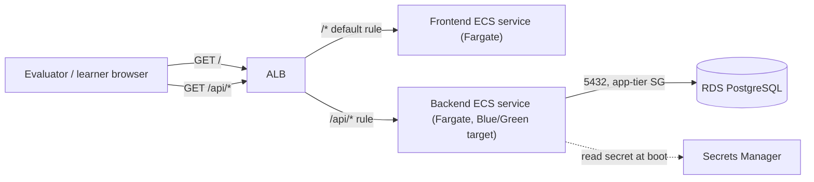
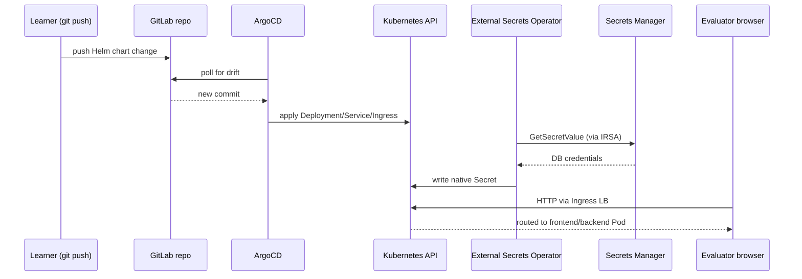
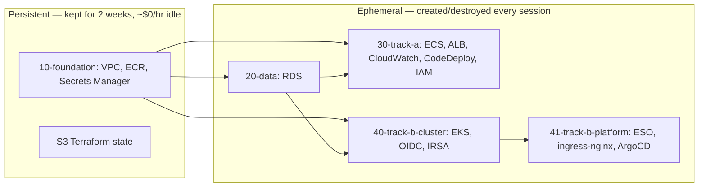
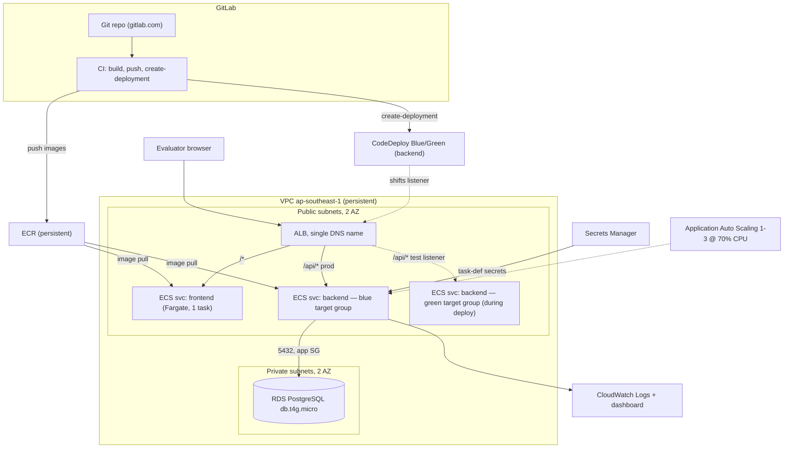
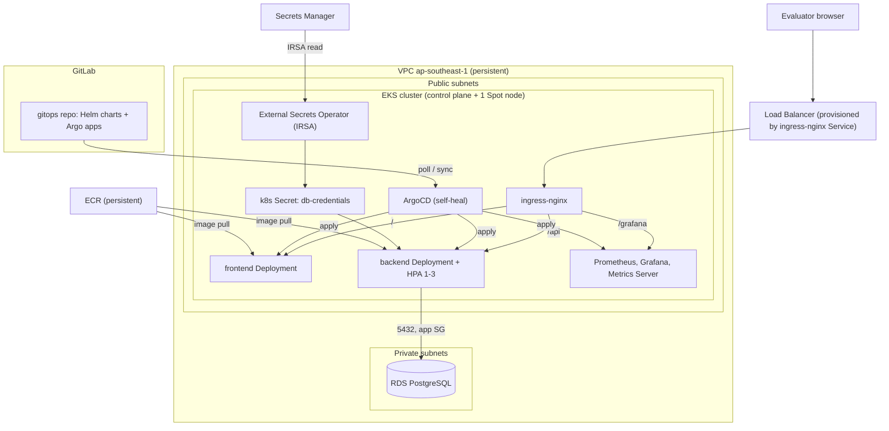

# Architecture Document: AWS Containers Bootcamp (Self-Paced, Hands-On)

## 1. Document Metadata

```
Project:      AWS Containers Bootcamp (Self-Paced, Hands-On)
Project Code: DCTA-AWS
Version:      v6.0
Date:         2026-09-28
Author:       Solution Architect
Source PRDs:  PRD: AWS Containers Bootcamp (Self-Paced, Hands-On), v1.0, 2026-09-28, @Lee
Source BRD:   Not provided
```

Versioning note: this project's `docs/` history contains ARCH/ADR sets at v1.0–v4.0 built against an earlier epic breakdown (six epics: Security Groups & ECR, ECS/Fargate Deployment, EKS Deployment, CI/CD Extended, Cost Hygiene & Teardown, ECS-vs-EKS Comparison). The PRD supplied for this run defines **four** epics with different titles and scope boundaries. Per this project's grounding rule, prior Architecture Documents are not used as source material — this version is derived solely from the v1.0 PRD dated 2026-09-28. The epic structure below follows that PRD exactly and does not carry over the old six-epic scheme.

**v6.0 revisions** (stakeholder direction, 2026-09-28 — supersedes v5.0):
- Trivy vulnerability scanning removed from scope. This is a **flagged deviation from the PRD** (Epic 2 AC 3 and M4, and §2 Technical Stack, all name Trivy explicitly) — recorded, not silently dropped. See ADR-DCTA-AWS-E004-02, now Deprecated.
- FinOps teardown simplified to `terraform destroy` per ephemeral stack, run in dependency order; the previously proposed learner-run `audit.sh` script and Argo-cascade-delete step are removed as unnecessary. See ADR-DCTA-AWS-E004-03 (revised).
- GitLab hosting confirmed as **gitlab.com** (SaaS, shared runners). Resolves former Open Question 4. See new ADR-DCTA-AWS-E004-05.
- Confirmed: learners entering this bootcamp have already built and deployed the reference app (`devops-capstone-3tier-app`) to a local Minikube cluster via their own GitLab CI pipeline, in the prerequisite local-Kubernetes phase. Modules 4 and 14 therefore **extend an already-working pipeline** to AWS targets, rather than building CI/CD from scratch.
- Confirmed: the learner's inbound `/32` CIDR is knowable and stable enough at session start to template automatically. Resolves former Open Question 8.
- Confirmed: a ~3 live-hour/day ceiling on Track B is acceptable. Resolves former Open Question 7.

---

## 2. System Overview

The system is a **self-paced training environment**, not a production application: sixteen modules that a learner works through independently in their own AWS sandbox account, building one reference 3-tier application (React frontend, Node.js/Express API, PostgreSQL) incrementally until it converges on a fully operational, observable, auto-scaling, GitOps- or CI/CD-deployed deployment on one of two container orchestration platforms. The PRD calls this the **capstone application**; every module adds a slice to it rather than building something new (PRD §2–3).

Architecturally, the interesting part is not any single module — it is how the modules **layer** on top of one another and **converge** into two different capstone systems, under a hard constraint that total AWS spend per learner must stay under $5.00 USD (PRD §1, Goal 2). Cost is therefore treated as a first-class architectural driver alongside functionality, on equal footing with security and scalability.

- **Architecture style**: layered infrastructure-as-code, split by resource lifecycle (persistent vs. ephemeral), converging into two parallel deployment topologies:
  - **Track A**: AWS-native orchestration — ECS on Fargate, ALB, CodeDeploy Blue/Green, CloudWatch (PRD Epic 2)
  - **Track B**: Kubernetes orchestration — EKS, Helm, ArgoCD GitOps, Prometheus/Grafana (PRD Epic 3)
- **Shared foundation**: one VPC, one ECR registry, one RDS instance, one Secrets Manager secret, built once in Module 1 and reused by whichever track the learner takes (PRD Epic 1).
- **Cross-cutting control plane**: budget guardrails, track selection, and the daily create/destroy operating procedure that keeps spend under the ceiling (PRD Epic 4).

### System context



**PRD traceability**: Learner and Evaluator flows — PRD §4 (Primary User Flow, Key Interactions). GitLab dependency — PRD §5 (External Dependencies). AWS Budgets — PRD §5, Epic 4 AC, and Open Question 4 (guardrails assumed pre-provisioned, out of scope of this PRD).

---

## 3. Component Breakdown

### 3.1 Curriculum-to-architecture translation

The sixteen modules do not each introduce a new component; they add to one of a small set of **architectural planes**. Reading the syllabus this way is what makes the dependency structure and the cost model tractable.

| Plane | Lifecycle | Modules that populate it | Why it sits there |
| --- | --- | --- | --- |
| **Foundation** | Persistent for the whole 2 weeks | M1 (VPC, ECR, Secrets Manager) | PRD Epic 1 AC; near-$0 idle cost, so daily teardown would waste learner time for no budget benefit |
| **Data** | Ephemeral by default, re-created per session | M1 (RDS) | The only always-billing non-compute resource (PRD Epic 1 Tech Stack: `db.t4g.micro`); see ADR-DCTA-AWS-003 |
| **Compute** | Ephemeral, destroyed every session | Track A: M2; Track B: M9 | PRD Epic 4 daily `apply`/`destroy` SOP |
| **Traffic** | Ephemeral | Track A: M2, M3; Track B: M13 | ALB / Ingress+LB created only when a service exists to route to |
| **Identity** | Ephemeral (roles are cheap, but scoped to the ephemeral compute they attach to) | Track A: M2, M4, M6, M7; Track B: M10, M11 | IAM/OIDC artifacts exist for the life of the session's compute |
| **Delivery** | Ephemeral (pipeline definitions persist in Git; runtime targets do not) | Track A: M4, M6; Track B: M12, M14 | CI/CD and GitOps tooling that deploys onto the ephemeral compute |
| **Operate** | Ephemeral | Track A: M5; Track B: M15 | Logging/metrics/autoscaling attached to ephemeral compute |
| **Convergence** | One-time, then torn down | M8 (Track A) / M16 (Track B) | Exercises every plane together for the live defense |



### 3.2 Component table

| Component | Responsibility | Interface | PRD Reference |
| --- | --- | --- | --- |
| VPC & subnets | Network isolation: 2-AZ, 2 public + 2 private subnets, no NAT | Terraform | Epic 1 AC 1; Technical Constraints (No NAT Gateways) |
| Security-group chain | Restricts RDS to app-tier only; ALB/node ingress limited to learner IP | Terraform (SG references) | Epic 1 AC 2 |
| Amazon ECR | Stores React and Node.js container images | `docker push`/`pull`, CI | Epic 1 AC 4 |
| AWS Secrets Manager secret | Holds DB credentials; nothing hardcoded | Task-def `secrets` (A) / ExternalSecret (B) | Epic 1 AC 3 |
| Amazon RDS PostgreSQL (`db.t4g.micro`) | The only stateful store in the system | TCP 5432, app-tier SG only | Epic 1 AC 2; Technical Constraints (no PVs) |
| ECS cluster + Fargate/Fargate Spot | Runs frontend/backend as ECS services, 70/30 Spot split | ECS API / Terraform | Epic 2 M2, AC 1 |
| Application Load Balancer | Path-routes `/api/*` → backend, `/*` → frontend; raw DNS, no Route 53 | HTTP(S) listener rules | Epic 2 M2–M3, AC 2 |
| GitLab CI/CD pipeline (Track A) | Build, push, rolling deploy on merge to `main`; extends the learner's existing local pipeline | `.gitlab-ci.yml` (gitlab.com) | Epic 2 M4, AC 3 (Trivy step removed — see ADR-DCTA-AWS-E004-02) |
| CloudWatch (logs, dashboard, Application Auto Scaling) | Log routing, dashboards, 1→3 task autoscaling at 70% CPU | `awslogs` driver, CW API | Epic 2 M5, AC 4 |
| AWS CodeDeploy (Blue/Green) | Dual-target-group cutover for the backend service | CodeDeploy API, `CODE_DEPLOY` controller | Epic 2 M6, AC 5 |
| IAM Task Execution Role / App Task Role | Least-privilege split: image pull & log write vs. app-level AWS calls | IAM | Epic 2 M7, AC 6 |
| EKS cluster + 1 EC2 Spot node | Kubernetes control plane and worker capacity | `kubectl`, Terraform (`terraform-aws-modules/eks/aws`) | Epic 3 M9, AC 1 |
| OIDC provider + IRSA role | Lets a Pod's ServiceAccount assume an IAM role | Kubernetes ServiceAccount annotation | Epic 3 M10, AC 2 |
| External Secrets Operator | Syncs the Secrets Manager secret into a native `Secret` | `ClusterSecretStore`/`ExternalSecret` CRDs | Epic 3 M11, AC 3 |
| Helm charts (frontend/backend) | Deploys the capstone app to EKS, consumes ESO secret | `helm upgrade --install` | Epic 3 M12, AC 4 |
| NGINX Ingress Controller | Exposes frontend/backend via one AWS-provisioned Load Balancer | Kubernetes `Ingress` | Epic 3 M13, AC 5 |
| ArgoCD | GitOps auto-sync of the Helm charts from GitLab | `Application` CRD | Epic 3 M14, AC 6 |
| Prometheus Operator + Grafana + Metrics Server + HPA | Cluster/app metrics, dashboards, CPU-based pod autoscaling | Kubernetes CRDs / metrics API | Epic 3 M15, AC 7 |
| Terraform stack set (foundation / data / track) | Independent-lifecycle IaC so "destroy" removes only what bills; `terraform destroy` run per stack, in dependency order, is the sole teardown mechanism | Terraform CLI, S3 state | Epic 4 (Daily FinOps SOP) |
| AWS Budgets / Cost Explorer | Enforces the $5 ceiling with 80% alert | Pre-provisioned, out of scope | Epic 4 AC 1; Out of Scope |

Every row above traces to a PRD epic and acceptance criterion; there is no component in this document without one.

---

## 4. Technology Choices

### Operating model
- **Choice**: Single region (`ap-southeast-1`), single AWS account per learner, no cross-region or cross-account resources anywhere in the design.
- **Rationale**: PRD Technical Constraints mandate this explicitly ("no multi-region or multi-cloud deployments"); it is also what makes the account-level AWS Budgets alarm (PRD Open Question 4) a sufficient detective control in the first place.
- **ADR**: ADR-DCTA-AWS-E004-04 (Prescribed)

### Infrastructure as Code
- **Choice**: Terraform, including `terraform-aws-modules/eks/aws` and the `hashicorp/helm` provider.
- **Rationale**: Named explicitly in PRD §2 (Technical Stack) for all tracks.
- **ADR**: ADR-DCTA-AWS-E001-01 (Prescribed)

### State backend and stack topology
- **Choice**: Single S3 bucket, native S3 lockfile, split into independent-lifecycle stacks (persistent foundation vs. ephemeral data/compute per track).
- **Rationale**: The PRD's daily `terraform apply`/`terraform destroy` SOP (Epic 4) only saves money if what gets destroyed is what bills, and what's free (VPC, subnets, SGs) is left alone; a single monolithic stack would force a full VPC rebuild every session, adding both time and failure surface with no budget benefit.
- **ADR**: ADR-DCTA-AWS-E004-01 (Decision)

### Network design
- **Choice**: 2-AZ VPC, 2 public + 2 private subnets, no NAT Gateway; ECS tasks/EKS nodes in public subnets with public IPs; RDS in private subnets.
- **Rationale**: PRD Epic 1 AC 1 and Technical Constraints mandate exactly this shape and explicitly exclude NAT Gateways to avoid its $0.045/hr charge.
- **ADR**: ADR-DCTA-AWS-E001-02 (Prescribed)

### Security-group chaining
- **Choice**: SG-to-SG references (ALB/node SG → app-tier SG → RDS SG) instead of CIDR-based ingress rules.
- **Rationale**: PRD Epic 1 AC 2 requires RDS be "reachable only from the application tier on port 5432." SG-to-SG references keep that guarantee correct automatically as ECS/EKS compute is recreated daily with new ENIs and IPs; a CIDR-based rule would need to be re-authored every session.
- **ADR**: ADR-DCTA-AWS-E001-05 (Decision)

### Container registry
- **Choice**: Amazon ECR, one repository per image (frontend, backend), lifecycle policy retaining the last 2 tagged images.
- **Rationale**: PRD Epic 1 AC 4 mandates ECR by name. The retention policy is a cost choice: unbounded image history has a small but nonzero storage cost against a $5 ceiling.
- **ADR**: ADR-DCTA-AWS-E001-06 (Prescribed)

### Relational data store and lifecycle
- **Choice**: Amazon RDS PostgreSQL `db.t4g.micro`, ephemeral by default (created/destroyed with the daily session) unless the sandbox account's Free Tier eligibility is confirmed as the legacy 750-hour model.
- **Rationale**: PRD Epic 1 Tech Stack names RDS `db.t4g.micro` "Free Tier," but AWS Free Tier eligibility depends on account creation date (post-2025-07-15 accounts get a shrinking credit balance, not 750 free monthly hours). An always-on instance without confirmed eligibility costs roughly $8 over 14 days on its own — over the PRD's entire $5 ceiling.
- **ADR**: ADR-DCTA-AWS-E001-03 (Decision)

### Secrets and configuration
- **Choice**: One AWS Secrets Manager secret for DB credentials; all other configuration (host names, feature flags) in SSM Parameter Store.
- **Rationale**: PRD Epic 1 AC 3 mandates Secrets Manager for credentials specifically ("not hardcoded"); Parameter Store is free at the tier this program needs, so splitting non-secret config out of Secrets Manager keeps the per-secret monthly charge to one line item instead of many.
- **ADR**: ADR-DCTA-AWS-E001-04 (Decision)

### Track A compute
- **Choice**: Amazon ECS on Fargate with a 70% Fargate Spot / 30% On-Demand capacity provider split, at the smallest supported task size (0.25 vCPU / 0.5 GB).
- **Rationale**: PRD Epic 2 Tech Stack and M2 mandate ECS/Fargate/Fargate Spot with this exact ratio; the smallest task size is chosen to minimize the per-vCPU-second and per-GB-second charge under the budget ceiling.
- **ADR**: ADR-DCTA-AWS-E002-01 (Prescribed)

### Track A traffic routing
- **Choice**: Single Application Load Balancer, path-based rules (`/api/*` → backend target group, `/*` → frontend target group), raw ALB DNS name.
- **Rationale**: PRD Epic 2 M3 and AC 2 mandate this routing shape and explicitly exclude Route 53.
- **ADR**: ADR-DCTA-AWS-E002-02 (Prescribed)

### Track A CI/CD and deployment mechanism
- **Choice**: GitLab CI (gitlab.com), extending the learner's existing local pipeline from the prerequisite phase; rolling deploy via `aws ecs update-service` (M4), later superseded by AWS CodeDeploy Blue/Green for the backend only (M6). No vulnerability-scan stage (see CI/CD scanning, below).
- **Rationale**: PRD Epic 2 M4 and M6 mandate both deployment mechanisms in sequence; the transition is handled as an explicit pipeline refactor because the `CODE_DEPLOY` deployment controller replaces the ECS service rather than being toggled on an existing one. Learners already have a working GitLab CI pipeline that builds and deploys this same reference app to a local Minikube cluster from the prerequisite phase, so M4 extends that pipeline with AWS-specific stages (ECR push, ECS deploy) rather than authoring CI from zero.
- **ADR**: ADR-DCTA-AWS-E002-03 (Decision, on the transition strategy)

### Track A observability and scaling
- **Choice**: CloudWatch Logs (`awslogs` driver, short retention), CloudWatch dashboards, Application Auto Scaling target-tracking on the backend service (1→3 tasks at 70% CPU).
- **Rationale**: PRD Epic 2 M5 and AC 4 name these exactly.
- **ADR**: ADR-DCTA-AWS-E002-04 (Prescribed)

### Track A identity
- **Choice**: Separate IAM Task Execution Role (image pull, log write, secret injection) from App Task Role (what application code may call), the latter scoped to a single Secrets Manager ARN.
- **Rationale**: PRD Epic 2 M7 and AC 6 mandate this split and the scoping test ("denied test call").
- **ADR**: ADR-DCTA-AWS-E002-05 (Prescribed)

### Track B compute
- **Choice**: Amazon EKS control plane (Terraform-managed) with a single EC2 Spot managed node.
- **Rationale**: PRD Epic 3 Tech Stack and M9 mandate EKS with exactly one Spot node for $0 NAT/idle-capacity cost.
- **ADR**: ADR-DCTA-AWS-E003-01 (Prescribed)

### Track B node instance size
- **Choice**: `t3.medium` (or `t4g.medium`) Spot, recommended over the PRD-listed `t3.small`/`t4g.small`.
- **Rationale**: The default VPC CNI limits `t3.small`/`t4g.small` to 11 pods per node and 2 GiB RAM. The capstone stack — system pods, ESO, ingress-nginx, ArgoCD, Prometheus, Grafana, Metrics Server, and two application Deployments — does not fit in that ceiling. This is a genuine deviation from the PRD's stated instance types and is flagged for program-lead approval, not silently substituted.
- **ADR**: ADR-DCTA-AWS-E003-02 (Decision — needs PRD amendment)

### Track B cluster lifecycle tooling
- **Choice**: Terraform owns cluster create/destroy end to end; `eksctl` is retained only as a read/diagnostic utility (`eksctl get cluster`, etc.), not for `eksctl create/delete cluster`.
- **Rationale**: PRD Epic 3 Tech Stack lists `eksctl` and M9 builds the cluster via the Terraform EKS module, but M16's closing step names `eksctl delete cluster` — a tool designed to delete clusters it created itself, which conflicts with a Terraform-built cluster. Resolving this before publishing avoids learners hitting an unowned-resource error at the worst possible moment (the live defense).
- **ADR**: ADR-DCTA-AWS-E003-03 (Decision)

### Track B identity
- **Choice**: EKS OIDC provider + IAM Roles for Service Accounts (IRSA), trust policy pinned to the exact ServiceAccount External Secrets Operator will use.
- **Rationale**: PRD Epic 3 M10 and AC 2 mandate OIDC/IRSA explicitly.
- **ADR**: ADR-DCTA-AWS-E003-04 (Prescribed)

### Track B secrets sync
- **Choice**: External Secrets Operator with a `ClusterSecretStore` reading the same Secrets Manager secret used by Track A, syncing to a native Kubernetes `Secret`.
- **Rationale**: PRD Epic 3 M11 and AC 3 mandate ESO by name; reusing the Epic 1 secret avoids a second secret (and its cost) per track.
- **ADR**: ADR-DCTA-AWS-E003-05 (Prescribed)

### Track B ingress and load balancer provisioning
- **Choice**: NGINX Ingress Controller via Helm, exposed through the single Network Load Balancer that ingress-nginx's own `Service` provisions — not a separate AWS Load Balancer Controller + ALB Ingress path.
- **Rationale**: PRD Epic 3 M13/AC 5 mandates NGINX Ingress with an AWS-provisioned LB and no Route 53; adding the AWS Load Balancer Controller would introduce a second controller, its own IRSA role, and no functional requirement the simpler path doesn't already satisfy, at added cost and complexity.
- **ADR**: ADR-DCTA-AWS-E003-06 (Decision)

### Track B delivery
- **Choice**: ArgoCD, auto-sync/prune/self-heal, pointed at the same GitLab repo used for Track A's CI, reading Helm charts migrated from the prerequisite local-Kubernetes phase.
- **Rationale**: PRD Epic 3 M14 and AC 6 mandate ArgoCD by name.
- **ADR**: ADR-DCTA-AWS-E003-07 (Prescribed)

### Track B observability and scaling
- **Choice**: Prometheus Operator, Grafana (exposed via Ingress path, not its own LB), Kubernetes Metrics Server, HPA on the backend Deployment at 70% CPU.
- **Rationale**: PRD Epic 3 M15 and AC 7 name these exactly; Grafana shares the existing Ingress/LB rather than provisioning a second one, which the PRD does not require and the budget cannot absorb.
- **ADR**: ADR-DCTA-AWS-E003-08 (Prescribed, with the node-capacity risk documented)

### CI/CD scanning — removed from scope
- **Choice**: No automated container vulnerability scan stage (Trivy or otherwise) in either track's CI/CD pipeline.
- **Rationale**: Removed per stakeholder direction (2026-09-28). Learners entering this bootcamp have already completed the prerequisite local-Kubernetes phase, building and deploying this same reference app through their own GitLab CI pipeline; scanning is treated as already covered by that phase and out of scope here. **This is a flagged deviation from PRD Epic 2 AC 3 and M4 ("Trivy vulnerability scanning stage," "Trivy-scanned... deployment") and §2 Technical Stack, which name Trivy explicitly — the PRD itself should be amended to match.**
- **ADR**: ADR-DCTA-AWS-E004-02 (Deprecated)

### FinOps teardown mechanism
- **Choice**: `terraform destroy`, run against each ephemeral stack individually in dependency order (Track B: `41-track-b-platform` → `40-track-b-cluster` → `20-data`; Track A: `30-track-a` → `20-data`) — no separate audit or verification script. The `ingress-nginx` `helm_release` resource (Track B) is configured with `wait = true` and an adequate `timeout` so its `terraform destroy` step blocks until the Load Balancer it provisioned is actually deprovisioned, before the cluster stack is destroyed next.
- **Rationale**: The stack split already assigned in ADR-DCTA-AWS-E004-01 makes the correct teardown order a property of *which stack directory `terraform destroy` is run in*, not something a separate script needs to enforce; the one out-of-cluster side effect that could otherwise be orphaned — the Load Balancer ingress-nginx provisions — is itself Terraform-managed (ADR-DCTA-AWS-E003-06), so a correctly configured `helm_release` destroy already waits for it to clear. The account-level AWS Budgets alarm (80% alert, pre-provisioned, out of scope per PRD Open Question 4) remains the backstop for anything this ordered destroy sequence misses.
- **ADR**: ADR-DCTA-AWS-E004-03 (Decision, revised)

### GitLab hosting
- **Choice**: gitlab.com (SaaS, shared runners), Docker-in-Docker for image builds.
- **Rationale**: Confirmed by stakeholder direction (2026-09-28), resolving what was Open Question 4. Learners already hold a gitlab.com repository with a working pipeline from the prerequisite phase, so Modules 4 and 14 extend that same project rather than standing up new hosting.
- **ADR**: ADR-DCTA-AWS-E004-05 (Decision)

---

## 5. Data Model

The PRD specifies exactly one stateful store: Amazon RDS PostgreSQL, holding whatever schema the reference capstone application (`devops-capstone-3tier-app`, a task-manager app) defines. The PRD does not describe that schema, so entity-level detail is out of this document's scope.

| Entity | Storage | Notes |
| --- | --- | --- |
| Task-manager application data | Amazon RDS PostgreSQL, `db.t4g.micro`, single-AZ | PRD Epic 1 Tech Stack; schema owned by the reference app repository, not this PRD |
| DB credentials | AWS Secrets Manager (one secret) | PRD Epic 1 AC 3; synced into Kubernetes as a native `Secret` by ESO for Track B (Epic 3 AC 3) |
| Non-secret configuration | SSM Parameter Store | Derived choice, §4 |



*Application-level entity detail (tables, columns, relationships within the task-manager schema) is not specified in the source PRD. [TBD — requires input from the reference application repository (`stratpoint-engineering/devops-capstone-3tier-app`) or a data-architect pass; out of this document's scope per the You-Do-NOT constraints on database schema design.]*

---

## 6. Integration and API Design

| Integration | Direction | Protocol | Auth | PRD Reference |
| --- | --- | --- | --- | --- |
| Learner laptop → AWS API | Outbound | AWS SDK / Terraform provider | AWS CLI credentials (sandbox account) | §5 System & Environment Requirements |
| GitLab CI → ECR | Outbound | Docker registry API (HTTPS) | Scoped IAM CI user (push only) | Epic 2 M4 |
| GitLab CI → ECS (Track A) | Outbound | `aws ecs update-service` / CodeDeploy `create-deployment` | Scoped IAM CI user, `iam:PassRole` limited to the two task roles | Epic 2 M4, M6 |
| ArgoCD → GitLab (Track B) | Outbound (poll) | Git over HTTPS | Read-only deploy token | Epic 3 M14 |
| ArgoCD → Kubernetes API | Internal | Kubernetes API | ArgoCD service account | Epic 3 M14 |
| ESO → Secrets Manager | Outbound | AWS SDK | IRSA (OIDC-federated IAM role) | Epic 3 M10, M11 |
| Evaluator browser → ALB / Ingress LB | Inbound | HTTP(S) | Security-group-restricted to learner `/32` | Epic 2 AC 2; Epic 3 AC 5 |
| Backend (both tracks) → RDS | Internal | PostgreSQL wire protocol, port 5432 | Security-group chain (ALB/node SG → app SG → RDS SG); no IAM auth specified in PRD | Epic 1 AC 2 |

### Track A request flow



### Track B request and sync flow



---

## 7. Deployment Topology

### 7.1 Environments

The PRD does not describe a traditional dev/staging/prod pipeline — it describes one isolated sandbox AWS account per learner (Epic 4, §5 System & Environment Requirements), region-locked to `ap-southeast-1`, re-created and torn down daily within that single account. `[ASSUMPTION: the "environment" concept for this document is the per-learner sandbox account, not a traditional multi-environment promotion pipeline; the PRD explicitly scopes account provisioning as out of scope and assumes a single-account, single-region model.]`

Within that one account, the architecture still separates concerns by **lifecycle** rather than by environment name:

| Layer | Terraform stack | Lifecycle | Created by |
| --- | --- | --- | --- |
| Bootstrap | `00-bootstrap` | Once, before Day 1 | Program setup (out of PRD scope) |
| Foundation | `10-foundation` | Persistent for the 2 weeks | M1 |
| Data | `20-data` | Ephemeral by default, daily | M1 |
| Track A compute | `30-track-a` | Ephemeral, daily | M2–M7 |
| Track B cluster | `40-track-b-cluster` | Ephemeral, daily | M9–M10 |
| Track B platform | `41-track-b-platform` | Ephemeral, daily | M11, M13, M14 |



### 7.2 Capstone deployment diagrams

**Track A (Epic 2 convergence, Module 8)**



**Track B (Epic 3 convergence, Module 16)**



### 7.3 CI/CD pipeline overview

- **Track A**: `git push` to `main` → GitLab CI (gitlab.com, extending the learner's existing local pipeline) builds both images → push to ECR → (M4) `aws ecs update-service` rolling deploy, or (M6, backend only) `aws deploy create-deployment` triggering CodeDeploy Blue/Green with a temporary green target group and listener-based traffic shift.
- **Track B**: `git push` to the GitOps repo (gitlab.com) → ArgoCD detects drift on its poll interval → applies the Helm-rendered manifests → self-heal reverts any manual cluster drift. No AWS credentials are required in Track B's delivery path.

### 7.4 Daily operating loop

1. `scripts/up.sh` — `terraform apply` on the data stack, then the learner's track stack(s), in dependency order. Session clock starts.
2. Lab work — Terraform/Kubernetes manifests are authored and validated offline where possible before any `apply`.
3. `scripts/down.sh` — `terraform destroy` run against each ephemeral stack individually, in reverse dependency order (Track B: platform stack, then cluster stack, then data stack; Track A: compute stack, then data stack). No separate audit script; the `ingress-nginx` `helm_release`'s `wait = true` setting (ADR-DCTA-AWS-E004-03) ensures its Load Balancer is fully removed before the next stack is destroyed.
4. The account-level AWS Budgets alarm (80% alert, pre-provisioned, out of scope) is the backstop that flags any spend this sequence didn't catch.

This satisfies PRD Epic 4's Daily FinOps SOP and the Key Interaction "Daily teardown: Learner runs the destroy command; a budget check confirms spend is still under threshold."

---

## 8. NFR Fulfillment

The source PRD's Success Metrics (§1) mix program-operational metrics with budget/architecture requirements. Only the latter are architectural; the former are flagged as out of this document's scope rather than silently claimed as satisfied.

| NFR | PRD Reference | Target | Architectural Response |
| --- | --- | --- | --- |
| **Budget ceiling (cost as NFR)** | §1 Goal 2; Epic 4 AC 1 | 100% of learners under $5.00 USD cumulative spend | Persistent-vs-ephemeral stack split (§7.1); smallest Fargate task size and single-Spot-node EKS (§4); zero NAT Gateway, zero Route 53, zero PersistentVolumes (PRD Technical Constraints); one shared ALB/LB per track; ordered `terraform destroy` per stack (§4, FinOps teardown mechanism); ECR lifecycle policy retaining only the last 2 images; Track B live-hour usage confirmed acceptable at ~3 hours/day, the level EKS's dominant per-hour cost requires to stay under ceiling |
| **Isolation / no cross-learner collision** | §5 Assumptions | One isolated sandbox account per learner | Single-account, single-region model (`ap-southeast-1` only); no shared compute between learners at any layer |
| **Security — least privilege** | Epic 2 AC 6; Epic 3 AC 2–3 | Backend reads only its own secret; Pod assumes IAM role via IRSA; no credentials in Git | IAM Task Execution Role vs. App Task Role split, secret ARN scoping (§4); OIDC/IRSA for Track B; ESO sync instead of committed secrets |
| **Network exposure** | Technical Constraints (No NAT) | Public-subnet compute with public IPs is an accepted trade-off, not silently ignored | Security-group chaining (ALB/node SG → app SG → RDS SG) with RDS never publicly reachable (§3.2, §6); inbound restricted to the learner's `/32` on ALB/LB and node security groups via a Terraform variable populated automatically at session start — confirmed feasible (the learner's public IP is known and stable enough per session to template) |
| **Resilience — Spot interruption** | Epic 3 M9; Risks §6 | EKS runs on a single Spot node that "could be reclaimed mid-lab" | ArgoCD self-heal (Track B) restores workloads automatically after a Spot interruption reprovisions the node; framed in the curriculum as an intentional resilience lesson per the PRD's own risk mitigation |
| **Scalability (teaching-scale, not production-scale)** | Epic 2 AC 4; Epic 3 AC 7 | Backend auto-scales 1→3 on CPU > 70% (both tracks) | Application Auto Scaling target-tracking (Track A); HPA + Metrics Server (Track B) |
| **Observability** | Epic 2 M5; Epic 3 M15 | Logs and scaling events visible to the learner | CloudWatch Logs + dashboard (Track A); Prometheus + Grafana (Track B), both sized to fit inside the ceiling above (short retention, no Container Insights, Grafana sharing the existing LB) |
| **Accessibility of self-paced content** | §4 Design Considerations | WCAG 2.1 AA for theory content | Content/LMS concern, not an infrastructure architecture concern — out of this document's scope; no architectural component addresses it |
| Module/bootcamp completion rate, capstone pass rate, learner satisfaction, instructor-time ceiling | §1 Success Metrics | ≥90% / ≥80% / ≥70% / ≥4.0 / ≤2 hrs | **Not architectural NFRs.** These are program-operational and curriculum-design outcomes (content quality, mentor scheduling, pacing) that no infrastructure decision in this document directly produces. Flagged here rather than assumed satisfied. |

---

## 9. Open Questions and Deferred Decisions

| # | Question / Deferred Decision | Impact | Owner | Target Date |
| --- | --- | --- | --- | --- |
| 1 | Are the issued sandbox accounts on the legacy 750-hour Free Tier, the post-2025-07-15 credit model, or an Organization-pooled allowance? | Decides whether RDS can safely run persistently or must be ephemeral (§4, ADR-DCTA-AWS-E001-03) | Program sponsor / Cloud Platform team | Before Day 1 |
| 2 | Approve `t3.medium`/`t4g.medium` for the Track B node, superseding the PRD's `t3.small`/`t4g.small`? | Without it, the Module 15/16 capstone stack does not fit on one node (§4, ADR-DCTA-AWS-E003-02) | Program sponsor / Curriculum lead | Before Track B content is authored |
| 3 | Confirm dropping `eksctl delete cluster` from the Module 16 teardown script in favor of `terraform destroy` alone | Avoids an unowned-resource failure during the live defense (§4, ADR-DCTA-AWS-E003-03) | Curriculum lead | Before Track B content is authored |
| 4 | Pin exact Terraform, `terraform-aws-modules/eks/aws`, Helm chart, and Kubernetes versions | PRD leaves all four open (§2 note) | Cloud Platform team | Before content build-out |
| 5 | The prerequisite local phase confirms the reference app (`devops-capstone-3tier-app`) runs and migrates successfully against a persistent local Postgres. Does it run **idempotent** DB migrations specifically — i.e., does it tolerate a fresh, empty RDS instance every single session, as the ephemeral-RDS default (§4, ADR-DCTA-AWS-E001-04) requires? | If not, a seed/migration job must be added to the daily `up.sh` loop for both tracks | Curriculum lead (reference app owner) | Before Epic 1 content is authored |

Resolved since v5.0 (no longer open): GitLab hosting is gitlab.com (see ADR-DCTA-AWS-E004-05); the ~3 live-hour/day ceiling on Track B is accepted; the per-learner `/32` inbound CIDR is confirmed knowable and stable enough to template automatically at session start.

---

*End of Architecture Document. Corresponding ADRs: `docs/adrs/ADR-DCTA-AWS-E001-Shared-Infrastructure-Foundation-v6.0.md`, `docs/adrs/ADR-DCTA-AWS-E002-Track-A-AWS-ECS-Fargate-v6.0.md`, `docs/adrs/ADR-DCTA-AWS-E003-Track-B-AWS-EKS-Path-v6.0.md`, `docs/adrs/ADR-DCTA-AWS-E004-Program-Operations-FinOps-Guardrails-Capstone-v6.0.md`.*
