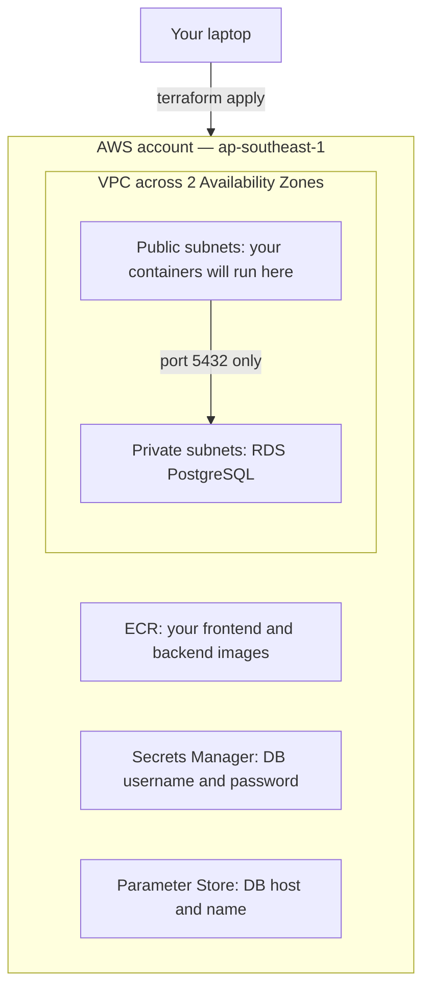
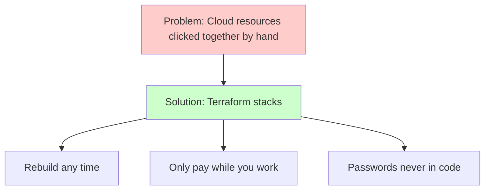

# Week 5 — AWS Shared Foundation: VPC, ECR, RDS & Secrets (M1)

## Objective

Welcome to the cloud half of the bootcamp! This pack will help you build the
**AWS foundation** that both tracks (ECS and EKS) use. Don't worry if AWS is
new to you — we'll go one piece at a time.

What we're building:



By the end of this pack you will:

1. Have a network, an image registry, a database and a safe home for the DB
   password — all written in Terraform.
2. Have your app's images in ECR, ready for either track.
3. Follow the **daily routine**: `terraform apply` at the start of a session,
   `terraform destroy` at the end — every session.

## Topics

- Terraform remote state and "stacks"
- VPC basics: public and private subnets, and why we skip the NAT Gateway
- Security groups that point at other security groups
- Amazon ECR: a private home for your images
- Amazon RDS: a database AWS runs for you
- Secrets Manager (passwords) vs. Parameter Store (settings)
- Keeping the password out of Terraform's state file
- The daily apply/destroy routine

## M1: AWS VPC, ECR & RDS Database Setup

### Learning Objective

This guide will help you create the AWS foundation — a network, an image
registry, a database and a safe place for its password — for the
task-manager app, using Terraform. We'll break it down into simple steps.

### Core Idea

**What is an AWS Foundation and Why Do We Need It?**

Before your containers can run in AWS, they need somewhere to live (a
network), somewhere to pull images from (a registry), somewhere to keep data
(a database), and somewhere safe to keep the database password. We build
these once with Terraform, and both tracks plug straight into them.

### Why It Matters



**Problem:** Resources clicked together in the AWS console are slow to
rebuild, easy to leave running (and billing), and tempt you to paste the
database password into your code.

**Solution:** Terraform stacks, split by how long things should live — a
network and registry you build once, a database you create and destroy every
session, and a password that goes straight into Secrets Manager without
ever being written down.

### How It Works

#### Concepts

The foundation helps us run the app on AWS by:
1. Giving it a private network with public and private areas
2. Keeping our images in a registry inside our own AWS account
3. Storing data in a managed database that only the app can reach
4. Keeping the password out of Git and out of Terraform's files
5. Letting us create and destroy everything with a single command per stack

**Session 1.1 — AWS global infrastructure & VPC networking 101**

- We work in one **region**, `ap-southeast-1` (Singapore), across two
  **Availability Zones**: `ap-southeast-1a` and `ap-southeast-1b`.
- Our **VPC** uses the address range `10.20.0.0/16`, sliced into four
  **subnets**: two public, two private.
- A subnet is "public" only because its route table sends internet traffic
  (`0.0.0.0/0`) to an **Internet Gateway**. A private subnet has no such
  route.
- **No NAT Gateway.** Normally, apps in private subnets reach the internet
  through a NAT Gateway, which bills by the hour and per GB. To keep costs
  down, your containers run in the **public** subnets with public IPs, and
  only the database sits in the private ones. It's a training shortcut, not
  a production pattern.
- Public IP addresses bill by the hour too — one more reason to destroy your
  containers at the end of every session.

**Session 1.2 — Container registries and Amazon ECR**

- One **repository** per image: `dcta-frontend` and `dcta-backend`.
- Docker logs in to ECR with a short-lived password from
  `aws ecr get-login-password`.
- A **lifecycle policy** deletes old images automatically; we keep the last 2.
- Tag every image with the short Git SHA, and make tags `IMMUTABLE`, so you
  always know exactly which code is running.
- **Watch the CPU type:** AWS runs your images on `amd64` machines. Apple
  Silicon Macs build `arm64` by default, which fails with `exec format
  error`. Always build with `--platform linux/amd64`.

**Session 1.3 — Stateless compute vs. stateful managed storage (Amazon RDS)**

- Containers are disposable; data isn't. So the database never runs in a
  container — it runs on **Amazon RDS**.
- A **DB subnet group** tells RDS to use our two private subnets.
- **Security-group chaining:** the database's firewall says "allow 5432
  from anything wearing the app security group", not "from these IPs".
  Containers get new IPs every day; the rule keeps working.

  ```text
  your /32 ──► dcta-alb-sg ──► dcta-app-sg ──► dcta-rds-sg :5432
               (Track A        (ECS tasks        (RDS only)
                load balancer)  or EKS node)
  ```

- RDS for PostgreSQL 15+ **requires TLS** (`rds.force_ssl = 1`). The app
  doesn't encrypt its DB connection yet — you'll add that in the lab.
- Passwords go in **Secrets Manager**; plain settings (DB host and name) go
  in **SSM Parameter Store**, which is free for standard parameters.

**Terraform state and stacks**

- Terraform remembers what it built in a **state file**, kept in your S3
  bucket. `use_lockfile = true` stops two runs changing it at once.
- Each stack folder has its own state. A later stack reads an earlier one's
  **outputs** with `terraform_remote_state` — treat output names as a
  promise.
- **Ephemeral resources** and **write-only arguments** (Terraform 1.11+) let
  Terraform create a password, store it and hand it to RDS without ever
  saving it in state.

| Stack folder | Lives for | Built in |
|---|---|---|
| `infra/10-foundation` | The whole bootcamp | M1 |
| `infra/20-data` | One session | M1 |
| `infra/30-track-a` | One session | Track A |
| `infra/40-track-b-cluster`, `infra/41-track-b-platform` | One session | Track B |

Key terms to know:
- **Region** (a group of AWS data centers in one area) and **Availability
  Zone** (one separate data center group inside a region)
- **VPC** (your own private network in AWS)
- **Subnet** (a slice of the VPC, in one Availability Zone)
- **Internet Gateway** (the VPC's door to the internet)
- **Security group** (a firewall around a resource)
- **ECR repository** (a private store for one Docker image)
- **RDS** (a database AWS runs and patches for you)
- **State file** (Terraform's record of what it built)
- **Stack** (one Terraform folder with its own state)

#### Best Practices

1. Let security groups point at other security groups, and allow internet
   traffic only from your own IP (`/32`).
2. Destroy stacks in **reverse** order at the end of every session, and keep
   `10-foundation` until the last day.

#### Real-World Example

Think of it like:
- A `docker-compose.yml` for your laptop — one file that sets up the
  network, the database and the environment variables
- The GitLab Container Registry you pushed images to in the local phase
- But for your own AWS account, written in Terraform!

### Supplemental Reading

- [How Amazon VPC works](https://docs.aws.amazon.com/vpc/latest/userguide/how-it-works.html) — route tables, Internet Gateways, public vs. private subnets.
- [Security group rules](https://docs.aws.amazon.com/vpc/latest/userguide/security-group-rules.html) — using another security group as the source.
- [Amazon VPC pricing](https://aws.amazon.com/vpc/pricing/) and [the public IPv4 charge announcement](https://aws.amazon.com/blogs/aws/new-aws-public-ipv4-address-charge-public-ip-insights/) — why NAT Gateways and public IPs matter to your costs.
- [Pushing a Docker image to ECR](https://docs.aws.amazon.com/AmazonECR/latest/userguide/docker-push-ecr-image.html) and [ECR lifecycle policies](https://docs.aws.amazon.com/AmazonECR/latest/userguide/LifecyclePolicies.html).
- [Docker multi-platform builds](https://docs.docker.com/build/building/multi-platform/) — building `amd64` images on an Apple Silicon Mac.
- [RDS DB instance in a VPC](https://docs.aws.amazon.com/AmazonRDS/latest/UserGuide/USER_VPC.WorkingWithRDSInstanceinaVPC.html) — DB subnet groups.
- [Using SSL with a PostgreSQL DB instance](https://docs.aws.amazon.com/AmazonRDS/latest/UserGuide/PostgreSQL.Concepts.General.SSL.html) and [RDS certificate bundles](https://docs.aws.amazon.com/AmazonRDS/latest/UserGuide/UsingWithRDS.SSL.html).
- [What is AWS Secrets Manager](https://docs.aws.amazon.com/secretsmanager/latest/userguide/intro.html) and [Parameter Store](https://docs.aws.amazon.com/systems-manager/latest/userguide/systems-manager-parameter-store.html).
- [Terraform S3 backend](https://developer.hashicorp.com/terraform/language/backend/s3) and [`terraform_remote_state`](https://developer.hashicorp.com/terraform/language/state/remote-state-data).
- [`aws_db_instance` resource](https://registry.terraform.io/providers/hashicorp/aws/latest/docs/resources/db_instance) — see `password_wo`.
- [Managing costs with AWS Budgets](https://docs.aws.amazon.com/cost-management/latest/userguide/budgets-managing-costs.html).

## Hands-on lab

### M1 — Guided activity: foundation, images and the daily routine

**Before you start**, have these ready:

1. Your AWS sandbox credentials from the program.
2. The name of your Terraform **state bucket** (also from the program).
3. Your gitlab.com project from the local phase.
4. Tools: Terraform 1.11 or newer, AWS CLI v2, Docker with `buildx`, `git`,
   `curl`, `jq`.

```bash
# Check your tools
terraform version
aws --version
docker buildx version
jq --version
```

#### 1. Check who you are in AWS

Every command you run acts as some AWS identity in some region. Let's make
sure both are right.

```bash
# Which account and user am I?
aws sts get-caller-identity

# Which region will commands use?
aws configure get region
```

You should see: your sandbox account ID, and `ap-southeast-1`. If the region
is different, set it:

```bash
# Make Singapore the default region
aws configure set region ap-southeast-1
```

#### 2. Add the infrastructure folders to your repo

Work in the same gitlab.com project you used in the local phase. Add an
`infra/` folder next to `app/`:

```text
<your-project>/
├── app/                       # already there: frontend/, backend/, database/
└── infra/
    ├── backend.hcl            # where Terraform keeps its state
    ├── env.sh                 # your learner ID + state bucket name (not secret)
    ├── 10-foundation/         # built once: VPC, security groups, ECR, secret
    └── 20-data/               # built every session: RDS
```

`infra/backend.hcl` — replace the placeholder with your bucket name:

```hcl
bucket       = "<YOUR_STATE_BUCKET>"
region       = "ap-southeast-1"
use_lockfile = true
encrypt      = true
```

`infra/env.sh` — two settings Terraform reads from your shell:

```bash
export TF_VAR_learner_id="<your-gitlab-username>"
export TF_VAR_state_bucket="<YOUR_STATE_BUCKET>"
```

#### 3. Pin Terraform and the providers

Pinning exact versions means everyone in the cohort gets the same behavior.

`infra/10-foundation/versions.tf`:

```hcl
terraform {
  required_version = ">= 1.11"

  required_providers {
    aws = {
      source  = "hashicorp/aws"
      version = "6.66.0"
    }
    random = {
      source  = "hashicorp/random"
      version = "3.9.1"
    }
  }

  backend "s3" {
    key = "dcta/10-foundation.tfstate"
  }
}

provider "aws" {
  region = var.region

  default_tags {
    tags = {
      ProjectCode = "Terraform101-CloudIntern"
      Environment = "sandbox"
      Owner       = var.learner_id
      CostCenter  = "training"
      ManagedBy   = "terraform"
      Stack       = "10-foundation"
    }
  }
}
```

`infra/10-foundation/variables.tf`:

```hcl
variable "region" {
  type    = string
  default = "ap-southeast-1"
}

variable "learner_id" {
  type        = string
  description = "Your GitLab username; used in tags."
}

variable "learner_cidr" {
  type        = string
  description = "Your public IP as a /32, exported at the start of each session."

  validation {
    condition     = endswith(var.learner_cidr, "/32")
    error_message = "learner_cidr must be a single /32 address."
  }
}
```

#### 4. Create the ECR repositories

One repository per image, with a rule that keeps only the last 2 images.

`infra/10-foundation/ecr.tf`:

```hcl
locals {
  repositories = ["dcta-frontend", "dcta-backend"]
}

resource "aws_ecr_repository" "app" {
  for_each = toset(local.repositories)

  name                 = each.value
  image_tag_mutability = "IMMUTABLE"
  force_delete         = true # lets the last-day teardown remove the repo with images in it
}

resource "aws_ecr_lifecycle_policy" "app" {
  for_each   = aws_ecr_repository.app
  repository = each.value.name

  policy = jsonencode({
    rules = [
      {
        rulePriority = 1
        description  = "Expire untagged images after 1 day"
        selection = {
          tagStatus   = "untagged"
          countType   = "sinceImagePushed"
          countUnit   = "days"
          countNumber = 1
        }
        action = { type = "expire" }
      },
      {
        rulePriority = 2
        description  = "Keep only the last 2 tagged images"
        selection = {
          tagStatus      = "tagged"
          tagPatternList = ["*"]
          countType      = "imageCountMoreThan"
          countNumber    = 2
        }
        action = { type = "expire" }
      }
    ]
  })
}
```

#### 5. Create the DB secret — without saving the password anywhere

Terraform makes up a password, puts it in Secrets Manager, and forgets it.

`infra/10-foundation/secrets.tf`:

```hcl
ephemeral "random_password" "db" {
  length           = 24
  override_special = "!#%^*-_=+" # RDS rejects / @ " and spaces
}

resource "aws_secretsmanager_secret" "db" {
  name                    = "dcta/db/credentials"
  recovery_window_in_days = 0 # training sandbox: allow immediate re-creation
}

resource "aws_secretsmanager_secret_version" "db" {
  secret_id = aws_secretsmanager_secret.db.id
  secret_string_wo = jsonencode({
    username = "taskadmin"
    password = ephemeral.random_password.db.result
  })
  secret_string_wo_version = 1 # bump to rotate
}

resource "aws_ssm_parameter" "db_name" {
  name  = "/dcta/db/name"
  type  = "String"
  value = "taskdb"
}
```

> **Tip:** after you apply, run
> `terraform -chdir=infra/10-foundation state show aws_secretsmanager_secret_version.db`.
> There's no password in it — that's the point.

#### 6. Review the network design

You'll write the VPC and security groups yourself in the Lab exercise.
First, read this picture and make sure every line makes sense to you:

```text
VPC 10.20.0.0/16 (ap-southeast-1)
├── public-a   10.20.0.0/24   ap-southeast-1a   route 0.0.0.0/0 → Internet Gateway   (load balancer, containers / EKS node)
├── public-b   10.20.1.0/24   ap-southeast-1b   route 0.0.0.0/0 → Internet Gateway
├── private-a  10.20.10.0/24  ap-southeast-1a   no internet route                    (RDS)
└── private-b  10.20.11.0/24  ap-southeast-1b   no internet route

dcta-alb-sg  in : 80 from your /32                         out: all
dcta-app-sg  in : 80 and 3000 from dcta-alb-sg             out: all (needed to reach ECR/AWS without a NAT)
             in : all from dcta-app-sg (node-to-pod traffic, Track B)
dcta-rds-sg  in : 5432 from dcta-app-sg                    out: none needed
```

Later, **VPC → Your VPCs → Resource map** in the console will show you this
same picture.

#### 7. Get the app ready for AWS

The app needs three small changes before it can run in AWS. Commit them to
your repo.

**(a) Backend: talk to the database over TLS.** In
`app/backend/src/server.js`, add `const fs = require('fs');` at the top,
then add the `ssl` line to the pool:

```javascript
const pool = new Pool({
  user: process.env.DB_USER || 'postgres',
  host: process.env.DB_HOST || 'localhost',
  database: process.env.DB_NAME || 'taskdb',
  password: process.env.DB_PASSWORD || 'postgres',
  port: process.env.DB_PORT || 5432,
  ssl: process.env.DB_SSL_CA_PATH
    ? { ca: fs.readFileSync(process.env.DB_SSL_CA_PATH).toString(), rejectUnauthorized: true }
    : false,
});
```

Then put AWS's certificate bundle for RDS into the backend image. Replace
`app/backend/Dockerfile`:

```dockerfile
FROM public.ecr.aws/docker/library/node:24-alpine
WORKDIR /app
COPY package*.json ./
RUN npm install --omit=dev
COPY . .
ADD https://truststore.pki.rds.amazonaws.com/ap-southeast-1/ap-southeast-1-bundle.pem /app/certs/rds-ca.pem
EXPOSE 3000
HEALTHCHECK --interval=30s --timeout=3s --start-period=5s --retries=3 \
    CMD wget --no-verbose --tries=1 --spider http://localhost:3000/health || exit 1
CMD ["npm", "start"]
```

On your laptop (Docker Compose) `DB_SSL_CA_PATH` isn't set, so nothing
changes there. On AWS you'll set `DB_SSL_CA_PATH=/app/certs/rds-ca.pem`.

**(b) Frontend: a production image.** The current image runs React's
**development** server, which needs much more memory than a small cloud
container has. Its `nginx.conf` also sends `/api` to a host called
`backend`, which only exists inside Docker Compose — nginx won't even start
without it. In AWS, the load balancer sends `/api` to the backend for you.
Replace `app/frontend/Dockerfile`:

```dockerfile
FROM public.ecr.aws/docker/library/node:24-alpine AS build
WORKDIR /app
COPY package*.json ./
RUN npm install
COPY . .
ARG REACT_APP_API_URL=/api
ENV REACT_APP_API_URL=$REACT_APP_API_URL
RUN npm run build

FROM public.ecr.aws/docker/library/nginx:1.30-alpine
COPY nginx.conf /etc/nginx/conf.d/default.conf
COPY --from=build /app/build /usr/share/nginx/html
EXPOSE 80
```

Then delete the whole `location /api/ { ... }` block from
`app/frontend/nginx.conf`. Keep `location /`, `location /static/`,
`location /health` and the error pages. With `REACT_APP_API_URL=/api`, the
browser calls the API on the same address it loaded the page from.

**(c) A seed script that's safe to run every day.** The app never creates
its own table, and your database is brand-new each session. The original
`init.sql` breaks if you run it twice. Create `app/database/seed.sql`:

```sql
CREATE TABLE IF NOT EXISTS tasks (
    id UUID DEFAULT gen_random_uuid() PRIMARY KEY,
    title VARCHAR(255) NOT NULL,
    description TEXT,
    status VARCHAR(20) DEFAULT 'TODO' CHECK (status IN ('TODO', 'IN_PROGRESS', 'DONE')),
    created_at TIMESTAMP WITH TIME ZONE DEFAULT CURRENT_TIMESTAMP,
    updated_at TIMESTAMP WITH TIME ZONE DEFAULT CURRENT_TIMESTAMP
);

CREATE INDEX IF NOT EXISTS idx_tasks_status ON tasks(status);
CREATE INDEX IF NOT EXISTS idx_tasks_created_at ON tasks(created_at);

CREATE OR REPLACE FUNCTION update_updated_at_column()
RETURNS TRIGGER AS $$
BEGIN
    NEW.updated_at = CURRENT_TIMESTAMP;
    RETURN NEW;
END;
$$ LANGUAGE plpgsql;

CREATE OR REPLACE TRIGGER update_tasks_updated_at
    BEFORE UPDATE ON tasks
    FOR EACH ROW
    EXECUTE FUNCTION update_updated_at_column();

INSERT INTO tasks (title, description, status)
SELECT * FROM (VALUES
    ('Complete frontend', 'Implement React components', 'IN_PROGRESS'),
    ('Set up database', 'Configure PostgreSQL', 'DONE'),
    ('Write API endpoints', 'Create REST API with Express', 'TODO')
) AS seed(title, description, status)
WHERE NOT EXISTS (SELECT 1 FROM tasks);
```

Your track runs this at the start of every session (Track A: a one-off ECS
task; Track B: a Kubernetes Job).

#### 8. Apply the foundation and push both images

```bash
# Load your learner ID and state bucket name
source infra/env.sh

# Tell Terraform your current public IP (only this IP may reach your load balancer)
export TF_VAR_learner_cidr="$(curl -fsS https://checkip.amazonaws.com)/32"

# Connect the stack to your S3 state bucket (first time, or after changing providers)
terraform -chdir=infra/10-foundation init -backend-config=../backend.hcl

# Preview, then create the resources
terraform -chdir=infra/10-foundation apply
```

You should see: `Apply complete!` with the ECR repositories and the secret
created. (Your VPC and security groups from the Lab exercise go in this same
stack — just apply again once you've written them.)

Now push both images, tagged with your current commit:

```bash
# Work out your registry address and image tag
ACCOUNT_ID="$(aws sts get-caller-identity --query Account --output text)"
REGISTRY="${ACCOUNT_ID}.dkr.ecr.ap-southeast-1.amazonaws.com"
TAG="$(git rev-parse --short HEAD)"

# Log Docker in to ECR
aws ecr get-login-password --region ap-southeast-1 | docker login --username AWS --password-stdin "$REGISTRY"

# Build for amd64 and push, one image at a time
docker buildx build --platform linux/amd64 -t "$REGISTRY/dcta-backend:$TAG" --push app/backend
docker buildx build --platform linux/amd64 -t "$REGISTRY/dcta-frontend:$TAG" --push app/frontend

# Check the backend image is there
aws ecr describe-images --repository-name dcta-backend --query 'imageDetails[].imageTags' --output text
```

You should see: your short commit SHA listed as an image tag.

#### 9. Read the sample database definition

This is what the database in `infra/20-data` looks like. Read it, and try to
answer the questions below before writing your own.

```hcl
ephemeral "aws_secretsmanager_secret_version" "db" {
  secret_id = data.terraform_remote_state.foundation.outputs.db_secret_arn
}

resource "aws_db_instance" "postgres" {
  identifier     = "dcta-postgres"
  engine         = "postgres"
  engine_version = "17"
  instance_class = "db.t4g.micro"

  allocated_storage = 20
  storage_type      = "gp3"
  storage_encrypted = true

  db_name             = "taskdb"
  username            = "taskadmin" # must match the username stored in the secret
  password_wo         = jsondecode(ephemeral.aws_secretsmanager_secret_version.db.secret_string).password
  password_wo_version = 1

  db_subnet_group_name   = aws_db_subnet_group.private.name
  vpc_security_group_ids = [data.terraform_remote_state.foundation.outputs.rds_sg_id]
  publicly_accessible    = false
  multi_az               = false

  backup_retention_period  = 0    # disposable training data
  skip_final_snapshot      = true # daily destroy must not leave snapshots
  delete_automated_backups = true
  deletion_protection      = false
  apply_immediately        = true
}
```

- Why is `username` a normal argument, while `password` must use
  `password_wo`? (Hint: an ephemeral value can only go into a write-only
  argument — Terraform refuses anywhere it would be saved to state.)
- What would change if `publicly_accessible` were `true`, but the database
  stayed in private subnets?
- Which of these settings would you change for a real production database?

#### 10. Learn the daily routine

There's no wrapper script — you run `terraform apply` and `terraform
destroy` yourself, one stack at a time, so you always know what exists.
Run everything from the root of your repo.

**Start of every session:**

```bash
# 1. Load your settings and current IP
source infra/env.sh
export TF_VAR_learner_cidr="$(curl -fsS https://checkip.amazonaws.com)/32"

# 2. Foundation — nothing changes unless your IP changed
terraform -chdir=infra/10-foundation init -backend-config=../backend.hcl
terraform -chdir=infra/10-foundation apply

# 3. Database
terraform -chdir=infra/20-data init -backend-config=../backend.hcl
terraform -chdir=infra/20-data apply
```

Then apply your track's stacks (your track's pack lists them).

**End of every session — in reverse order.** First your track's stacks (see
your track's pack), then the database:

```bash
# Remove the database
terraform -chdir=infra/20-data destroy
```

**Last day of the bootcamp only**, after every other stack is gone:

```bash
# Remove the foundation
terraform -chdir=infra/10-foundation destroy
```

> **Why reverse order?** `20-data` uses `10-foundation`'s outputs, and the
> track stacks use both. Destroy an upstream stack first and you'd be left
> with resources Terraform can no longer manage cleanly.

#### If something goes wrong

| Symptom | Likely cause | Fix |
|---|---|---|
| `Error acquiring the state lock` | Another `terraform` run is going (or crashed) | Wait for it to finish; if it crashed, `terraform force-unlock <LOCK_ID>` |
| `SignatureDoesNotMatch` / "Signature expired" | Your computer's clock is off (common on WSL2 after sleep) | WSL2: `sudo hwclock -s`, or `wsl --shutdown` from Windows. Otherwise, turn on automatic date & time |
| Task or pod fails with `exec format error` | Image was built for `arm64` | Rebuild with `--platform linux/amd64` and push a new tag |
| `docker: command not found` or can't connect, on WSL2 | Docker Desktop's WSL integration is off | Docker Desktop → Settings → Resources → WSL integration → turn on your distro |
| `aws` works in PowerShell but not in WSL2 | The CLI and `~/.aws` must be inside WSL | Install the AWS CLI inside WSL and run `aws configure` there |
| `denied: … not authorized` on `docker push` | Docker isn't logged in to ECR (tokens expire after 12 hours) | Run the `get-login-password` step again |
| `terraform apply` on `20-data` says an output is missing | `10-foundation` doesn't export that output yet | Check the output names in the Lab exercise table |
| App says `no pg_hba.conf entry … no encryption` | DB connection isn't using TLS | Check step 7(a) and that `DB_SSL_CA_PATH` is set |

## Lab exercise

**Unguided — M1 Capstone Challenge: write the foundation and the database.**

You write the Terraform this time; the lab above only gave you the pieces
you need.

1. In `infra/10-foundation`, add a VPC across `ap-southeast-1a` and
   `ap-southeast-1b` with **2 public and 2 private subnets**, an Internet
   Gateway, a public route table, and **no NAT Gateway**. Set
   `map_public_ip_on_launch = true` on the public subnets (the Track B EKS
   node gets its public IP this way; ECS tasks ask for one themselves).
2. In the same stack, create `dcta-alb-sg`, `dcta-app-sg` and `dcta-rds-sg`
   as in step 6. Internet traffic may only come from `var.learner_cidr`.
   `dcta-rds-sg` must allow `5432` **only** from `dcta-app-sg` — no IP
   ranges. Any `0.0.0.0/0` egress rule needs a `# justification:` comment.
3. Add these outputs to `10-foundation`, spelled exactly like this (the
   tracks depend on them):

   | Output | Value |
   |---|---|
   | `vpc_id` | VPC ID |
   | `public_subnet_ids` | list of 2 |
   | `private_subnet_ids` | list of 2 |
   | `alb_sg_id`, `app_sg_id`, `rds_sg_id` | security group IDs |
   | `ecr_repository_urls` | map: `frontend`, `backend` → repository URL |
   | `db_secret_arn` | Secrets Manager secret ARN |
   | `db_name_parameter_arn` | ARN of SSM `/dcta/db/name` |

4. Create `infra/20-data` with its own state key (`dcta/20-data.tfstate`),
   a `terraform_remote_state` read of `10-foundation`, a DB subnet group
   over the **private** subnets, the RDS instance (based on step 9), and an
   SSM parameter `/dcta/db/host` holding the RDS address. Output
   `db_host_parameter_arn`.
5. Apply both stacks. Then `terraform destroy` `20-data` and apply it again.
   It must come back cleanly with **no manual steps**.

**Check your work** (save the output — you'll need it for your capstone
documentation):

```bash
# Database status, public access, and which subnets it's in
aws rds describe-db-instances --db-instance-identifier dcta-postgres \
  --query 'DBInstances[0].[DBInstanceStatus,PubliclyAccessible,DBSubnetGroup.Subnets[].SubnetIdentifier]'

# The database's firewall rules (should reference dcta-app-sg, not an IP range)
aws ec2 describe-security-groups --filters Name=group-name,Values=dcta-rds-sg \
  --query 'SecurityGroups[0].IpPermissions'

# Number of NAT Gateways (should be 0)
aws ec2 describe-nat-gateways --filter Name=state,Values=available --query 'length(NatGateways)'
```

**Prove it fails when it should:** from your laptop, show that the database
is **not** reachable. The connection must time out or fail:

```bash
# Try to reach RDS from outside the VPC (this should fail)
# On macOS, use -G 5 instead of -w 5 for the connect timeout
nc -vz -w 5 "$(aws ssm get-parameter --name /dcta/db/host --query Parameter.Value --output text)" 5432
```

## Checkpoint (self-assessed)

- [ ] `aws sts get-caller-identity` works and my default region is `ap-southeast-1`.
- [ ] `infra/10-foundation` uses the S3 backend with `use_lockfile = true`; providers are pinned to exact versions and `.terraform.lock.hcl` is committed.
- [ ] My VPC has 2 public + 2 private subnets across 2 AZs, and **zero** NAT Gateways.
- [ ] `dcta-rds-sg` allows `5432` only from `dcta-app-sg` (a security-group reference, not an IP range).
- [ ] Nothing internet-facing allows `0.0.0.0/0` inbound; my `/32` is exported as `TF_VAR_learner_cidr` each session.
- [ ] Both ECR repositories have an `amd64` image tagged with a Git SHA, and old images are cleaned up automatically.
- [ ] `terraform state show` on the secret version shows **no** password, and no password is in Git.
- [ ] RDS is `available`, `PubliclyAccessible: false`, in the private subnets, and `/dcta/db/host` holds its address.
- [ ] **Failure path:** `nc` from my laptop to RDS on `5432` fails.
- [ ] I destroyed and re-created `20-data` with no manual steps, and I ended the session with `20-data` destroyed.
