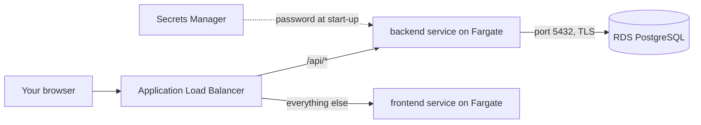
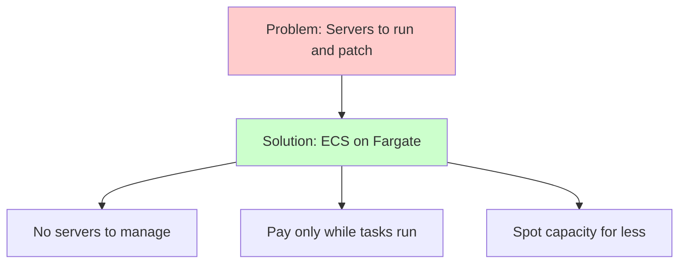
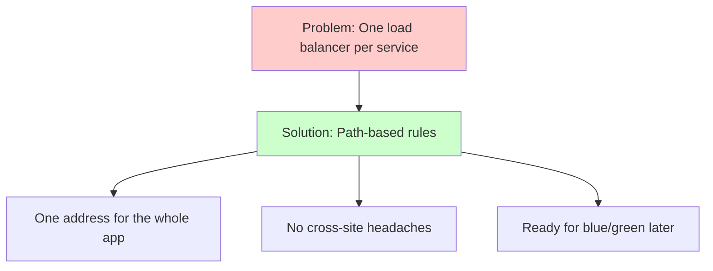

# Week 5 — Track A: ECS on Fargate & ALB Path Routing (M2–M3)

## Objective

Welcome to Track A! This pack will help you run your frontend and backend on
**Amazon ECS** with **AWS Fargate** — AWS runs the servers, you just bring the
containers. Then we'll put one **Application Load Balancer (ALB)** in front,
so a single web address serves the whole app.

What we're building:



By the end of this pack you will:

1. Run both containers as ECS services — 70% on low-cost **Fargate Spot**,
   30% on regular Fargate.
2. Reach the whole app through one ALB address, with `/api/*` going to the
   backend.
3. Create everything with `terraform apply` in a new stack,
   `infra/30-track-a`, and remove it with `terraform destroy` each session.

## Topics

- ECS building blocks: cluster, task definition, task, service
- Fargate: containers without servers
- The task execution role
- Fargate Spot vs. regular Fargate
- Passing the DB password safely with the `secrets` block
- ALB basics: listeners, target groups, health checks
- Listener rules: path-based routing and priority
- Seeding the fresh database with a one-off task

## M2: Low-Cost ECS Fargate Compute & Load Balancing

### Learning Objective

This guide will help you run the task-manager frontend and backend on Amazon
ECS with Fargate, behind an Application Load Balancer, using Terraform. We'll
break it down into simple steps.

### Core Idea

**What is ECS on Fargate and Why Do We Need It?**

ECS is AWS's own container orchestrator — it starts your containers, keeps
the right number running, and replaces them when they break. Fargate is the
"serverless" way to run them: you describe CPU, memory and image, and AWS
finds somewhere to run it. No nodes to patch, no cluster to operate.

### Why It Matters



**Problem:** Running containers yourself means renting servers, patching
them, and paying for them even when your app is quiet.

**Solution:** ECS on Fargate — describe the container once, let AWS run it,
pay only while it runs, and put most of it on discounted **Fargate Spot**
capacity.

### How It Works

#### Concepts

ECS on Fargate helps us run containers by:
1. Keeping a set number of copies (tasks) of each container running
2. Replacing any copy that stops or fails its health check
3. Registering each copy with the load balancer automatically
4. Fetching secrets at start-up, so they're never baked into the image

**Session 2.1 — Container orchestration basics & ECS architecture**

You already know Kubernetes from the local phase. Here's how ECS lines up:

| ECS | Kubernetes you already know |
|---|---|
| Cluster | Cluster (but no control plane to run) |
| Task definition | Pod spec inside a Deployment |
| Task | Pod |
| Service | Deployment + Service |

- For Fargate, a task definition always sets `requires_compatibilities =
  ["FARGATE"]`, `network_mode = "awsvpc"`, task-level `cpu` and `memory`
  (`256` = 0.25 vCPU, `512` = 0.5 GB), and `cpu_architecture = "X86_64"`.
- **Two roles, two jobs:** the **task execution role** is used by ECS
  *before* your code runs (pull the image, read secrets, send logs). The
  **task role** is used by your code when it calls AWS — you'll add it in M7.
- The **`secrets` block** maps an environment variable to a Secrets Manager
  or Parameter Store ARN. Add `:<key>::` to pick one field from a JSON
  secret, e.g. `…:secret:dcta/db/credentials-AbC123:password::`.

**Session 2.2 — Serverless compute with Fargate & Fargate Spot**

- A service picks capacity with a **capacity provider strategy**.
  `FARGATE_SPOT` weight **7** + `FARGATE` weight **3** = a 70/30 split.
- With just 1 task you can't *see* the split — you'll see it in M5 when the
  backend scales to 3 tasks.
- AWS can take Spot capacity back with a two-minute warning. The service
  starts a replacement; with 1 task, expect a short blip.

**Session 2.3 — Layer 7 load balancing with ALB**

- An ALB has **listeners** (like port 80), each with a **default action**
  and optional **rules**. Actions usually **forward** to a **target group**.
- Fargate target groups use `target_type = "ip"` — every task has its own
  IP, and ECS adds and removes them for you.
- The ALB only sends traffic to targets that pass their **health check**
  (we use `/health`).
- We use plain HTTP on port 80 — there's no custom domain, so there's
  nothing to attach an HTTPS certificate to.

Key terms to know:
- **Task definition** (the recipe: image, CPU, memory, ports, secrets)
- **Task** (one running copy of that recipe)
- **Service** (keeps N tasks running and connects them to the ALB)
- **Fargate** (AWS runs the servers; you pay per second of CPU and memory)
- **Fargate Spot** (spare capacity at a discount that can be taken back)
- **Target group** (the list of task IPs a load balancer sends traffic to)
- **Health check** (the ALB's regular "are you OK?" call to each task)

#### Best Practices

1. Pass passwords with `secrets`, never with `environment`, and tag images
   with the Git SHA — never `:latest`.
2. Keep some regular Fargate capacity, so a Spot reclaim never takes every
   copy of a service down at once.

#### Real-World Example

Think of it like:
- `docker compose up` for your laptop — describe the containers, and they run
- A Kubernetes Deployment for your Minikube cluster
- But for AWS, with no servers or cluster to look after!

### Supplemental Reading

- [What is Amazon ECS](https://docs.aws.amazon.com/AmazonECS/latest/developerguide/Welcome.html) and [task definitions](https://docs.aws.amazon.com/AmazonECS/latest/developerguide/task_definitions.html).
- [Task definition parameters](https://docs.aws.amazon.com/AmazonECS/latest/developerguide/task_definition_parameters.html) — `runtimePlatform`, `secrets`, `logConfiguration`.
- [Task execution IAM role](https://docs.aws.amazon.com/AmazonECS/latest/developerguide/task_execution_IAM_role.html).
- [Fargate capacity providers](https://docs.aws.amazon.com/AmazonECS/latest/developerguide/fargate-capacity-providers.html) — Spot, weights, and interruptions.
- [Fargate task networking](https://docs.aws.amazon.com/AmazonECS/latest/developerguide/fargate-task-networking.html) and [Fargate task sizes](https://docs.aws.amazon.com/AmazonECS/latest/developerguide/fargate-tasks-services.html).
- [Pass sensitive data to a container](https://docs.aws.amazon.com/AmazonECS/latest/developerguide/specifying-sensitive-data-secrets.html) — the `:json-key::` syntax.
- [What is an Application Load Balancer](https://docs.aws.amazon.com/elasticloadbalancing/latest/application/introduction.html) and [target groups](https://docs.aws.amazon.com/elasticloadbalancing/latest/application/load-balancer-target-groups.html).
- [AWS Fargate pricing](https://aws.amazon.com/fargate/pricing/).

## M3: Advanced ALB Path-Based Routing & Listener Rules

### Learning Objective

This guide will help you create ALB listener rules that send `/api/*` to the
backend and everything else to the frontend, all on one web address. We'll
break it down into simple steps.

### Core Idea

**What is Path-Based Routing and Why Do We Need It?**

When a request arrives, the ALB checks its **rules** in priority order —
lowest number first. The first rule that matches wins; if none match, the
**default action** runs. Path-based routing is simply a rule that looks at
the start of the URL path.

### Why It Matters



**Problem:** Giving every service its own load balancer costs more, gives you
several addresses to manage, and makes the browser call the API on a
different site (hello, CORS errors).

**Solution:** Path-based rules on one ALB — one address, `/api/*` to the
backend, everything else to the frontend. It's also the exact rule M6's
blue/green deployments will switch.

### How It Works

#### Concepts

Path-based routing helps us route traffic by:
1. Checking each request against rules in priority order
2. Matching on the path, host, headers, method, query string or source IP
3. Forwarding to the right target group — or falling back to the default
   action

**Session 3.1 — Advanced HTTP routing (path-based vs. host-based)**

- All conditions in one rule must match; the values inside one condition
  are "any of".
- `/api/*` matches `/api/tasks` and `/api/tasks/123`, but **not** `/api` on
  its own. Paths are case-sensitive.
- **Host-based routing** needs several host names — which means DNS. We
  don't have a custom domain, so path-based routing is our tool.
- The ALB passes the path through unchanged: the backend still receives
  `/api/tasks`.
- Priorities run from 1 to 50000. Leave gaps (10, 20, 100) — in M6 you'll
  add a rule *above* this one.

**Session 3.2 — Application-layer traffic management & health checks**

- The **target-group health check** is the ALB calling each task. A task
  that keeps failing stops getting traffic, and ECS replaces it.
- The **container `HEALTHCHECK`** in the Dockerfile is a separate check that
  ECS runs inside the task.
- The backend's `/health` isn't under `/api/` — that's fine. Health checks
  go straight to the task, not through listener rules.
- A target group with **no** tasks at all makes the ALB answer **503**.

Key terms to know:
- **Listener** (the port the ALB listens on, like 80)
- **Rule** (an "if this, send it there" instruction on a listener)
- **Priority** (the order rules are checked — lower number first)
- **Default action** (what happens when no rule matches)
- **Path pattern** (a rule condition such as `/api/*`)

#### Best Practices

1. Keep the default action on the catch-all service (the frontend) and put
   specific paths in rules.
2. Use a health check that doesn't depend on the database, so a database
   hiccup doesn't make the ALB drop every task.

#### Real-World Example

Think of it like:
- Express's `app.use('/api', apiRouter)` for Node.js
- The paths in a Kubernetes `Ingress` for your cluster
- But for an AWS load balancer!

### Supplemental Reading

- [ALB listeners](https://docs.aws.amazon.com/elasticloadbalancing/latest/application/load-balancer-listeners.html) and [listener rules](https://docs.aws.amazon.com/elasticloadbalancing/latest/application/listener-update-rules.html).
- [Rule condition types](https://docs.aws.amazon.com/elasticloadbalancing/latest/application/rule-condition-types.html) — path-pattern syntax.
- [Target group health checks](https://docs.aws.amazon.com/elasticloadbalancing/latest/application/target-group-health-checks.html).

## Hands-on lab

### M2 — Guided activity: cluster, role, load balancer and the seed task

Create the folder `infra/30-track-a`. Copy `versions.tf` from
`10-foundation` and change two things: the state key to
`dcta/30-track-a.tfstate`, and the `Stack` tag to `30-track-a`. Copy
`variables.tf` too (`region`, `learner_id`, `learner_cidr`).

#### 1. Read the earlier stacks' outputs

This lets `30-track-a` use the VPC, security groups and secret you already
built — no copying IDs by hand.

`infra/30-track-a/remote_state.tf`:

```hcl
variable "state_bucket" {
  type = string
}

data "terraform_remote_state" "foundation" {
  backend = "s3"
  config = {
    bucket = var.state_bucket
    key    = "dcta/10-foundation.tfstate"
    region = var.region
  }
}

data "terraform_remote_state" "data" {
  backend = "s3"
  config = {
    bucket = var.state_bucket
    key    = "dcta/20-data.tfstate"
    region = var.region
  }
}

locals {
  f = data.terraform_remote_state.foundation.outputs
  d = data.terraform_remote_state.data.outputs
}
```

#### 2. Create the cluster

Take a quick look in the console first: **Amazon ECS → Clusters → Create
cluster**. Notice "AWS Fargate (serverless)" is already selected. Cancel,
and let's declare it in code instead.

`infra/30-track-a/ecs.tf`:

```hcl
resource "aws_ecs_cluster" "this" {
  name = "dcta-ecs"

  setting {
    name  = "containerInsights"
    value = "disabled" # Container Insights metrics are billed separately
  }
}

resource "aws_ecs_cluster_capacity_providers" "this" {
  cluster_name       = aws_ecs_cluster.this.name
  capacity_providers = ["FARGATE", "FARGATE_SPOT"]

  default_capacity_provider_strategy {
    capacity_provider = "FARGATE"
    weight            = 1
  }
}
```

#### 3. Create the task execution role

This role lets ECS pull your images, write logs, and read exactly **one**
secret and **two** parameters — nothing else.

`infra/30-track-a/iam.tf`:

```hcl
data "aws_iam_policy_document" "ecs_tasks_assume" {
  statement {
    actions = ["sts:AssumeRole"]
    principals {
      type        = "Service"
      identifiers = ["ecs-tasks.amazonaws.com"]
    }
  }
}

resource "aws_iam_role" "execution" {
  name               = "dcta-ecs-task-execution"
  assume_role_policy = data.aws_iam_policy_document.ecs_tasks_assume.json
}

resource "aws_iam_role_policy_attachment" "execution_managed" {
  role       = aws_iam_role.execution.name
  policy_arn = "arn:aws:iam::aws:policy/service-role/AmazonECSTaskExecutionRolePolicy"
}

data "aws_iam_policy_document" "execution_secrets" {
  statement {
    actions   = ["secretsmanager:GetSecretValue"]
    resources = [local.f.db_secret_arn]
  }
  statement {
    actions   = ["ssm:GetParameters"]
    resources = [local.f.db_name_parameter_arn, local.d.db_host_parameter_arn]
  }
}

resource "aws_iam_role_policy" "execution_secrets" {
  name   = "read-db-config"
  role   = aws_iam_role.execution.id
  policy = data.aws_iam_policy_document.execution_secrets.json
}
```

#### 4. Create the load balancer and both target groups

One ALB, one listener on port 80, and a target group for each service. For
now, everything goes to the frontend.

`infra/30-track-a/alb.tf`:

```hcl
resource "aws_lb" "web" {
  name               = "dcta-alb"
  load_balancer_type = "application"
  internal           = false
  security_groups    = [local.f.alb_sg_id]
  subnets            = local.f.public_subnet_ids
}

resource "aws_lb_target_group" "frontend" {
  name                 = "dcta-frontend-tg"
  port                 = 80
  protocol             = "HTTP"
  target_type          = "ip"
  vpc_id               = local.f.vpc_id
  deregistration_delay = 30

  health_check {
    path                = "/health"
    matcher             = "200"
    interval            = 15
    healthy_threshold   = 2
    unhealthy_threshold = 3
  }
}

resource "aws_lb_target_group" "backend" {
  name                 = "dcta-backend-tg"
  port                 = 3000
  protocol             = "HTTP"
  target_type          = "ip"
  vpc_id               = local.f.vpc_id
  deregistration_delay = 30

  health_check {
    path                = "/health"
    matcher             = "200"
    interval            = 15
    healthy_threshold   = 2
    unhealthy_threshold = 3
  }
}

resource "aws_lb_listener" "http" {
  load_balancer_arn = aws_lb.web.arn
  port              = 80
  protocol          = "HTTP"

  default_action {
    type             = "forward"
    target_group_arn = aws_lb_target_group.frontend.arn
  }
}

output "alb_dns_name" {
  value = aws_lb.web.dns_name
}
```

#### 5. Add the database seed task

Remember `seed.sql` from M1? This task runs it once against the fresh
database, using the public `postgres` image as a `psql` client.

`infra/30-track-a/seed.tf`:

```hcl
resource "aws_cloudwatch_log_group" "seed" {
  name              = "/dcta/ecs/db-seed"
  retention_in_days = 3
}

resource "aws_ecs_task_definition" "db_seed" {
  family                   = "dcta-db-seed"
  requires_compatibilities = ["FARGATE"]
  network_mode             = "awsvpc"
  cpu                      = "256"
  memory                   = "512"
  execution_role_arn       = aws_iam_role.execution.arn

  runtime_platform {
    operating_system_family = "LINUX"
    cpu_architecture        = "X86_64"
  }

  container_definitions = jsonencode([{
    name      = "seed"
    image     = "public.ecr.aws/docker/library/postgres:17-alpine"
    essential = true
    command   = ["sh", "-c", "printf '%s' \"$SEED_SQL\" | psql -v ON_ERROR_STOP=1"]
    environment = [
      { name = "SEED_SQL", value = file("${path.module}/../../app/database/seed.sql") },
      { name = "PGSSLMODE", value = "require" }
    ]
    secrets = [
      { name = "PGHOST", valueFrom = local.d.db_host_parameter_arn },
      { name = "PGDATABASE", valueFrom = local.f.db_name_parameter_arn },
      { name = "PGUSER", valueFrom = "${local.f.db_secret_arn}:username::" },
      { name = "PGPASSWORD", valueFrom = "${local.f.db_secret_arn}:password::" }
    ]
    logConfiguration = {
      logDriver = "awslogs"
      options = {
        awslogs-group         = aws_cloudwatch_log_group.seed.name
        awslogs-region        = var.region
        awslogs-stream-prefix = "seed"
      }
    }
  }])
}

output "seed_run_command" {
  value = join(" ", [
    "aws ecs run-task --cluster ${aws_ecs_cluster.this.name}",
    "--task-definition ${aws_ecs_task_definition.db_seed.family}",
    "--capacity-provider-strategy capacityProvider=FARGATE,weight=1",
    "--network-configuration 'awsvpcConfiguration={subnets=[${join(",", local.f.public_subnet_ids)}],securityGroups=[${local.f.app_sg_id}],assignPublicIp=ENABLED}'",
    "--query 'tasks[0].taskArn' --output text"
  ])
}
```

#### 6. Your Track A session commands

From now on, every session runs these, after the M1 start-of-session
commands (settings, `10-foundation`, `20-data`).

**Start of session:**

```bash
# 1. Use the newest images already in ECR (the Lab exercise adds these two variables)
export TF_VAR_frontend_image_tag="$(aws ecr describe-images --repository-name dcta-frontend --query 'sort_by(imageDetails,&imagePushedAt)[-1].imageTags[0]' --output text)"
export TF_VAR_backend_image_tag="$(aws ecr describe-images --repository-name dcta-backend --query 'sort_by(imageDetails,&imagePushedAt)[-1].imageTags[0]' --output text)"

# 2. Create the Track A stack
terraform -chdir=infra/30-track-a init -backend-config=../backend.hcl
terraform -chdir=infra/30-track-a apply
```

```bash
# 3. Seed the fresh database, wait for it to finish, and check the exit code
TASK_ARN="$(eval "$(terraform -chdir=infra/30-track-a output -raw seed_run_command)")"
aws ecs wait tasks-stopped --cluster dcta-ecs --tasks "$TASK_ARN"
aws ecs describe-tasks --cluster dcta-ecs --tasks "$TASK_ARN" --query 'tasks[0].containers[0].exitCode'

# 4. Read what psql printed
aws logs tail /dcta/ecs/db-seed --since 15m
```

You should see: exit code `0`. The logs show `CREATE TABLE` … `INSERT 0 3`
on the first run of a session, and `INSERT 0 0` if you run it again.

**End of session — in reverse order** (keep the same shell, so the exported
variables are still set):

```bash
# Track A stack first, then the database
terraform -chdir=infra/30-track-a destroy
terraform -chdir=infra/20-data destroy
```

#### 7. Walk the console

After `terraform apply`, take a look around:

1. **ECS → Clusters → dcta-ecs → Task definitions → dcta-db-seed**: find the
   execution role, `awsvpc`, and the `secrets` entries. Only ARNs are shown
   — never values.
2. **EC2 → Load Balancers → dcta-alb → Listeners**: read the default action.

### M3 — Guided activity: reading listener rules

Let's look at a rule in the console first — without creating one — so you
know what Terraform will build. Everything in AWS stays in Terraform; the
console is only for looking.

1. Open **EC2 → Load Balancers → dcta-alb → Listeners → HTTP:80 → Manage
   rules → Add rule**. Look at the three parts of a rule — **conditions**
   (like *Path is `/api/*`*), the **action** (*Forward to* a target group)
   and the **priority** — then click **Cancel**. Don't save anything.
2. Back on the listener, read the **default action**: it forwards everything
   to `dcta-frontend-tg`. Until you add the `/api/*` rule in Terraform,
   `/api/tasks` goes to the frontend too.
3. Keep it that way in the console. A rule saved by hand is invisible to
   Terraform ("drift") and would clash with the rule you'll write next.

```bash
# The frontend should answer on the ALB address
curl -s -o /dev/null -w '%{http_code}\n' "http://$(terraform -chdir=infra/30-track-a output -raw alb_dns_name)/"
```

#### If something goes wrong

| Symptom | Likely cause | Fix |
|---|---|---|
| Task stops with `ResourceInitializationError … secrets` | Execution role can't read a secret/parameter, or an ARN is wrong | Check step 3's resources and your `:username::` suffixes |
| Task stops with `CannotPullContainerError` | Wrong image tag, or no public IP to reach ECR | Check the tag exists in ECR; set `assign_public_ip = true` |
| Target shows `unhealthy` | Wrong port or health path, or security group blocks the ALB | Frontend: port 80; backend: 3000; path `/health`; `dcta-app-sg` allows the ALB |
| Seed exit code isn't `0` | Can't reach RDS, or a SQL error | `aws logs tail /dcta/ecs/db-seed`; check `dcta-rds-sg` allows `dcta-app-sg` |
| Page loads but tasks don't | `/api/*` rule missing, or backend unhealthy | Check the rule (M3) and backend target health |
| `503` on everything | No healthy tasks in the target group | `aws ecs describe-services …` and look at `events` |

## Lab exercise

**Unguided — M2 Capstone Challenge: task definitions and services.**

In `infra/30-track-a`, write:

1. `aws_ecs_task_definition` for the **frontend** (`dcta-frontend`, port 80)
   and **backend** (`dcta-backend`, port 3000): Fargate, `awsvpc`, `X86_64`,
   **256 CPU / 512 MiB**, images from your ECR repositories, tagged from two
   variables: `var.frontend_image_tag` and `var.backend_image_tag`.
2. The backend gets `DB_USER` and `DB_PASSWORD` from the Secrets Manager
   secret (JSON keys `username`, `password`), `DB_HOST` and `DB_NAME` from
   Parameter Store, and plain `environment` values for `PORT=3000`,
   `DB_PORT=5432` and `DB_SSL_CA_PATH=/app/certs/rds-ca.pem`. **No password
   may appear in `environment`.**
3. `aws_ecs_service` for both, in `dcta-ecs`, with `desired_count = 1`,
   public subnets, `dcta-app-sg`, `assign_public_ip = true`, the matching
   target group, and a **capacity provider strategy of 70% `FARGATE_SPOT` /
   30% `FARGATE`**.
4. Apply, run the seed, and open the app in your browser through the ALB
   address.

**Unguided — M3 Capstone Challenge: path-based routing.**

5. Add an `aws_lb_listener_rule` that sends `/api/*` to the backend target
   group. The default action keeps serving the frontend — one ALB, one
   address.

**Check your work:**

```bash
# Save the ALB address
ALB="$(terraform -chdir=infra/30-track-a output -raw alb_dns_name)"

# The API returns the seeded tasks
curl -s "http://$ALB/api/tasks" | jq length

# The frontend answers 200
curl -s -o /dev/null -w '%{http_code}\n' "http://$ALB/"

# Both services are running, with the 70/30 strategy
aws ecs describe-services --cluster dcta-ecs --services dcta-frontend dcta-backend \
  --query 'services[].{name:serviceName,running:runningCount,strategy:capacityProviderStrategy}'

# The backend target is healthy
aws elbv2 describe-target-health --target-group-arn "$(aws elbv2 describe-target-groups --names dcta-backend-tg --query 'TargetGroups[0].TargetGroupArn' --output text)"
```

**Prove it fails when it should:**

1. `curl -s "http://$ALB/api/does-not-exist"` returns Express's `Cannot GET`
   page — you reached the backend, not React.
2. Scale the backend to 0. `/api/tasks` returns **503** while `/` still
   returns **200**. Then scale it back:

```bash
# Take the backend away...
aws ecs update-service --cluster dcta-ecs --service dcta-backend --desired-count 0 >/dev/null
curl -s -o /dev/null -w '%{http_code}\n' "http://$ALB/api/tasks"
curl -s -o /dev/null -w '%{http_code}\n' "http://$ALB/"

# ...and bring it back
aws ecs update-service --cluster dcta-ecs --service dcta-backend --desired-count 1 >/dev/null
```

End the session (reverse order):

```bash
terraform -chdir=infra/30-track-a destroy
terraform -chdir=infra/20-data destroy
```

## Checkpoint (self-assessed)

- [ ] `infra/30-track-a` reads `10-foundation` and `20-data` with `terraform_remote_state` — no copied IDs.
- [ ] The execution role can read only `dcta/db/credentials`, `/dcta/db/name` and `/dcta/db/host`.
- [ ] Both task definitions are Fargate, `X86_64`, 256/512, with Git-SHA image tags.
- [ ] The backend gets DB credentials only through `secrets`; nothing sensitive is in `environment`.
- [ ] Both services use 70% `FARGATE_SPOT` / 30% `FARGATE`.
- [ ] The seed task exits `0`, and running it again inserts 0 rows.
- [ ] The app loads through the ALB address, and I can create, update and delete a task.
- [ ] `/api/*` is a Terraform listener rule; `/` uses the default action.
- [ ] **Failure path:** `/api/does-not-exist` returns the Express 404, and with the backend at 0 tasks `/api/tasks` returns 503 while `/` returns 200.
- [ ] I ended the session with `terraform destroy` on `30-track-a`, then `20-data`, and no ALB is left (`aws elbv2 describe-load-balancers`).
