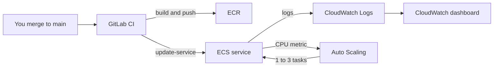
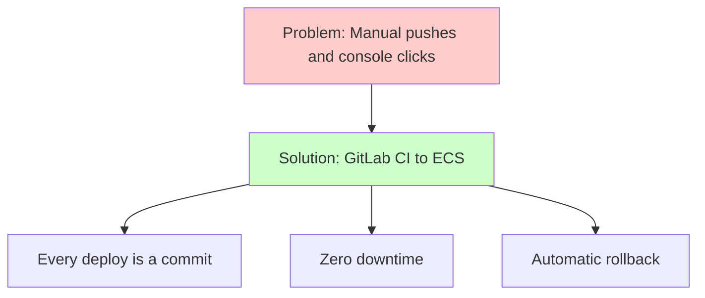
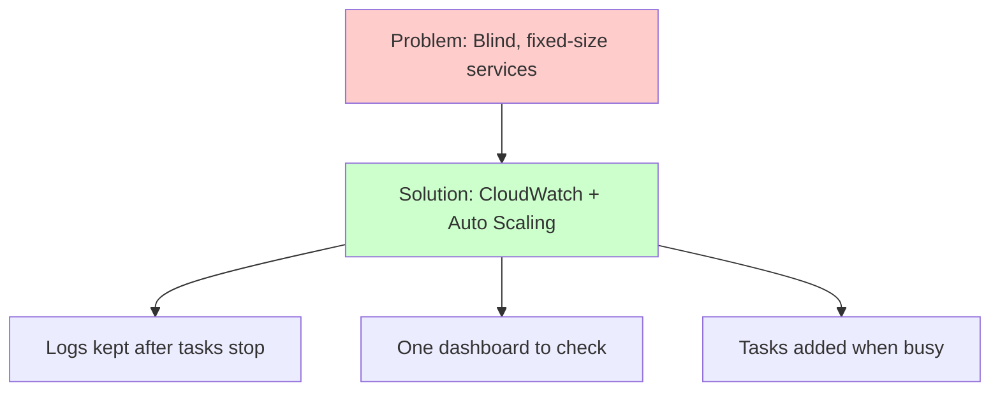

# Week 6 — Track A: GitLab CI to ECS, CloudWatch & Auto Scaling (M4–M5)

## Objective

This pack will help you make deployments **automatic** and the app
**visible**. You already have a GitLab CI pipeline from the local phase —
we'll extend it so that merging to `main` builds your images, pushes them to
ECR and updates ECS with **zero downtime**. Then we'll send every log to
CloudWatch, build a dashboard, and let the backend add tasks by itself when
it's busy.

What we're building:



By the end of this pack you will:

1. Deploy by merging — no manual `docker push` or console clicks.
2. See every container's logs in CloudWatch.
3. Watch the backend grow from 1 to 3 tasks under load, and shrink back.

## Topics

- CI/CD for containers: build once, tag by commit, deploy that exact image
- Giving a pipeline safe access to AWS
- Keyless CI access to AWS with OIDC
- Who owns what: Terraform vs. the pipeline
- ECS rolling updates and the circuit breaker
- The `awslogs` log driver and log groups
- CloudWatch metrics and dashboards
- Target-tracking auto scaling

## M4: GitLab CI/CD & Automated ECS Rollouts

### Learning Objective

This guide will help you create a GitLab CI pipeline that builds, pushes and
deploys the task-manager app to ECS with zero downtime every time you merge
to `main`. We'll break it down into simple steps.

### Core Idea

**What is CI/CD to ECS and Why Do We Need It?**

The pipeline builds an image, tags it with the commit SHA, registers a **new
task definition revision** that points at it, and tells the ECS service to
use it. ECS starts the new task, waits until it passes the load balancer's
health check, and only then stops the old one.

### Why It Matters



**Problem:** Manual deploys are easy to get wrong, hard to trace back to a
commit, and a broken release can take the app down.

**Solution:** A pipeline that deploys on every merge, with an AWS identity
that can only touch your app — plus ECS rolling updates that keep the old
version serving until the new one is healthy, and roll back by themselves
if it never gets there.

### How It Works

#### Concepts

A GitLab CI pipeline to ECS helps us ship changes by:
1. Building each image once and tagging it with the commit SHA
2. Pushing it to ECR
3. Registering a new task definition revision that uses it
4. Updating the service and waiting until it's stable

**Session 4.1 — CI/CD principles for containerized microservices**

- **Build once:** the image CI builds is exactly the one that runs.
- Two stages: `build` (both images → ECR), then `deploy` (new revision →
  update service → wait until stable).
- **Who owns what:** Terraform creates the service and its first task
  definition; after that, the pipeline registers new revisions. So Terraform
  doesn't "undo" the pipeline on the next apply, the service ignores
  `task_definition` (and, from M5, `desired_count`):

  ```hcl
  lifecycle {
    ignore_changes = [task_definition, desired_count]
  }
  ```

- Each morning `terraform apply` recreates the service, so it must start from
  the **newest image in ECR** — that's what the image-tag exports in your
  Track A session commands do.

**Session 4.2 — Securely authenticating CI pipelines with AWS IAM**

- gitlab.com runners live outside your AWS account, so they need a way in.
  Instead of storing an access key in GitLab, we use **OIDC**: GitLab gives
  each job a short-lived signed token, and AWS swaps it for temporary
  credentials for the IAM role `dcta-gitlab-ci`. No long-lived key exists
  anywhere.
- The role only trusts tokens from `https://gitlab.com` for **your project's
  `main` branch** (`gitlab.com:sub` =
  `project_path:<group>/<project>:ref_type:branch:ref:main`).
- It may only: log in to ECR and push to your two repositories, register
  task definitions, update your two services, and pass the task roles to ECS.
- The OIDC provider, the role and its permissions are all in Terraform —
  nothing is created by hand, and nothing is left behind.
- The role's ARN isn't a secret. GitLab gets it as a normal CI/CD variable,
  `AWS_ROLE_ARN`.

**Session 4.3 — Deployment strategies: rolling vs. recreate**

- **Recreate:** stop the old, then start the new — there's a gap.
- **Rolling** (the ECS default): `deployment_minimum_healthy_percent = 100`
  and `deployment_maximum_percent = 200` mean "start the new task first,
  then stop the old one".
- The **circuit breaker** with rollback stops a failing deployment and goes
  back to the last working revision by itself.
- `aws ecs wait services-stable` makes the job wait, so a failed rollout
  turns the pipeline red.

Key terms to know:
- **CI/CD** (Continuous Integration builds it; Continuous Delivery ships it)
- **Task definition revision** (a numbered version of the recipe)
- **OIDC** (a standard way for one system to vouch for another with short-lived tokens)
- **Web identity token** (the signed token GitLab gives each job)
- **Rolling update** (replace tasks a few at a time, never dropping capacity)
- **Circuit breaker** (ECS's automatic "this isn't working, roll back")

#### Best Practices

1. Log the pipeline in with OIDC — no long-lived key — and let the role
   touch only your repositories and services, only from your `main` branch.
2. Make the deploy job wait for a stable service — a green pipeline should
   mean a healthy app.

#### Real-World Example

Think of it like:
- Your local-phase GitLab CI pipeline deploying to Minikube
- Argo CD rolling out a new image in Kubernetes
- But for ECS on AWS!

### Supplemental Reading

- [GitLab CI/CD YAML reference](https://docs.gitlab.com/ci/yaml/) and [CI/CD variables](https://docs.gitlab.com/ci/variables/) — `id_tokens` and where `AWS_ROLE_ARN` goes.
- [Use Docker to build Docker images (Docker-in-Docker)](https://docs.gitlab.com/ci/docker/using_docker_build/).
- [Connect to AWS with GitLab OIDC](https://docs.gitlab.com/ci/cloud_services/aws/) — how the keyless login works.
- [IAM security best practices](https://docs.aws.amazon.com/IAM/latest/UserGuide/best-practices.html).
- [ECS rolling update deployments](https://docs.aws.amazon.com/AmazonECS/latest/developerguide/deployment-type-ecs.html) and [the deployment circuit breaker](https://docs.aws.amazon.com/AmazonECS/latest/developerguide/deployment-circuit-breaker.html).
- [AWS CLI `ecs update-service`](https://awscli.amazonaws.com/v2/documentation/api/latest/reference/ecs/update-service.html).

## M5: CloudWatch Observability & Auto-Scaling

### Learning Objective

This guide will help you create CloudWatch logging, a dashboard and CPU-based
auto scaling for the task-manager services on ECS. We'll break it down into
simple steps.

### Core Idea

**What is CloudWatch and Why Do We Need It?**

CloudWatch is AWS's built-in observability service. The `awslogs` driver
ships everything your containers print to a CloudWatch **log group**, ECS
publishes each service's CPU and memory every minute, and **Application Auto
Scaling** watches those numbers to add or remove tasks for you.

### Why It Matters



**Problem:** On Fargate there's no server to log in to — if logs aren't
shipped, they vanish when the task stops. And a fixed number of tasks is
either too few when busy or wasted when quiet.

**Solution:** CloudWatch Logs for every container, a dashboard for the
numbers that matter, and target-tracking auto scaling that keeps average CPU
near 70% by adding or removing tasks.

### How It Works

#### Concepts

CloudWatch helps us run the services by:
1. Keeping every container's output in a log group
2. Graphing CPU, memory, requests and errors on one dashboard
3. Adding tasks when CPU is high, and removing them when it's low

**Session 5.1 — Cloud observability 101: metrics, logs, traces**

- **Logs** are events, **metrics** are numbers over time, **traces** follow
  one request across services (you used Tempo for those locally).
- ECS `CPUUtilization` for a service is the **average** across its tasks.
- The ALB has its own metrics: `RequestCount`, `HTTPCode_Target_5XX_Count`,
  `TargetResponseTime`.
- **Container Insights** adds more detail but is billed separately — we
  leave it **off**.

**Session 5.2 — Routing container logs with the `awslogs` driver**

This goes inside each container definition:

```json
"logConfiguration": {
  "logDriver": "awslogs",
  "options": {
    "awslogs-group": "/dcta/ecs/backend",
    "awslogs-region": "ap-southeast-1",
    "awslogs-stream-prefix": "backend"
  }
}
```

- Create the log group yourself in Terraform with a short
  `retention_in_days` — if ECS creates it, logs are kept forever.
- Stream names are `<prefix>/<container-name>/<task-id>`, so you can jump
  straight to one task's logs.

**Session 5.3 — Application Auto Scaling mechanisms**

- `aws_appautoscaling_target` says *what* can scale and between which
  numbers (1 to 3).
- `aws_appautoscaling_policy` with `TargetTrackingScaling` and
  `ECSServiceAverageCPUUtilization` at 70 says *how* — AWS creates the
  alarms for you.
- **Cooldowns** stop flip-flopping: scale out fast, scale in slowly.
- Scaling out needs a few minutes above target, so load test for about 5
  minutes.

Key terms to know:
- **Log group** (a named home for related logs)
- **Retention** (how long logs are kept)
- **Metric** (a number recorded over time, like CPU %)
- **Dashboard** (a page of graphs you choose)
- **Target tracking** (auto scaling that aims to keep a metric at a value)
- **Cooldown** (a wait between scaling steps)

#### Best Practices

1. Create every log group yourself, with a short retention period.
2. Tell Terraform to ignore `desired_count` once auto scaling owns it.

#### Real-World Example

Think of it like:
- Loki and Grafana from your local-phase observability stack
- The Horizontal Pod Autoscaler for Kubernetes
- But for ECS, built into AWS!

### Supplemental Reading

- [Send Amazon ECS logs to CloudWatch](https://docs.aws.amazon.com/AmazonECS/latest/developerguide/using_awslogs.html).
- [CloudWatch dashboards](https://docs.aws.amazon.com/AmazonCloudWatch/latest/monitoring/CloudWatch_Dashboards.html).
- [ECS service auto scaling with target tracking](https://docs.aws.amazon.com/AmazonECS/latest/developerguide/service-autoscaling-targettracking.html).
- [Application Auto Scaling target tracking](https://docs.aws.amazon.com/autoscaling/application/userguide/application-auto-scaling-target-tracking.html) — cooldowns and alarms.
- [CloudWatch pricing](https://aws.amazon.com/cloudwatch/pricing/) — why retention and Container Insights matter.

## Hands-on lab

### M4 — Guided activity: a keyless CI identity and the build jobs

#### 1. Create the CI role

The pipeline needs its own AWS identity — without an access key. We'll let
AWS trust gitlab.com's OIDC tokens for your project's `main` branch only.
Service ARNs and role names are predictable, so the policy can name them
even while your Track A stack is destroyed.

Add your GitLab project path to `infra/env.sh`:

```bash
export TF_VAR_gitlab_project_path="<your-group>/<your-project>"
```

`infra/10-foundation/ci.tf`:

```hcl
variable "gitlab_project_path" {
  type        = string
  description = "Your gitlab.com project path, e.g. my-group/task-app."
}

data "aws_caller_identity" "current" {}

locals {
  account_id  = data.aws_caller_identity.current.account_id
  ecs_service = "arn:aws:ecs:${var.region}:${local.account_id}:service/dcta-ecs"
  task_roles = [
    "arn:aws:iam::${local.account_id}:role/dcta-ecs-task-execution",
    "arn:aws:iam::${local.account_id}:role/dcta-backend-task",
    "arn:aws:iam::${local.account_id}:role/dcta-frontend-task",
  ]
}

resource "aws_iam_openid_connect_provider" "gitlab" {
  url            = "https://gitlab.com"
  client_id_list = ["https://gitlab.com"]
}

data "aws_iam_policy_document" "ci_trust" {
  statement {
    actions = ["sts:AssumeRoleWithWebIdentity"]

    principals {
      type        = "Federated"
      identifiers = [aws_iam_openid_connect_provider.gitlab.arn]
    }

    condition {
      test     = "StringEquals"
      variable = "gitlab.com:aud"
      values   = ["https://gitlab.com"]
    }

    condition {
      test     = "StringEquals"
      variable = "gitlab.com:sub"
      values   = ["project_path:${var.gitlab_project_path}:ref_type:branch:ref:main"]
    }
  }
}

resource "aws_iam_role" "ci" {
  name               = "dcta-gitlab-ci"
  assume_role_policy = data.aws_iam_policy_document.ci_trust.json
}

data "aws_iam_policy_document" "ci" {
  statement {
    sid       = "EcrAuth"
    actions   = ["ecr:GetAuthorizationToken"]
    resources = ["*"] # justification: GetAuthorizationToken has no resource-level permissions
  }

  statement {
    sid = "EcrPush"
    actions = [
      "ecr:BatchCheckLayerAvailability",
      "ecr:InitiateLayerUpload",
      "ecr:UploadLayerPart",
      "ecr:CompleteLayerUpload",
      "ecr:PutImage",
      "ecr:BatchGetImage",
    ]
    resources = [for r in aws_ecr_repository.app : r.arn]
  }

  statement {
    sid       = "TaskDefinitions"
    actions   = ["ecs:RegisterTaskDefinition", "ecs:DescribeTaskDefinition"]
    resources = ["*"] # justification: DescribeTaskDefinition does not support resource-level permissions
  }

  statement {
    sid = "Services"
    actions = [
      "ecs:UpdateService",
      "ecs:DescribeServices",
      "ecs:ListServiceDeployments",
      "ecs:DescribeServiceDeployments",
    ]
    resources = ["${local.ecs_service}/dcta-frontend", "${local.ecs_service}/dcta-backend"]
  }

  statement {
    sid       = "PassTaskRolesToEcsOnly"
    actions   = ["iam:PassRole"]
    resources = local.task_roles
    condition {
      test     = "StringEquals"
      variable = "iam:PassedToService"
      values   = ["ecs-tasks.amazonaws.com"]
    }
  }
}

resource "aws_iam_role_policy" "ci" {
  name   = "dcta-ci-deploy"
  role   = aws_iam_role.ci.id
  policy = data.aws_iam_policy_document.ci.json
}

output "ci_role_arn" {
  value = aws_iam_role.ci.arn
}
```

```bash
# Load the new setting, then add the OIDC provider and CI role to the foundation
source infra/env.sh
terraform -chdir=infra/10-foundation apply
```

You should see: an `aws_iam_openid_connect_provider` and an `aws_iam_role`
created, and a `ci_role_arn` output.

#### 2. Tell GitLab which role to use

```bash
# Print the role ARN to copy into GitLab
terraform -chdir=infra/10-foundation output -raw ci_role_arn
```

In gitlab.com, go to **Settings → CI/CD → Variables → Add variable** and add
`AWS_ROLE_ARN` with that value. It isn't a secret, but tick **Protect
variable** so only `main` pipelines use it. That's it — there's no access key
to create, copy or rotate.

#### 3. Start each session from the newest image

Nothing new to type here — your Track A session commands (from M2) already
export `TF_VAR_frontend_image_tag` and `TF_VAR_backend_image_tag` from the
newest image in ECR before `terraform apply`. Once CI starts pushing
images, that's how tomorrow's fresh stack picks up the last version you
merged. Keep the same shell open for `terraform destroy` too — it needs
the same variables.

> **Tip:** the pipeline registers new task definition revisions that
> Terraform doesn't know about. On the **last day**, after destroying
> `30-track-a`, clean them up so nothing is left behind:

```bash
# Last day only: deregister, then delete, every dcta-* task definition revision
for arn in $(aws ecs list-task-definitions --family-prefix dcta- --status ACTIVE --query 'taskDefinitionArns[]' --output text); do
  aws ecs deregister-task-definition --task-definition "$arn" > /dev/null
done
for arn in $(aws ecs list-task-definitions --family-prefix dcta- --status INACTIVE --query 'taskDefinitionArns[]' --output text); do
  aws ecs delete-task-definitions --task-definitions "$arn" > /dev/null
done
```

#### 4. Add the AWS build jobs to `.gitlab-ci.yml`

Keep your existing local-phase jobs. Add these build jobs, which only run
on your default branch:

```yaml
variables:
  AWS_DEFAULT_REGION: ap-southeast-1
  DOCKER_TLS_CERTDIR: "/certs"
  IMAGE_TAG: $CI_COMMIT_SHORT_SHA

stages:
  - build
  - deploy

.aws-docker:
  image: docker:29
  services:
    - docker:29-dind
  id_tokens:
    GITLAB_OIDC_TOKEN:
      aud: https://gitlab.com
  before_script:
    - apk add --no-cache aws-cli
    # Log in to AWS with the job's OIDC token (uses the AWS_ROLE_ARN variable)
    - echo "$GITLAB_OIDC_TOKEN" > /tmp/web-identity-token
    - export AWS_WEB_IDENTITY_TOKEN_FILE=/tmp/web-identity-token AWS_ROLE_SESSION_NAME="gitlab-${CI_PIPELINE_ID}"
    - export ECR_REGISTRY="$(aws sts get-caller-identity --query Account --output text).dkr.ecr.${AWS_DEFAULT_REGION}.amazonaws.com"
    - aws ecr get-login-password | docker login --username AWS --password-stdin "$ECR_REGISTRY"
  rules:
    - if: $CI_COMMIT_BRANCH == $CI_DEFAULT_BRANCH

build-backend-aws:
  extends: .aws-docker
  stage: build
  script:
    - docker build --platform linux/amd64 -t "$ECR_REGISTRY/dcta-backend:$IMAGE_TAG" app/backend
    - docker push "$ECR_REGISTRY/dcta-backend:$IMAGE_TAG"

build-frontend-aws:
  extends: .aws-docker
  stage: build
  script:
    - docker build --platform linux/amd64 -t "$ECR_REGISTRY/dcta-frontend:$IMAGE_TAG" app/frontend
    - docker push "$ECR_REGISTRY/dcta-frontend:$IMAGE_TAG"
```

Push to `main`, then check the new image arrived:

```bash
# Newest backend image tag and when it was pushed
aws ecr describe-images --repository-name dcta-backend \
  --query 'sort_by(imageDetails,&imagePushedAt)[-1].[imageTags[0],imagePushedAt]' --output text
```

You should see: the short SHA of the commit you just pushed.

> **Tip:** if you merge while `30-track-a` is destroyed, that's fine — only
> the build jobs matter, and tomorrow's image-tag exports pick up the new
> tag.

### M5 — Guided activity: find the logs, build a dashboard

#### 1. Look at the logs you already have

Open **CloudWatch → Logs → Log groups → /dcta/ecs/db-seed**, open a stream,
and match its name to a task ID in **ECS → dcta-ecs → Tasks (Stopped)**.
Then from the terminal:

```bash
# Last hour of seed-task logs
aws logs tail /dcta/ecs/db-seed --since 1h --format short
```

#### 2. Create a dashboard in Terraform

Two graphs: service CPU (with a line at 70%) and ALB traffic/errors.

`infra/30-track-a/dashboard.tf`:

```hcl
resource "aws_cloudwatch_dashboard" "ecs" {
  dashboard_name = "dcta-ecs"

  dashboard_body = jsonencode({
    widgets = [
      {
        type   = "metric"
        width  = 12
        height = 6
        properties = {
          title  = "Service CPU % (average across tasks)"
          region = var.region
          stat   = "Average"
          period = 60
          metrics = [
            ["AWS/ECS", "CPUUtilization", "ClusterName", "dcta-ecs", "ServiceName", "dcta-backend"],
            ["AWS/ECS", "CPUUtilization", "ClusterName", "dcta-ecs", "ServiceName", "dcta-frontend"]
          ]
          annotations = { horizontal = [{ label = "scale-out target", value = 70 }] }
        }
      },
      {
        type   = "metric"
        width  = 12
        height = 6
        properties = {
          title  = "ALB requests and target 5xx"
          region = var.region
          stat   = "Sum"
          period = 60
          metrics = [
            ["AWS/ApplicationELB", "RequestCount", "LoadBalancer", aws_lb.web.arn_suffix],
            ["AWS/ApplicationELB", "HTTPCode_Target_5XX_Count", "LoadBalancer", aws_lb.web.arn_suffix]
          ]
        }
      }
    ]
  })
}
```

```bash
# Create the dashboard
terraform -chdir=infra/30-track-a apply
```

You should see: a `dcta-ecs` dashboard under **CloudWatch → Dashboards**.

#### 3. Look at the scaling settings (don't change anything)

Open **ECS → dcta-ecs → dcta-backend → Service auto scaling**. Note the
*minimum*, *maximum* and *target tracking policy* fields — you'll set them
from Terraform in the Lab exercise.

#### If something goes wrong

| Symptom | Likely cause | Fix |
|---|---|---|
| CI job: `Unable to locate credentials` | `AWS_ROLE_ARN` missing, or the job isn't on `main` (protected variable) | Add the variable (step 2); run on `main` |
| CI job: `Not authorized to perform sts:AssumeRoleWithWebIdentity` | The role's trust doesn't match this project or branch | `TF_VAR_gitlab_project_path` must be exactly `group/project`; deploy from `main`; keep `aud: https://gitlab.com` |
| `terraform apply`: OIDC provider `EntityAlreadyExists` | A gitlab.com OIDC provider already exists in the account | Import it: `terraform -chdir=infra/10-foundation import aws_iam_openid_connect_provider.gitlab <PROVIDER_ARN>` |
| CI job: `AccessDenied` on `ecs:UpdateService` | Service name in the policy doesn't match | Services must be named exactly `dcta-frontend` / `dcta-backend` |
| CI job: `not authorized to perform: iam:PassRole` | Task role name isn't in the CI policy | Use the role names from step 1 |
| `docker: Cannot connect to the Docker daemon` in CI | The `dind` service didn't start | Keep `DOCKER_TLS_CERTDIR` and the `services` entry exactly as shown |
| Next day, Terraform wants to change the task definition back | `ignore_changes` missing on the service | Add the `lifecycle` block from Session 4.1 |
| No logs in CloudWatch | `logConfiguration` missing, or the group name is wrong | Compare the container definition with Session 5.2 |
| Service never scales out | Load too short/light, or policy not attached | Run the full 5 minutes; check `describe-scaling-policies` |

## Lab exercise

**Unguided — M4 Capstone Challenge: automated zero-downtime rollouts.**

1. Set up both ECS services for rolling deployments that never drop below
   full capacity (`minimum healthy 100%`, `maximum 200%`), with the
   **deployment circuit breaker and automatic rollback** on, and a
   `lifecycle` block that lets CI own `task_definition`.
2. Add a `deploy` stage to `.gitlab-ci.yml` (default branch only) that, for
   each service: gets the current task definition, swaps in the new
   `$IMAGE_TAG` image, registers the new revision, runs
   `aws ecs update-service --region ap-southeast-1 …` with it, and **waits
   until the service is stable** — failing the job if it isn't.
3. Prove it: start a request loop against the ALB, merge a visible change
   to `main` (for example, change the page title), and let the pipeline run.

```bash
# Save the ALB address
ALB="$(terraform -chdir=infra/30-track-a output -raw alb_dns_name)"

# Hit the API twice a second and record each status code (Ctrl+C to stop)
while true; do curl -s -o /dev/null -w '%{http_code}\n' "http://$ALB/api/tasks"; sleep 0.5; done | tee rollout.log
```

```bash
# Count the status codes you got during the rollout
sort rollout.log | uniq -c
```

You should see: only `200`.

**Prove it fails safely:** push a deliberately broken backend (for example,
change the `CMD` to a file that doesn't exist). Show that the deploy job
fails, ECS reports the circuit breaker rolled back, and your request loop
still shows only `200`. Then revert the commit.

```bash
# Deployment history, including rollbacks
aws ecs describe-services --cluster dcta-ecs --services dcta-backend \
  --query 'services[0].deployments[].[status,rolloutState,rolloutStateReason,taskDefinition]' --output table
```

**Unguided — M5 Capstone Challenge: logs and CPU-based scaling.**

4. Give the frontend and backend containers an `awslogs` configuration, and
   create `aws_cloudwatch_log_group` resources for them in Terraform
   (`/dcta/ecs/frontend`, `/dcta/ecs/backend`) with retention of 7 days or less.
5. With `aws_appautoscaling_target` and `aws_appautoscaling_policy`, scale
   `dcta-backend` between **1 and 3** tasks, keeping average CPU near
   **70%**. Make sure Terraform doesn't fight auto scaling over
   `desired_count`.
6. Run a 5-minute load test and save: the scaling activities, the task list
   with capacity providers, and a dashboard screenshot.

```bash
# ab comes with macOS; on Ubuntu/WSL2 install it first: sudo apt install apache2-utils
# Allow enough open connections for the test
ulimit -n 4096

# 50 parallel requests for 300 seconds
ab -t 300 -c 50 "http://$ALB/api/tasks"
```

```bash
# What auto scaling did, and why
aws application-autoscaling describe-scaling-activities --service-namespace ecs \
  --resource-id service/dcta-ecs/dcta-backend --max-items 5

# Which backend tasks are Spot and which aren't
aws ecs describe-tasks --cluster dcta-ecs \
  --tasks $(aws ecs list-tasks --cluster dcta-ecs --service-name dcta-backend --query 'taskArns[]' --output text) \
  --query 'tasks[].[capacityProviderName,lastStatus]' --output table

# Last 10 minutes of backend logs
aws logs tail /dcta/ecs/backend --since 10m
```

End the session (reverse order):

```bash
terraform -chdir=infra/30-track-a destroy
terraform -chdir=infra/20-data destroy
```

## Checkpoint (self-assessed)

- [ ] The CI role can push only to my two ECR repositories, update only my two services, and pass only my task roles — only to ECS.
- [ ] CI logs in with OIDC: no AWS access key exists for the pipeline, the role trusts only my project's `main` branch, and the OIDC provider and role are in Terraform.
- [ ] A merge to `main` builds, pushes a SHA-tagged image, registers a new task definition revision, and updates the service.
- [ ] The deploy job waits for a stable service and fails if it isn't.
- [ ] My request loop during a rollout shows only `200`.
- [ ] **Failure path:** a broken image made the deploy job fail and the circuit breaker roll back, with no errors for users.
- [ ] Every container logs to a Terraform-managed log group with short retention.
- [ ] The backend scales 1 → 3 under load at 70% CPU and back afterwards; I saved the scaling activities.
- [ ] With 3 backend tasks running, I saw both `FARGATE_SPOT` and `FARGATE` in `describe-tasks`.
- [ ] I ended the session with `terraform destroy` on `30-track-a`, then `20-data`.
