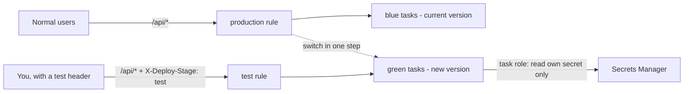
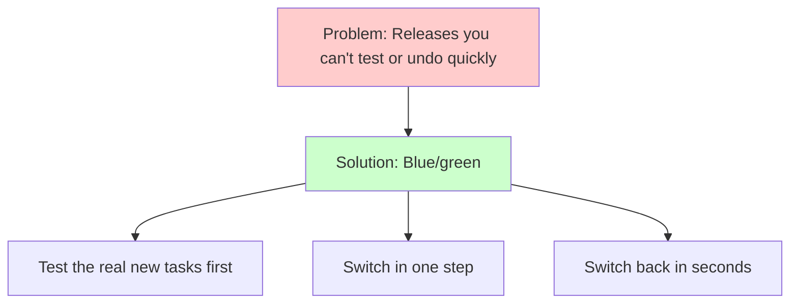
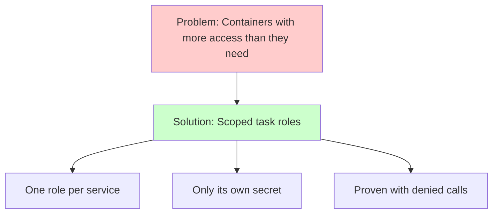

# Week 6 — Track A: Blue/Green Deployments & IAM Task Roles (M6–M7)

## Objective

This pack will help you make backend releases **safer** and lock down what
the backend is **allowed to do** in AWS.

First, **blue/green deployments**: the new version starts next to the old
one, you test it privately on the same load balancer, all traffic switches in
one step, and the old version waits on standby so you can switch back
instantly. Then, **IAM task roles**: each container gets only the AWS
permissions it needs — and you'll prove it with a call that AWS **refuses**.

What we're building:



By the end of this pack you will:

1. Deploy the backend with blue/green, test the new version before users see
   it, and roll back during the standby window.
2. Give the backend and frontend their own IAM roles, scoped to exactly what
   each needs.
3. Prove the limits with calls AWS denies.

## Topics

- Deployment strategies: rolling, blue/green, canary, linear
- ECS blue/green: two target groups, a production rule, a test rule, bake time
- The ECS infrastructure role for load balancers
- Rolling back a deployment in progress
- Task execution role vs. task role
- IAM least privilege
- Secrets Manager vs. Parameter Store
- Proving least privilege with a "should be denied" test

## M6: Blue/Green Deployments for the Backend

### Learning Objective

This guide will help you create blue/green deployments for the backend ECS
service, so every release can be tested privately and rolled back instantly.
We'll break it down into simple steps.

### Core Idea

**What is a Blue/Green Deployment and Why Do We Need It?**

Blue/green keeps **two target groups** for one service. **Blue** is the
version serving users now; **green** is the new version, started next to it.
ECS sends your test traffic to green first, switches the production rule to
green in one step, and keeps blue running for a **bake time** in case you
need to switch back.

### Why It Matters



**Problem:** With rolling updates, old and new versions mix during a deploy,
and "rolling back" means deploying the old version all over again.

**Solution:** Blue/green — test the exact tasks that will take real traffic,
switch everyone over at once, and keep the old version warm so going back is
instant.

### How It Works

#### Concepts

Blue/green helps us release safely by:
1. Starting the new version beside the old one
2. Sending only test traffic to the new version first
3. Switching production traffic in one step
4. Keeping the old version running for a bake time, so rollback is instant

**Session 6.1 — Advanced deployment strategies**

| Strategy | During a deploy | Going back |
|---|---|---|
| Rolling | Old and new mixed, task by task | Deploy the old version again |
| Blue/green | All on blue → (test on green) → all on green | Switch back during bake time |
| Canary | A small % on green first, then the rest | Switch back |
| Linear | Green's share grows in equal steps | Switch back |

ECS supports all four through the service's
`deployment_configuration.strategy`. Blue/green, canary and linear need room
for **two** sets of tasks while a deployment runs.

**Session 6.2 — How blue/green works on ECS**

```text
Listener :80
 ├─ rule 90   /api/*  AND  header X-Deploy-Stage: test  ─► test rule       ─► green (during a deploy)
 ├─ rule 100  /api/*                                     ─► production rule ─► blue ⇄ green
 └─ default                                               ─► frontend (rolling, unchanged)
```

- **Two target groups** — `dcta-backend-tg` and `dcta-backend-tg-alt` —
  that swap roles after every successful deployment.
- The **production rule** is your M3 `/api/*` rule. ECS rewrites where it
  forwards, so Terraform stops managing that part (`ignore_changes`).
- The **test rule** only matches requests carrying `X-Deploy-Stage: test` —
  which you send with `curl`.
- The **ECS infrastructure role** (trusted by `ecs.amazonaws.com`, with
  `AmazonECSInfrastructureRolePolicyForLoadBalancers`) lets ECS edit your
  rules and target groups.
- Roll back during the bake time with `aws ecs stop-service-deployment
  --stop-type ROLLBACK`.
- Your CI `update-service` step from M4 stays exactly the same.

Key terms to know:
- **Blue / green** (the current version / the new version)
- **Alternate target group** (the second target group green tasks join)
- **Production rule / test rule** (the listener rules for real and test traffic)
- **Bake time** (how long blue keeps running after the switch)
- **Lifecycle hook** (an optional pause or Lambda check at a deployment stage)

#### Best Practices

1. Make health checks reflect real readiness — blue/green moves *all*
   traffic at once.
2. Practice a rollback during bake time before you ever need one for real.

#### Real-World Example

Think of it like:
- Swapping a new build in behind a feature flag for web apps
- Argo Rollouts' blue/green strategy for Kubernetes
- But for ECS and your ALB!

### Supplemental Reading

- [Amazon ECS blue/green deployments](https://docs.aws.amazon.com/AmazonECS/latest/developerguide/deployment-type-blue-green.html) — terms, bake time, lifecycle stages.
- [Resources you need for ECS blue/green](https://docs.aws.amazon.com/AmazonECS/latest/developerguide/blue-green-deployment-implementation.html).
- [ECS infrastructure IAM role for load balancers](https://docs.aws.amazon.com/AmazonECS/latest/developerguide/AmazonECSInfrastructureRolePolicyForLoadBalancers.html).
- [AWS CLI `ecs stop-service-deployment`](https://docs.aws.amazon.com/cli/latest/reference/ecs/stop-service-deployment.html) and [`list-service-deployments`](https://docs.aws.amazon.com/cli/latest/reference/ecs/list-service-deployments.html).

## M7: IAM Task Roles & Granular Access Control

### Learning Objective

This guide will help you create least-privilege IAM task roles for the
frontend and backend, and prove them with calls AWS denies. We'll break it
down into simple steps.

### Core Idea

**What is a Task Role and Why Do We Need It?**

A task role is the AWS identity your **application code** uses inside a
running task. IAM is "no" by default — an identity can only do what a policy
explicitly allows. Least privilege means allowing specific **actions** on
specific **resources**, and nothing more.

### Why It Matters



**Problem:** If someone breaks into a container — say, through a vulnerable
library — they get every permission that container has.

**Solution:** A separate task role per service, allowed only what that
service needs, and a test that proves anything else is refused.

### How It Works

#### Concepts

A task role helps us limit the damage of a break-in by:
1. Giving each service its own AWS identity
2. Allowing only named actions on named resources
3. Refusing everything else by default

**Session 7.1 — IAM least privilege**

- A policy statement has an `Effect`, `Action`s and `Resource`s. If nothing
  allows a call, it's denied; an explicit `Deny` beats any `Allow`.
- Secret ARNs end in 6 random characters — use the ARN from Terraform
  instead of guessing it.
- The **IAM policy simulator** tells you whether a call would be allowed,
  without making it.

**Session 7.2 — Task roles vs. the task execution role**

| | Task execution role | Task role |
|---|---|---|
| Used by | ECS, while starting your task | Your app's code, while it runs |
| Typical permissions | Pull image, write logs, fetch `secrets` | Whatever the app calls |
| In this course | `dcta-ecs-task-execution` | `dcta-backend-task`, `dcta-frontend-task` |

- Secrets in the task definition are fetched by the **execution** role. The
  task role matters when your code calls AWS itself.

**Session 7.3 — Secrets management lifecycles**

| | Secrets Manager | Parameter Store (standard) |
|---|---|---|
| Use for | Passwords, keys | Settings (hosts, names, flags) |
| Rotation | Built in | Not built in |
| In this course | `dcta/db/credentials` | `/dcta/db/host`, `/dcta/db/name` |

Key terms to know:
- **IAM policy** (a list of allowed or denied actions on resources)
- **Least privilege** (only the permissions a job really needs)
- **Implicit deny** (anything not allowed is refused)
- **ARN** (Amazon Resource Name — the unique ID of an AWS resource)
- **Task role** (the identity your app's code uses)

#### Best Practices

1. One task role per service, with specific ARNs — no `"Resource": "*"`
   unless AWS offers nothing narrower.
2. Never print secret values when testing — ask for the secret's name, not
   its value.

#### Real-World Example

Think of it like:
- Linux file permissions for users on a server
- A Kubernetes ServiceAccount with a narrow RBAC role
- But for your containers' access to AWS!

### Supplemental Reading

- [ECS task IAM role](https://docs.aws.amazon.com/AmazonECS/latest/developerguide/task-iam-roles.html).
- [IAM JSON policy elements: Resource](https://docs.aws.amazon.com/IAM/latest/UserGuide/reference_policies_elements_resource.html).
- [Secrets Manager policy examples](https://docs.aws.amazon.com/secretsmanager/latest/userguide/auth-and-access_examples.html).
- [Restricting access to Parameter Store parameters](https://docs.aws.amazon.com/systems-manager/latest/userguide/sysman-paramstore-access.html).
- [IAM policy simulator](https://docs.aws.amazon.com/IAM/latest/UserGuide/access_policies_testing-policies.html).
- [ECS Exec](https://docs.aws.amazon.com/AmazonECS/latest/developerguide/ecs-exec.html) — another way to run commands in a task (it needs extra task-role permissions, so this pack uses a probe task instead).

## Hands-on lab

### M6 — Guided activity: the pieces blue/green needs

#### 1. Add the second target group and the ECS infrastructure role

Green tasks need somewhere to live, and ECS needs permission to switch
traffic.

`infra/30-track-a/bluegreen.tf`:

```hcl
resource "aws_lb_target_group" "backend_alt" {
  name                 = "dcta-backend-tg-alt"
  port                 = 3000
  protocol             = "HTTP"
  target_type          = "ip"
  vpc_id               = local.f.vpc_id
  deregistration_delay = 30

  health_check {
    path                = "/health"
    matcher             = "200"
    interval            = 15
    healthy_threshold   = 2
    unhealthy_threshold = 3
  }
}

data "aws_iam_policy_document" "ecs_infra_assume" {
  statement {
    actions = ["sts:AssumeRole"]
    principals {
      type        = "Service"
      identifiers = ["ecs.amazonaws.com"]
    }
  }
}

resource "aws_iam_role" "ecs_lb_infra" {
  name               = "dcta-ecs-infra-lb"
  assume_role_policy = data.aws_iam_policy_document.ecs_infra_assume.json
}

resource "aws_iam_role_policy_attachment" "ecs_lb_infra" {
  role       = aws_iam_role.ecs_lb_infra.name
  policy_arn = "arn:aws:iam::aws:policy/AmazonECSInfrastructureRolePolicyForLoadBalancers"
}
```

```bash
# Create the new target group and role
terraform -chdir=infra/30-track-a apply
```

#### 2. See what ECS will change

Open your `/api/*` rule in the console (**EC2 → Load Balancers → dcta-alb
→ Listeners → HTTP:80 → Rules**). During a blue/green deployment, ECS
edits where this rule forwards. That's why, in the Lab exercise, both rules
get this block:

```hcl
  lifecycle {
    ignore_changes = [action] # ECS owns the forward target after creation
  }
```

#### 3. Learn the commands to follow a deployment

You'll use these during every blue/green rollout:

```bash
# The newest deployment for the backend, and its status
aws ecs list-service-deployments --cluster dcta-ecs --service dcta-backend \
  --query 'serviceDeployments[0].[serviceDeploymentArn,status]' --output text

# Which stage it's in (paste the ARN from above)
aws ecs describe-service-deployments --service-deployment-arns <SERVICE_DEPLOYMENT_ARN> \
  --query 'serviceDeployments[0].[status,lifecycleStage]'

# Roll it back (during bake time)
aws ecs stop-service-deployment --service-deployment-arn <SERVICE_DEPLOYMENT_ARN> --stop-type ROLLBACK
```

### M7 — Guided activity: a repeatable IAM probe

#### 1. Add the probe task

A tiny task that runs the AWS CLI and tries a few calls. You'll run it
with the **backend's** task role in the Lab exercise.

`infra/30-track-a/iam_probe.tf`:

```hcl
resource "aws_cloudwatch_log_group" "iam_probe" {
  name              = "/dcta/ecs/iam-probe"
  retention_in_days = 3
}

resource "aws_ecs_task_definition" "iam_probe" {
  family                   = "dcta-iam-probe"
  requires_compatibilities = ["FARGATE"]
  network_mode             = "awsvpc"
  cpu                      = "256"
  memory                   = "512"
  execution_role_arn       = aws_iam_role.execution.arn

  runtime_platform {
    operating_system_family = "LINUX"
    cpu_architecture        = "X86_64"
  }

  container_definitions = jsonencode([{
    name       = "probe"
    image      = "public.ecr.aws/aws-cli/aws-cli:2.37.4"
    essential  = true
    entryPoint = ["sh", "-c"]
    command = [join(" ; ", [
      "echo '--- expect ALLOW'",
      "aws secretsmanager get-secret-value --secret-id dcta/db/credentials --query Name --output text",
      "aws ssm get-parameter --name /dcta/db/host --query Parameter.Name --output text",
      "echo '--- expect DENY'",
      "aws secretsmanager get-secret-value --secret-id dcta/other-team/db --query Name --output text",
      "aws secretsmanager list-secrets --max-results 1",
      "aws s3 ls",
      "true"
    ])]
    logConfiguration = {
      logDriver = "awslogs"
      options = {
        awslogs-group         = aws_cloudwatch_log_group.iam_probe.name
        awslogs-region        = var.region
        awslogs-stream-prefix = "probe"
      }
    }
  }])
}
```

Notice the probe only ever prints the secret's **name**, never its value.

#### 2. Try the IAM policy simulator

Open the **IAM policy simulator** in the console, choose the role
`dcta-ecs-task-execution`, pick **Secrets Manager → GetSecretValue**, and
run it twice: once with your DB secret's ARN, once with `*`. Compare the
results.

#### If something goes wrong

| Symptom | Likely cause | Fix |
|---|---|---|
| `terraform apply` fails on the service's load-balancer settings | ARN of a rule or target group is wrong, or the infra role is missing | Check the `advanced_configuration` values and `dcta-ecs-infra-lb` |
| Test header returns the old version | No deployment is running, or the test rule's priority is lower than the production rule | Start a deployment; give the test rule the smaller number (90 < 100) |
| `terraform plan` wants to change a listener rule after a deploy | `ignore_changes = [action]` missing | Add the `lifecycle` block from M6 step 2 |
| Deployment stuck | Green tasks never become healthy | Check green's target health and the backend logs |
| Probe prints nothing | Task didn't start, or the log group is wrong | `aws ecs describe-tasks …` → `stoppedReason` |
| Probe's "expect ALLOW" calls are denied | Task role policy ARNs don't match | Use the ARNs from `terraform_remote_state` |

## Lab exercise

**Unguided — M6 Capstone Challenge: blue/green for the backend.**

1. Add a **test listener rule** with a smaller priority number than your
   `/api/*` rule. It matches `/api/*` **and** the header
   `X-Deploy-Stage: test`, and forwards to `dcta-backend-tg-alt`. Add
   `ignore_changes = [action]` to both the production and test rules.
2. Change the `dcta-backend` service to the `BLUE_GREEN` strategy with a
   **5-minute bake time**, and point its load-balancer settings at the
   second target group, the production rule, the test rule and the ECS
   infrastructure role. Leave `dcta-frontend` on rolling updates. (Also
   have Terraform ignore the backend service's `load_balancer` block — ECS
   swaps which target group is live after every deployment.)
3. Deploy a visible backend change through GitLab (for example, add a
   `version` field to the `/health` response). While it deploys, show:
   - the test route returns the **new** version while the normal route
     still returns the **old** one;
   - after the switch, the normal route returns the new version.

```bash
# Normal route vs. test route
curl -s "http://$ALB/api/tasks" -o /dev/null -w 'normal route: %{http_code}\n'
curl -s -H 'X-Deploy-Stage: test' "http://$ALB/api/tasks" -o /dev/null -w 'test route: %{http_code}\n'

# Where each rule is forwarding right now
aws elbv2 describe-rules --listener-arn "$(aws elbv2 describe-listeners --load-balancer-arn "$(aws elbv2 describe-load-balancers --names dcta-alb --query 'LoadBalancers[0].LoadBalancerArn' --output text)" --query 'Listeners[0].ListenerArn' --output text)" \
  --query 'Rules[].[Priority,Actions[0].ForwardConfig.TargetGroups]' --output json
```

**Prove the way back works:** start a second deployment and, during the
bake time, roll it back with `stop-service-deployment --stop-type
ROLLBACK`. Show the production rule pointing at the original target group
again, and the rolled-back status from `describe-service-deployments`.

**Unguided — M7 Capstone Challenge: least-privilege task roles.**

4. Create IAM roles `dcta-backend-task` and `dcta-frontend-task` (trusted by
   `ecs-tasks.amazonaws.com`) and set them as `task_role_arn` on the two
   task definitions. The backend role may only
   `secretsmanager:GetSecretValue` on `dcta/db/credentials`, and
   `ssm:GetParameter` / `ssm:GetParameters` on `/dcta/db/host` and
   `/dcta/db/name`. The frontend role gets **no** permissions.
5. Run the probe with the backend's role, then with the frontend's:

```bash
# Run the probe as the backend (change the role name to test the frontend)
aws ecs run-task --cluster dcta-ecs --task-definition dcta-iam-probe \
  --capacity-provider-strategy capacityProvider=FARGATE,weight=1 \
  --network-configuration "awsvpcConfiguration={subnets=[<PUBLIC_SUBNET_ID>],securityGroups=[<APP_SG_ID>],assignPublicIp=ENABLED}" \
  --overrides '{"taskRoleArn":"arn:aws:iam::<ACCOUNT_ID>:role/dcta-backend-task"}' \
  --query 'tasks[0].taskArn' --output text

# Read what the probe printed (give it a minute to finish)
aws logs tail /dcta/ecs/iam-probe --since 10m --format short
```

**What a pass looks like:** with the backend role, both "expect ALLOW"
calls print a **name**, and every "expect DENY" call prints an
`AccessDenied` / `AccessDeniedException` error. With the frontend role,
every call is denied. The app still works end to end.

End the session (reverse order):

```bash
terraform -chdir=infra/30-track-a destroy
terraform -chdir=infra/20-data destroy
```

## Checkpoint (self-assessed)

- [ ] `dcta-backend` uses `BLUE_GREEN` with a second target group, production rule, test rule, infrastructure role and a 5-minute bake time; `dcta-frontend` still uses rolling updates.
- [ ] Both listener rules ignore changes to `action`, and `terraform plan` right after a deployment shows no changes to them.
- [ ] During a deployment, the `X-Deploy-Stage: test` header reached the new version while normal traffic stayed on the old one.
- [ ] The switch completed and the normal route served the new version.
- [ ] **Failure path:** I rolled back during bake time and showed the rule pointing back at the original target group.
- [ ] The backend and frontend each have their own task role; neither reuses the execution role.
- [ ] The backend task role allows only `GetSecretValue` on my DB secret and `GetParameter(s)` on my two parameters.
- [ ] **Failure path:** the probe with the backend role got `AccessDenied` for another secret, `list-secrets` and `s3 ls`; with the frontend role, everything was denied.
- [ ] The app still works end to end.
- [ ] I ended the session with `terraform destroy` on `30-track-a`, then `20-data`.
