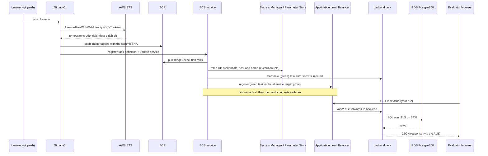

# Track A Capstone Project: Task Manager on AWS ECS Fargate

## Project Overview

This capstone project takes the task-manager app you deployed to Minikube
and runs it on **AWS**, using **Amazon ECS with Fargate**. You'll build the
whole environment with **Terraform**, deploy it automatically with
**GitLab CI**, release the backend safely with **blue/green deployments**,
watch it with **CloudWatch**, and lock it down with **least-privilege
IAM**. You'll show that you can run containers in the cloud the way real
teams do — and switch it all off at the end of every day.

## Provided Application

You'll keep working with the same task-manager application from the local
phase:

- React frontend
- Node.js/Express backend
- PostgreSQL database (now on **Amazon RDS**)

The code is already working. In M1 you made three small changes so it
runs on AWS — TLS for the database connection, a production frontend
image, and a re-runnable `seed.sql`. From there, your job is the cloud
infrastructure and delivery, not the app itself.

## Learning Objectives

By completing this project, you will:

1. Build AWS infrastructure with Terraform, split into stacks you can
   create and destroy safely every day
2. Design a VPC with public and private subnets and chained security groups
3. Run containers on Amazon ECS with Fargate and low-cost Fargate Spot
4. Route traffic for two services through one Application Load Balancer
5. Keep passwords out of Git and Terraform state with Secrets Manager
6. Automate build and deploy from GitLab CI to ECR and ECS
7. Release safely with rolling and blue/green deployments, and roll back
8. Ship logs to CloudWatch, build a dashboard, and auto-scale on CPU
9. Give every identity only the permissions it needs — and prove it

## Project Requirements

Each area below matches the modules you complete. The full list of
acceptance criteria is in your capstone spec,
`capstone-track-a-ecs-fargate-cohort.md`.

### 1. AWS Foundation (M1)
- Custom VPC in `ap-southeast-1` across 2 Availability Zones
  * 2 public and 2 private subnets
  * Internet Gateway, no NAT Gateway
- Security groups chained: load balancer → app → database
  * Internet traffic only from your own IP (`/32`)
  * Database port `5432` open only to the app tier
- Amazon ECR repositories for the frontend and backend
  * Images built for `linux/amd64` and tagged with the Git commit
- Amazon RDS PostgreSQL in the private subnets
  * Credentials in AWS Secrets Manager, never in Git or Terraform state
- Terraform remote state in S3 with locking

### 2. ECS Fargate Compute & Load Balancing (M2–M3)
- ECS task definitions and services for the frontend and backend
  * Smallest Fargate size (0.25 vCPU / 0.5 GB)
  * 70% Fargate Spot / 30% regular Fargate
- Database credentials passed to the backend with the `secrets` block
- One Application Load Balancer
  * `/api/*` to the backend, everything else to the frontend
- A one-off task that seeds the fresh database every session

### 3. GitLab CI/CD & Safe Releases (M4, M6)
- Pipeline on gitlab.com that builds and pushes both images to ECR
- Automated deploy to ECS on every merge to `main`
  * CI identity limited to your repositories and services
  * Keyless login to AWS with GitLab OIDC — no access keys
- Zero-downtime rolling deploys with automatic rollback for the frontend
- Blue/green deploys for the backend
  * Private test route before the switch
  * Rollback during the bake time

### 4. Observability & Auto Scaling (M5)
- All container logs in CloudWatch Logs with short retention
- CloudWatch dashboard with service CPU and load balancer metrics
- Backend auto-scaling from 1 to 3 tasks at 70% CPU

### 5. IAM & Access Control (M7)
- Separate task execution role and task roles
- Backend allowed to read only its own secret and parameters
- Frontend allowed nothing
- Proof with calls that AWS denies

## Integration and API Design

Here's how every part of your Track A system talks to the others — who
calls whom, over what, and how each call proves who it is.

### Track A deploy and request flow



| Integration | Protocol | How it authenticates | Module |
|---|---|---|---|
| Your laptop → AWS | Terraform / AWS CLI over HTTPS | Your sandbox credentials | M1 |
| GitLab CI → ECR, ECS | AWS APIs over HTTPS | GitLab OIDC token → `dcta-gitlab-ci` role (no keys); only from `main` | M4, M6 |
| Browser → ALB | HTTP on port 80 | Security group: your `/32` only | M2–M3 |
| ALB → frontend / backend | HTTP on 80 / 3000 | Security-group chain (ALB → app) | M2–M3 |
| ECS → ECR, Secrets Manager, Parameter Store, CloudWatch | AWS APIs | Task execution role | M2, M5 |
| Backend → RDS | PostgreSQL on 5432, TLS | Security-group chain (app → RDS) + DB password from Secrets Manager | M1–M2 |
| Backend code → AWS | AWS APIs | Backend task role (own secret and parameters only) | M7 |
| ECS → ALB listener rules (blue/green) | AWS APIs | ECS infrastructure role | M6 |
| CloudWatch → Application Auto Scaling → ECS | AWS-managed | Managed by AWS | M5 |

### App API

Your load balancer exposes the same API the app used on Minikube:

| Method | Path | What it does |
|---|---|---|
| `GET` | `/health` | Health check (not under `/api`) |
| `GET` | `/api/tasks` | List all tasks |
| `POST` | `/api/tasks` | Create a task |
| `PUT` | `/api/tasks/:id` | Update a task |
| `DELETE` | `/api/tasks/:id` | Delete a task |

## Getting Started

1. Make sure your local-phase gitlab.com project and the Minikube
   deployment of the app still work
2. Get your AWS sandbox credentials and Terraform state bucket name from
   the program
3. Start with the M1 content pack and build the foundation
4. Follow the daily routine every session (full commands, including `init`
   and your settings, are in the content packs):
```bash
# Start of session: apply in order
terraform -chdir=infra/10-foundation apply
terraform -chdir=infra/20-data apply
terraform -chdir=infra/30-track-a apply

# End of session: destroy in reverse order
terraform -chdir=infra/30-track-a destroy
terraform -chdir=infra/20-data destroy
```
5. Save your evidence in `docs/capstone/` as you go — don't leave it for
   the last day

## Two-Week Timeline

### Week 5: Foundation and Compute
- Days 1-2: AWS Foundation (M1)
  * Set up Terraform remote state and your stacks
  * Build the VPC, security groups, ECR and the DB secret
  * Push your frontend and backend images to ECR
  * Create and destroy RDS with Terraform

- Day 3: ECS on Fargate (M2)
  * Create the cluster, execution role and load balancer
  * Write the task definitions and services
  * Seed the database and open the app in a browser

- Day 4: Load Balancer Routing (M3)
  * Add the `/api/*` listener rule
  * Test routing and health checks
  * Try the failure tests

- Day 5: Review and Documentation
  * Fix anything that isn't working
  * Practice the daily apply/destroy routine end to end
  * Save your Week 5 evidence

### Week 6: Delivery, Operations and Security
- Day 1: GitLab CI/CD (M4)
  * Create the keyless CI role (GitLab OIDC) and the `AWS_ROLE_ARN` variable
  * Add build and deploy jobs to your pipeline
  * Prove a zero-downtime rollout and an automatic rollback

- Day 2: Observability and Auto Scaling (M5)
  * Send logs to CloudWatch
  * Build the dashboard
  * Load test and watch the backend scale

- Day 3: Blue/Green Deployments (M6)
  * Add the second target group and test route
  * Switch the backend to blue/green
  * Deploy, test privately, and practice a rollback

- Day 4: IAM Task Roles (M7)
  * Create scoped task roles
  * Run the IAM probe and capture the denied calls
  * Finish your capstone documentation

- Day 5: Capstone Defense (M8)
  * Run through the 30-minute defense
  * Live defense and Q&A
  * Final `terraform destroy` and teardown check

## Evaluation Criteria

Your capstone is graded with the **Capstone Grading Rubric**
(`capstone-grading-rubric.md`):

| Phase | Weight |
|---|---|
| Technical Execution | 45% |
| Functional Demonstration | 35% |
| Presentation & Defense | 20% |

Plus the **Technical Documentation Gate** (pass/fail): your evidence in
`docs/capstone/` must be complete and real. If it isn't, the capstone
doesn't pass, whatever the score.

### Not Yet Passing (below 75%)
- Missing or broken requirements
- Hardcoded secrets or open security groups
- Can't explain how the system works

### Proficient Implementation (75-89%)
- All requirements working in the live demo
- Terraform stacks clean, versions pinned, secrets out of Git and state
- Working CI/CD with blue/green for the backend
- Logs, dashboard and auto scaling working
- Task roles scoped and proven with denied calls
- Clear explanations of your choices

### Advanced Implementation (90-100%)
- Everything in Proficient, plus:
- Handles the live destructive tests calmly and correctly
- Explains trade-offs between options with confidence
- Well-organized, commented, easy-to-extend Terraform
- One or more stretch goals below
- Complete, clear documentation

## Stretch Goals

These don't add extra points on their own, but they're the kind of work
that earns **Exemplary** on "Application of Trained Skills":

1. **Security**
   - Separate CI roles for building (push to ECR only) and deploying (update ECS only)
   - CloudWatch alarms on backend 5xx errors that stop a bad deployment

2. **Advanced Features**
   - A lifecycle hook that pauses a blue/green deployment for approval
   - A canary or linear deployment for the frontend

3. **Advanced Observability**
   - Structured JSON logs from the backend
   - CloudWatch Logs Insights queries saved for common questions

## Deliverables

1. **GitLab Repository**
   - Application code (with the M1 changes)
   - Terraform stacks under `infra/`
   - `.gitlab-ci.yml` with build and deploy jobs
   - Documentation

2. **Documentation** (in `docs/capstone/`)
   - `terraform apply` / `terraform destroy` output for each stack
   - Proof the database is private
   - Routing, rollout and rollback evidence
   - Blue/green test-route and rollback evidence
   - Scaling activity and a dashboard screenshot
   - IAM probe logs (allowed and denied)
   - Teardown proof
   - Your daily apply/destroy order, explained in your own words

3. **Presentation** (30 minutes, live)
   - Live blue/green deployment triggered by a commit
   - Auto scaling under load in CloudWatch
   - Denied-call proof
   - Defense of your Terraform stack design
   - Clean teardown

## Support Resources

### Training Materials
Your content packs for this track:
1. Week 5 — AWS Shared Foundation: VPC, ECR, RDS & Secrets (M1)
2. Week 5 — Track A: ECS on Fargate & ALB Path Routing (M2–M3)
3. Week 6 — Track A: GitLab CI to ECS, CloudWatch & Auto Scaling (M4–M5)
4. Week 6 — Track A: Blue/Green Deployments & IAM Task Roles (M6–M7)
5. Capstone spec: `capstone-track-a-ecs-fargate-cohort.md`
6. Capstone Grading Rubric: `capstone-grading-rubric.md`

### Documentation
- Official documentation (for additional reference):
  * [Terraform S3 backend](https://developer.hashicorp.com/terraform/language/backend/s3)
  * [How Amazon VPC works](https://docs.aws.amazon.com/vpc/latest/userguide/how-it-works.html)
  * [Amazon ECS](https://docs.aws.amazon.com/AmazonECS/latest/developerguide/Welcome.html)
  * [Fargate capacity providers](https://docs.aws.amazon.com/AmazonECS/latest/developerguide/fargate-capacity-providers.html)
  * [Application Load Balancers](https://docs.aws.amazon.com/elasticloadbalancing/latest/application/introduction.html)
  * [GitLab CI/CD YAML reference](https://docs.gitlab.com/ci/yaml/)
  * [ECS blue/green deployments](https://docs.aws.amazon.com/AmazonECS/latest/developerguide/deployment-type-blue-green.html)
  * [ECS service auto scaling](https://docs.aws.amazon.com/AmazonECS/latest/developerguide/service-autoscaling-targettracking.html)
  * [ECS task IAM role](https://docs.aws.amazon.com/AmazonECS/latest/developerguide/task-iam-roles.html)

Remember:
- Focus on the infrastructure and delivery — the app code is provided and working
- Apply your stacks at the start of every session and destroy them at the end
- Build one module at a time, and test each piece before moving on
- Never put a password or access key in Git
- Save your evidence as you go, not on the last day
- Ask questions early during lab sessions
