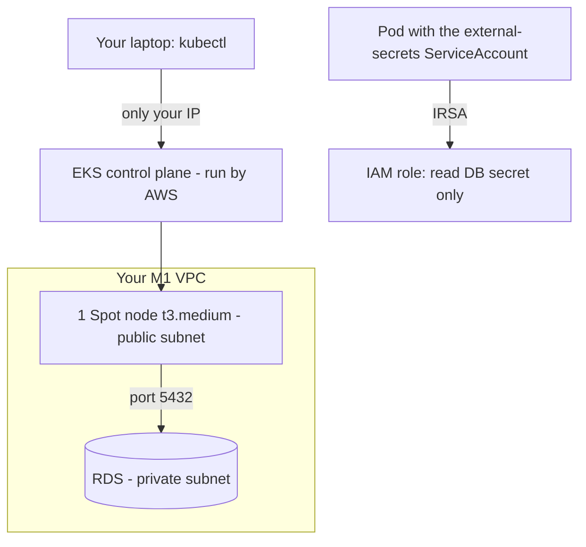
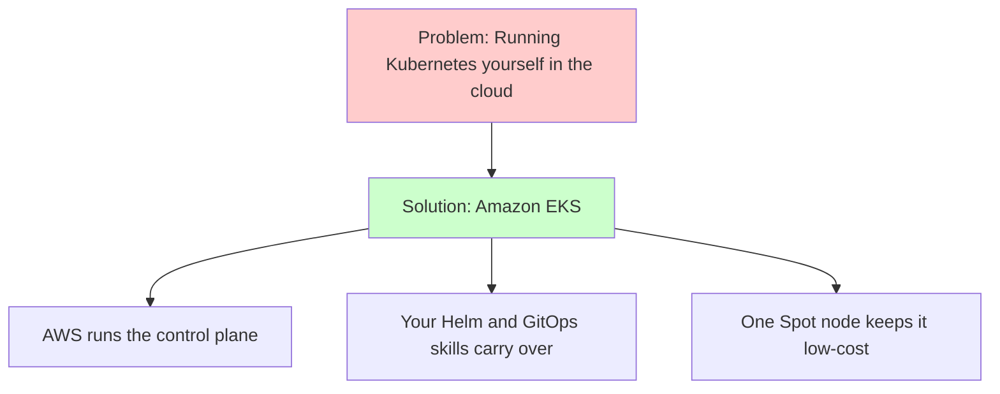
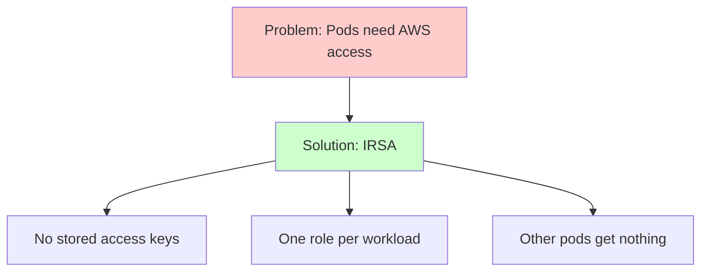

# Week 5 — Track B: Low-Cost EKS Cluster & IAM Roles for Service Accounts (M9–M10)

## Objective

Welcome to Track B! In the local phase your Kubernetes cluster ran on
Minikube. This pack will help you build a **real cloud cluster** with **Amazon
EKS**, using Terraform — one AWS-managed control plane and **one** worker node
on low-cost **EC2 Spot** capacity, inside the VPC you built in M1.

Then we'll give your pods AWS permissions the safe way — **IAM Roles for
Service Accounts (IRSA)** — so one specific ServiceAccount can read the
database secret, and nothing else can.

What we're building:



By the end of this pack you will:

1. Create and destroy an EKS cluster with `terraform apply` / `terraform destroy`.
2. Connect with `kubectl` and see your one Spot node.
3. Prove that one ServiceAccount can read the DB secret, and that other
   ServiceAccounts and other secrets are refused.

## Topics

- Control plane vs. worker nodes, on EKS
- Kubernetes versions on EKS
- Managed node groups and Spot capacity
- How many pods fit on a node, and prefix delegation
- The `terraform-aws-modules/eks/aws` module
- Connecting with `kubectl`; `eksctl` as a read-only helper
- OIDC and IAM Roles for Service Accounts (IRSA)
- EKS Pod Identity, the newer option

## M9: Low-Cost EKS Cluster Provisioning (Terraform)

### Learning Objective

This guide will help you create an Amazon EKS cluster with a single Spot
worker node for the task-manager app, using Terraform. We'll break it down
into simple steps.

### Core Idea

**What is Amazon EKS and Why Do We Need It?**

EKS is Kubernetes run by AWS. AWS operates the **control plane** — the API
server, etcd and scheduler — across several Availability Zones and keeps it
patched. You bring the **worker nodes** where your pods run; here that's a
managed node group with exactly one Spot instance.

### Why It Matters



**Problem:** Running your own Kubernetes control plane in the cloud means
operating etcd, upgrades and high availability yourself — before your app
runs at all.

**Solution:** Amazon EKS — AWS runs the control plane, you add one Spot node,
and the Helm charts and GitOps flow from Minikube move over almost unchanged.

### How It Works

#### Concepts

EKS helps us run Kubernetes on AWS by:
1. Running and patching the control plane for us
2. Joining EC2 worker nodes to the cluster through a managed node group
3. Giving every pod a real VPC IP address
4. Connecting cluster access to your AWS identity

**Session 9.1 — Kubernetes architecture (control plane vs. worker nodes)**

| Part | Where it runs on EKS | Who looks after it |
|---|---|---|
| API server, etcd, scheduler, controller-manager | AWS's control plane | AWS |
| `kubelet`, container runtime | Your EC2 node | You (through the managed node group) |
| `kube-proxy`, CoreDNS, Amazon VPC CNI | Pods on your node, as **EKS add-ons** | You pick versions; AWS provides them |

**Session 9.2 — Amazon EKS under the hood**

- Each Kubernetes version has 14 months of standard support on EKS, then 12
  months of pricier *extended* support. We use **1.36**.
- The **Amazon VPC CNI** gives pods real VPC IPs — so a pod can reach RDS
  directly, and the node's security groups apply to pod traffic too.
- **Pods per node:** by default `t3.medium` fits 17 pods. With **prefix
  delegation** (`ENABLE_PREFIX_DELEGATION=true` on the VPC CNI add-on, set
  *before* the node group exists), a managed node group raises that to
  **110**. Your full Track B setup needs about 20 pods.
- The identity that creates the cluster becomes admin through an **access
  entry**; `aws eks update-kubeconfig` connects `kubectl`. The API endpoint
  is public, but only your `/32` may reach it.
- `eksctl` is handy for **read-only** checks (`eksctl get …`); Terraform
  creates and destroys the cluster.

**Session 9.3 — Low-cost node provisioning (EC2 Spot in public subnets)**

- A **managed node group** is a group of EC2 instances EKS creates and joins
  to the cluster for you.
- `capacity_type = "SPOT"` uses spare capacity at a discount; AWS can take it
  back with a two-minute warning. Listing `t3.medium` and `t3a.medium`
  makes a Spot node easier to get.
- The node sits in a **public subnet** with a public IP to reach ECR without
  a NAT Gateway, and wears `dcta-app-sg` so pods can reach RDS.

Key terms to know:
- **Control plane** (the "brain" of Kubernetes — run by AWS on EKS)
- **Worker node** (the EC2 instance where your pods run)
- **Managed node group** (EC2 nodes EKS creates and updates for you)
- **EKS add-on** (a cluster component, like CoreDNS, AWS packages for you)
- **VPC CNI** (the network plugin that gives pods VPC IPs)
- **Prefix delegation** (giving a node blocks of IPs so it can run more pods)

#### Best Practices

1. Pin the module and Kubernetes versions, and restrict the API endpoint to
   your `/32`.
2. Turn on prefix delegation before the node group is created, and keep
   exactly one node.

#### Real-World Example

Think of it like:
- Minikube for your laptop
- Managed PostgreSQL (RDS) for databases — someone else runs the hard part
- But for Kubernetes on AWS!

### Supplemental Reading

- [Kubernetes cluster architecture](https://kubernetes.io/docs/concepts/architecture/).
- [What is Amazon EKS](https://docs.aws.amazon.com/eks/latest/userguide/what-is-eks.html) and [Amazon EKS pricing](https://aws.amazon.com/eks/pricing/).
- [EKS Kubernetes version lifecycle](https://docs.aws.amazon.com/eks/latest/userguide/kubernetes-versions.html).
- [Managed node groups](https://docs.aws.amazon.com/eks/latest/userguide/managed-node-groups.html) — Spot and public subnets.
- [Choose an optimal node instance type](https://docs.aws.amazon.com/eks/latest/userguide/choosing-instance-type.html) — how max pods is worked out.
- [Assign more IP addresses to EKS nodes with prefixes](https://docs.aws.amazon.com/eks/latest/userguide/cni-increase-ip-addresses.html) — prefix delegation.
- [Connect kubectl to an EKS cluster](https://docs.aws.amazon.com/eks/latest/userguide/create-kubeconfig.html) and [access entries](https://docs.aws.amazon.com/eks/latest/userguide/access-entries.html).
- [`terraform-aws-modules/eks/aws`](https://registry.terraform.io/modules/terraform-aws-modules/eks/aws/latest) — module inputs.
- [EC2 Spot Instance interruptions](https://docs.aws.amazon.com/AWSEC2/latest/UserGuide/spot-interruptions.html).
- [EKS Best Practices Guide](https://docs.aws.amazon.com/eks/latest/best-practices/introduction.html).

## M10: OIDC Federation & IAM Roles for Service Accounts (IRSA)

### Learning Objective

This guide will help you create an IAM role that only one Kubernetes
ServiceAccount can use, so the External Secrets Operator can read the
database secret without any access keys. We'll break it down into simple
steps.

### Core Idea

**What is IRSA and Why Do We Need It?**

Your cluster can sign a short-lived **token** for each ServiceAccount. IAM is
told to trust your cluster's tokens, but **only** for one exact
ServiceAccount. A pod using that ServiceAccount swaps its token for
temporary AWS credentials — no access keys anywhere.

### Why It Matters



**Problem:** Without IRSA, pods either get fixed access keys (which leak) or
borrow the node's permissions (so every pod gets everything any pod needs).

**Solution:** IRSA — one IAM role, trusted for one ServiceAccount, with only
the permissions that workload needs. It's the Kubernetes version of an ECS
task role.

### How It Works

#### Concepts

IRSA helps us give pods AWS access by:
1. Registering the cluster as a trusted identity provider in IAM
2. Pinning an IAM role to one exact ServiceAccount
3. Injecting temporary credentials into pods that use that ServiceAccount

**Session 10.1 — Identity federation in the cloud (OIDC deep dive)**

- Every EKS cluster has an **OIDC issuer** URL. Registering it in IAM as an
  **OIDC identity provider** lets IAM check tokens the cluster signed.
- A token says who issued it (`iss`), who it's for (`aud` =
  `sts.amazonaws.com`) and which ServiceAccount it belongs to (`sub` =
  `system:serviceaccount:external-secrets:external-secrets`).
- The role's trust policy uses `StringEquals` on both `sub` and `aud`. A `*`
  wildcard on `sub` would let *any* ServiceAccount in.

**Session 10.2 — Mapping Kubernetes ServiceAccounts to IAM (IRSA)**

1. Annotate the ServiceAccount with
   `eks.amazonaws.com/role-arn: arn:aws:iam::<account>:role/dcta-eso-irsa`.
2. New pods using it get `AWS_ROLE_ARN`, `AWS_WEB_IDENTITY_TOKEN_FILE` and a
   token file.
3. The AWS CLI or SDK in the pod gets temporary credentials by itself.
4. Pods created **before** the annotation don't get this — restart them.

**EKS Pod Identity** is a newer way to do the same thing, without an OIDC
provider to manage. The idea — one role per workload — is the same.

Key terms to know:
- **ServiceAccount** (a pod's identity inside Kubernetes)
- **OIDC provider** (tells IAM to trust tokens from your cluster)
- **Trust policy** (who may use an IAM role)
- **`sub` / `aud`** (which ServiceAccount a token belongs to / who it's for)
- **Temporary credentials** (short-lived keys that expire by themselves)

#### Best Practices

1. Pin trust with `StringEquals` on both `sub` and `aud`, and scope
   permissions to specific ARNs.
2. Never print secret values when testing — ask for the secret's name only.

#### Real-World Example

Think of it like:
- "Sign in with Google" for websites — a trusted issuer vouches for you
- An ECS task role for Track A's containers
- But for Kubernetes pods on EKS!

### Supplemental Reading

- [IAM roles for service accounts](https://docs.aws.amazon.com/eks/latest/userguide/iam-roles-for-service-accounts.html).
- [Create an IAM OIDC provider for your cluster](https://docs.aws.amazon.com/eks/latest/userguide/enable-iam-roles-for-service-accounts.html).
- [Assign IAM roles to Kubernetes service accounts](https://docs.aws.amazon.com/eks/latest/userguide/associate-service-account-role.html) — trust-policy conditions.
- [Kubernetes service accounts](https://kubernetes.io/docs/concepts/security/service-accounts/).
- [EKS Pod Identity](https://docs.aws.amazon.com/eks/latest/userguide/pod-identities.html).
- [EKS Best Practices — Identity and access management](https://docs.aws.amazon.com/eks/latest/best-practices/identity-and-access-management.html).

## Hands-on lab

### M9 — Guided activity: tools, providers and your first `kubectl`

#### 1. Check your Kubernetes tools

You need `kubectl` (within one minor version of 1.36), `helm` 3, and
`eksctl` for read-only checks.

```bash
# Check each tool is installed
kubectl version --client
helm version --short
eksctl version
```

> **Tip:** on WSL2, install these **inside** WSL. A Windows `kubectl.exe`
> uses a different kubeconfig from the one `aws eks update-kubeconfig`
> writes in WSL.

#### 2. Create the stack skeleton

`infra/40-track-b-cluster/versions.tf`:

```hcl
terraform {
  required_version = ">= 1.11"

  required_providers {
    aws = {
      source  = "hashicorp/aws"
      version = "6.66.0"
    }
  }

  backend "s3" {
    key = "dcta/40-track-b-cluster.tfstate"
  }
}

provider "aws" {
  region = var.region

  default_tags {
    tags = {
      ProjectCode = "Terraform101-CloudIntern"
      Environment = "sandbox"
      Owner       = var.learner_id
      CostCenter  = "training"
      ManagedBy   = "terraform"
      Stack       = "40-track-b-cluster"
    }
  }
}
```

Add the same variables as `10-foundation` (`region`, `learner_id`,
`learner_cidr`) plus `state_bucket`, and read `10-foundation`'s outputs:

```hcl
variable "state_bucket" {
  type = string
}

data "terraform_remote_state" "foundation" {
  backend = "s3"
  config = {
    bucket = var.state_bucket
    key    = "dcta/10-foundation.tfstate"
    region = var.region
  }
}

locals {
  f = data.terraform_remote_state.foundation.outputs
}
```

#### 3. Look at the options in the console

Open **Amazon EKS → Create cluster** and look through (don't create!):
*Kubernetes version*, *Cluster access* (who becomes admin), *Networking*
(VPC, subnets, "Public and private" endpoint with an IP restriction) and
*Add-ons*. Each of these is an input you'll set in Terraform.

#### 4. Your Track B session commands

Every session, after the M1 start-of-session commands (settings,
`10-foundation`, `20-data`):

**Start of session:**

```bash
# 1. Create the cluster (about 12–15 minutes)
terraform -chdir=infra/40-track-b-cluster init -backend-config=../backend.hcl
terraform -chdir=infra/40-track-b-cluster apply

# 2. Point kubectl at it
aws eks update-kubeconfig --region ap-southeast-1 --name dcta-eks

# 3. Check the node: type, Spot, and status
kubectl get nodes -o wide -L eks.amazonaws.com/capacityType,node.kubernetes.io/instance-type
```

You should see: one node, `Ready`, `SPOT`, `t3.medium` or `t3a.medium`.

**End of session — in reverse order.** (From M11, a platform stack joins
and is destroyed first; that pack shows you.)

```bash
# Cluster first, then the database
terraform -chdir=infra/40-track-b-cluster destroy
terraform -chdir=infra/20-data destroy
```

#### 5. Look around with `eksctl` (read-only)

```bash
# Cluster summary
eksctl get cluster --region ap-southeast-1

# Node group details
eksctl get nodegroup --cluster dcta-eks --region ap-southeast-1
```

### M10 — Guided activity: how IRSA reaches a pod

Once your cluster exists (after the Lab exercise), let's look at the pieces.

#### 1. Find the OIDC issuer and provider

```bash
# Your cluster's OIDC issuer URL
aws eks describe-cluster --name dcta-eks --region ap-southeast-1 \
  --query 'cluster.identity.oidc.issuer' --output text

# The matching identity provider registered in IAM
aws iam list-open-id-connect-providers
```

You should see: the issuer URL's ID at the end of one provider's ARN.

#### 2. A pod without IRSA

A pod using the `default` ServiceAccount gets no AWS role:

```bash
# Start a throwaway pod and list any AWS_ variables
kubectl run env-check --image=public.ecr.aws/docker/library/alpine:3.24 --restart=Never --command -- sh -c 'env | grep ^AWS_ || echo "no AWS_* variables"'

# Read what it printed, then clean up
kubectl logs env-check
kubectl delete pod env-check
```

You should see: `no AWS_* variables`. After the Lab exercise you'll repeat
this with the annotated ServiceAccount and see `AWS_ROLE_ARN` and
`AWS_WEB_IDENTITY_TOKEN_FILE` appear.

#### If something goes wrong

| Symptom | Likely cause | Fix |
|---|---|---|
| `kubectl` times out | Your IP changed since the cluster was created | Re-export `TF_VAR_learner_cidr` and `terraform apply` the cluster stack |
| `You must be logged in to the server (Unauthorized)` | Cluster creator isn't admin, or you're using different AWS credentials | Turn on creator admin permissions in the module; check `aws sts get-caller-identity` |
| Node never joins / node group `CREATE_FAILED` | No public IP on the node, or no Spot capacity | Check `map_public_ip_on_launch` on the public subnets; keep two instance types |
| Node shows `pods: 17`, not 110 | Prefix delegation was set after the node group was created | Destroy and re-apply the cluster stack with the setting on the VPC CNI add-on from the start |
| `aws eks get-token` says "Signature expired" | Computer clock drift (WSL2 after sleep) | WSL2: `sudo hwclock -s` |
| IRSA pod says "Unable to locate credentials" | ServiceAccount not annotated, or pod created before the annotation | Check the annotation; delete and re-create the pod |
| IRSA pod gets `AccessDenied` on the DB secret | Trust policy `sub` doesn't match namespace/name | It must be exactly `system:serviceaccount:external-secrets:external-secrets` |

## Lab exercise

**Unguided — M9 Capstone Challenge: the cluster.**

In `infra/40-track-b-cluster`, using `terraform-aws-modules/eks/aws`
version **21.26.0**:

1. Create cluster `dcta-eks`, Kubernetes **1.36**, in the M1 VPC. Nodes go
   in the **public** subnets; the control plane's network cards may use the
   private subnets.
2. Make the public API endpoint reachable only from `var.learner_cidr`, and
   give the cluster creator admin access through an access entry. Turn
   **off** control-plane logging and the module's CloudWatch log group — a
   cluster that's rebuilt every day can otherwise leave a log group behind
   that Terraform no longer tracks (and that blocks the next day's apply).
3. Add the EKS add-ons CoreDNS, kube-proxy and Amazon VPC CNI. The VPC CNI
   must be created **before** the node group and set with
   `ENABLE_PREFIX_DELEGATION = "true"` (the module's add-on settings
   `before_compute` and `configuration_values` are there for exactly this).
4. Add one managed node group: `AL2023` x86_64 image,
   **`capacity_type = "SPOT"`**, instance types `t3.medium` and
   `t3a.medium`, min/max/desired **1/1/1**, with `dcta-app-sg` attached as
   well as the module's own node security group.
5. Output `cluster_name`, `oidc_provider_arn` and `oidc_provider`.
6. Check your work:

```bash
# Pod capacity on the node (should be 110)
kubectl get nodes -o jsonpath='{.items[0].status.capacity.pods}{"\n"}'

# NAT Gateways (should be 0)
aws ec2 describe-nat-gateways --filter Name=state,Values=available --query 'length(NatGateways)'

# Can a pod reach RDS? (should print "accepting connections")
kubectl run pg-check --image=public.ecr.aws/docker/library/postgres:17-alpine --restart=Never --command -- \
  pg_isready -h "$(aws ssm get-parameter --name /dcta/db/host --query Parameter.Value --output text)" -p 5432
kubectl logs pg-check
kubectl delete pod pg-check
```

**Unguided — M10 Capstone Challenge: IRSA for External Secrets.**

7. In the same stack, create IAM role `dcta-eso-irsa`:
   - **trust:** `sts:AssumeRoleWithWebIdentity` from your cluster's OIDC
     provider, **only** for `system:serviceaccount:external-secrets:external-secrets`,
     audience `sts.amazonaws.com`;
   - **permissions:** only `secretsmanager:GetSecretValue` and
     `secretsmanager:DescribeSecret` on the DB secret, and
     `ssm:GetParameter` on `/dcta/db/host` and `/dcta/db/name`.
   Output the role ARN as `eso_irsa_role_arn`.
8. Create the namespace and ServiceAccount by hand for this test (in M11,
   the ESO Helm chart creates the real one), annotate it, and run a test pod:

```bash
# Test namespace and ServiceAccount, annotated with your role
kubectl create namespace external-secrets
kubectl -n external-secrets create serviceaccount external-secrets
kubectl -n external-secrets annotate serviceaccount external-secrets \
  eks.amazonaws.com/role-arn="$(terraform -chdir=infra/40-track-b-cluster output -raw eso_irsa_role_arn)"
```

```bash
# A pod using that ServiceAccount: who am I, read my secret's name, try another secret
kubectl -n external-secrets run irsa-test --image=public.ecr.aws/aws-cli/aws-cli:2.37.4 --restart=Never \
  --overrides='{"apiVersion":"v1","spec":{"serviceAccountName":"external-secrets"}}' \
  --command -- sh -c 'aws sts get-caller-identity --query Arn --output text; aws secretsmanager get-secret-value --secret-id dcta/db/credentials --query Name --output text; aws secretsmanager get-secret-value --secret-id dcta/other-team/db --query Name --output text; true'

# Read the results
kubectl -n external-secrets logs irsa-test
```

**What a pass looks like:** the caller ARN is `assumed-role/dcta-eso-irsa/…`,
the DB secret's **name** is printed, and the other secret returns
`AccessDeniedException`.

**Prove it fails when it should:** run the same kind of pod with the
`default` ServiceAccount. It must **not** read the DB secret — you'll see
either "Unable to locate credentials" or `AccessDenied`:

```bash
# Same test, default ServiceAccount (should fail)
kubectl -n external-secrets run irsa-negative --image=public.ecr.aws/aws-cli/aws-cli:2.37.4 --restart=Never \
  --command -- sh -c 'aws secretsmanager get-secret-value --secret-id dcta/db/credentials --query Name --output text; true'
kubectl -n external-secrets logs irsa-negative
```

Clean up the test objects before M11 installs ESO (the chart needs to
create its own ServiceAccount):

```bash
# Remove the test namespace and everything in it
kubectl delete namespace external-secrets
```

End the session (reverse order):

```bash
terraform -chdir=infra/40-track-b-cluster destroy
terraform -chdir=infra/20-data destroy
```

## Checkpoint (self-assessed)

- [ ] `40-track-b-cluster` pins module `21.26.0` and Kubernetes `1.36`, and reads the VPC from `10-foundation`'s outputs.
- [ ] The API endpoint only accepts my `/32`, and `kubectl get nodes` works from my laptop.
- [ ] Exactly one node runs: `t3.medium`/`t3a.medium`, `SPOT`, in a public subnet, with `dcta-app-sg` attached.
- [ ] Prefix delegation is on: the node's pod capacity is `110`.
- [ ] There are zero NAT Gateways, and `pg_isready` from a pod reaches RDS.
- [ ] `dcta-eso-irsa` trusts only `system:serviceaccount:external-secrets:external-secrets`, with `StringEquals` on `sub` and `aud`.
- [ ] The role can read only the DB secret and the two DB parameters.
- [ ] A pod with the annotated ServiceAccount showed the assumed role and read the DB secret's name.
- [ ] **Failure path:** that pod was refused another secret, and a pod with the `default` ServiceAccount couldn't read the DB secret at all.
- [ ] I use `eksctl` only for `get` commands; Terraform creates and destroys the cluster.
- [ ] I ended the session by destroying `40-track-b-cluster`, then `20-data`.
