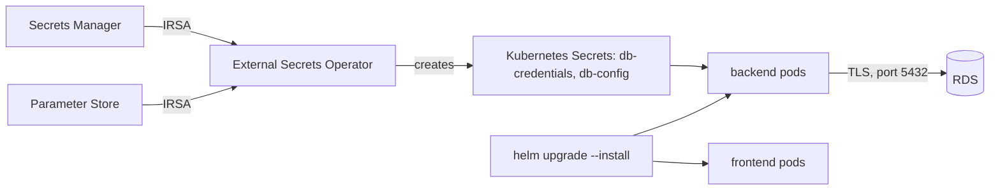
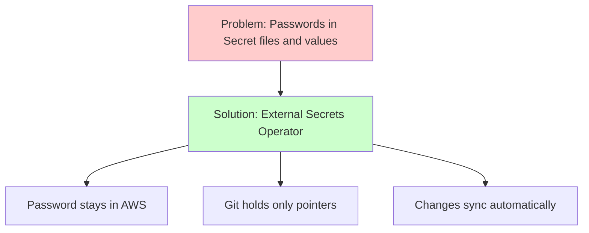
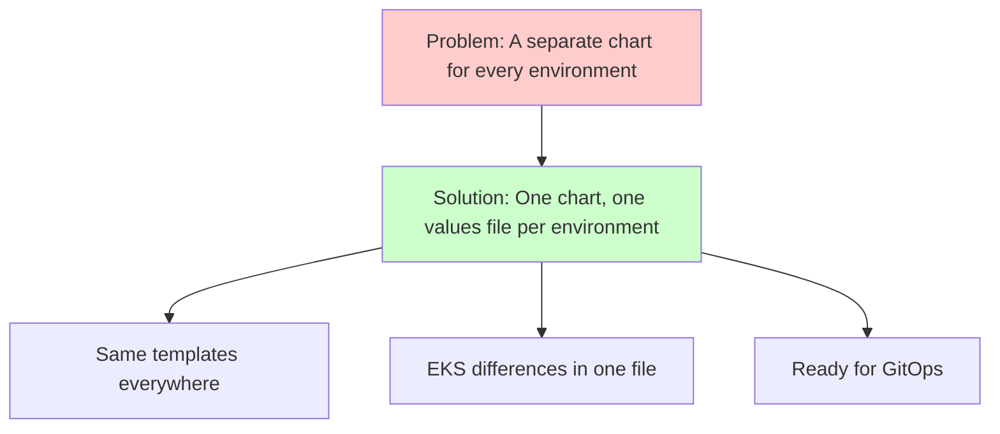

# Week 5 — Track B: External Secrets Operator & Helm on EKS (M11–M12)

## Objective

This pack will help you get your app running on EKS — **without ever writing
the database password down**.

First, we'll install the **External Secrets Operator (ESO)**. It uses the
IRSA role from M10 to read the password from AWS Secrets Manager and creates
a normal Kubernetes `Secret` for you. Then we'll take the `task-app` Helm
chart you built on Minikube, adjust it for EKS, and deploy the frontend and
backend to your cluster, talking to RDS over TLS.

What we're building:



By the end of this pack you will:

1. Install ESO with Terraform, in a new stack: `infra/41-track-b-platform`.
2. Have two Kubernetes Secrets that ESO keeps in sync with AWS — and no
   password anywhere in Git.
3. Run your app on EKS with one chart and an EKS values file.

## Topics

- Why Kubernetes `Secret` files don't belong in Git
- Operators and Custom Resource Definitions (CRDs)
- ESO objects: `ClusterSecretStore` and `ExternalSecret`
- Installing cluster tools with the Terraform Helm provider
- Helm values files for different environments
- ConfigMaps vs. Secrets; `env` vs. `envFrom`
- A Helm hook Job to seed the database
- A step-by-step way to troubleshoot pods in the cloud

## M11: External Secrets Operator (ESO) & Dynamic Syncing

### Learning Objective

This guide will help you create Kubernetes Secrets from AWS Secrets Manager
and Parameter Store using the External Secrets Operator, so the database
password never lives in Git. We'll break it down into simple steps.

### Core Idea

**What is the External Secrets Operator and Why Do We Need It?**

ESO is a program running in your cluster. You give it a small
`ExternalSecret` object that says: "read *these* keys from *that* AWS store,
write them into a Kubernetes `Secret` called *X*, and check again every
hour." ESO logs in to AWS with its IRSA role. Git only ever holds the
*pointer*, never the password.

### Why It Matters



**Problem:** A Kubernetes `Secret` is only base64-encoded, not encrypted.
Putting one in Git — or in a Helm values file — is the same as committing
the password.

**Solution:** ESO — the password stays in Secrets Manager, Git holds only a
description of what to fetch, and the cluster's copy is created and kept
up to date for you.

### How It Works

#### Concepts

ESO helps us manage secrets by:
1. Reading values from AWS Secrets Manager and Parameter Store
2. Writing them into native Kubernetes `Secret`s
3. Checking for changes on a schedule
4. Keeping every password out of Git

**Session 11.1 — Kubernetes secrets pitfalls**

- `Secret` data is base64 — anyone who can read the file (or the Git
  history) can decode it in one command.
- Passwords also leak through values files, CI variables echoed into
  manifests, and `kubectl create secret` commands copied into READMEs.
- Anyone allowed to `get secrets` in a namespace can read every secret in it.

**Session 11.2 — The operator pattern & External Secrets Operator**

- A **CRD** teaches Kubernetes a new kind of object; a **controller** keeps
  making reality match those objects, forever. Together they're an
  **operator**.
- ESO objects use `apiVersion: external-secrets.io/v1`:
  - `ClusterSecretStore` — how to reach AWS, usable from any namespace;
  - `ExternalSecret` — which AWS keys go into which Kubernetes `Secret`.
- With no `auth` section, an AWS store uses ESO's **own** IRSA identity.
- `remoteRef.key` is the secret name; `remoteRef.property` picks one JSON
  field (`username` or `password`).
- `refreshInterval` (like `1h`) is how often ESO checks AWS for changes.

Key terms to know:
- **Operator** (a controller plus CRDs that automates a job in the cluster)
- **CRD** (Custom Resource Definition — a new object type for Kubernetes)
- **ClusterSecretStore** (tells ESO how to reach a secrets provider)
- **ExternalSecret** (tells ESO what to fetch and where to put it)
- **Base64** (an encoding, not encryption — anyone can reverse it)

#### Best Practices

1. Keep secrets (Secrets Manager) and settings (Parameter Store) in separate
   stores, and name Kubernetes `Secret` keys exactly like the app's
   environment variables.
2. Check an `ExternalSecret`'s status (`SecretSynced`), not just that a
   `Secret` exists.

#### Real-World Example

Think of it like:
- A `.env` file your laptop fills in from a password manager
- GitLab CI/CD variables injected into a pipeline job
- But for Kubernetes, fed from AWS!

### Supplemental Reading

- [Kubernetes Secrets](https://kubernetes.io/docs/concepts/configuration/secret/) — including the good-practices section.
- [The operator pattern](https://kubernetes.io/docs/concepts/extend-kubernetes/operator/).
- [External Secrets Operator](https://external-secrets.io/latest/) and [its AWS Secrets Manager provider](https://external-secrets.io/latest/provider/aws-secrets-manager/).
- [`ClusterSecretStore` API](https://external-secrets.io/latest/api/clustersecretstore/) and [`ExternalSecret` API](https://external-secrets.io/latest/api/externalsecret/).
- [Terraform `helm_release`](https://registry.terraform.io/providers/hashicorp/helm/latest/docs/resources/release) — `wait`, `timeout`, `set`.

## M12: Local Helm Chart Migration & Cloud Deployment

### Learning Objective

This guide will help you update the `task-app` Helm chart from the local
phase so the same chart deploys to EKS with an EKS values file. We'll break
it down into simple steps.

### Core Idea

**What is a Helm Values File and Why Do We Need It?**

A Helm chart is a **template**; values are the **environment**. Keep the
templates the same everywhere, and put everything that's different on EKS —
image addresses, tags, ports, where DB settings come from, whether a
database pod runs at all — in `values-eks.yaml`.

### Why It Matters



**Problem:** Copying the chart for each environment means every fix has to
be made twice — and the copies drift apart.

**Solution:** One chart, with `values.yaml` for Minikube and
`values-eks.yaml` for EKS. It's also exactly what Argo CD (M14) will render.

### How It Works

#### Concepts

A values file helps us deploy one chart to many places by:
1. Keeping the templates generic
2. Overriding only what's different, file by file
3. Turning whole pieces on or off (like the in-cluster database)
4. Running hook Jobs, like a database seed, at install time

**Session 12.1 — Package management with Helm**

- `values.yaml` has the defaults; `-f values-eks.yaml` overrides them — the
  last file wins. Keep passwords out of every values file.
- `{{- if .Values.database.enabled }}` lets the chart skip PostgreSQL on EKS.
- `helm lint`, `helm template` and `helm upgrade --install` check, preview
  and install — the last one is safe to run again.
- A Job with `helm.sh/hook: post-install,post-upgrade` runs after each
  release. Argo CD understands these hooks too.
- Helm only reads files **inside** the chart folder, so the chart keeps its
  own copy of `seed.sql`.

**Session 12.2 — Configuration injection (ConfigMaps & Secrets)**

- **ConfigMap** for settings that aren't sensitive; **Secret** for ones that
  are (here, created by ESO).
- `envFrom` turns every key in a Secret into an environment variable;
  `env[].valueFrom.secretKeyRef` maps one key to a differently named
  variable (handy for `psql`'s `PGHOST`, `PGUSER`, …).
- Pods read environment variables only when they start — restart the
  Deployment after a Secret changes.

**Session 12.3 — Cloud Kubernetes troubleshooting methodologies**

Work from the outside in, one step at a time:

1. `kubectl get pods -o wide` — status, restarts, which node.
2. `kubectl describe pod` — read the **Events**: scheduling problems
   (`Insufficient memory`), image problems (`ErrImagePull`, or `exec format
   error` for the wrong CPU type).
3. `kubectl logs` (add `--previous` after a crash).
4. From inside the cluster: DNS and network (`nslookup`, `pg_isready`).
5. Only then look at AWS: security groups, IAM, the RDS status.

Key terms to know:
- **Values file** (the settings that fill in a chart's templates)
- **Hook** (a Helm resource that runs at a set point, like after install)
- **ConfigMap / Secret** (non-sensitive / sensitive settings for pods)
- **`envFrom`** (load every key of a ConfigMap or Secret as env variables)
- **Events** (Kubernetes' log of what happened to an object)

#### Best Practices

1. Pin image tags to a Git SHA, and give every container resource requests —
   you only have one node.
2. Troubleshoot outside-in: pod status, then events, then logs, then the
   network, then AWS.

#### Real-World Example

Think of it like:
- `.env.development` and `.env.production` for a Node.js app
- `docker-compose.override.yml` for Docker Compose
- But for Helm charts!

### Supplemental Reading

- [Helm values files](https://helm.sh/docs/chart_template_guide/values_files/) and [Helm charts](https://helm.sh/docs/topics/charts/) — including hooks and the `files/` folder.
- [Kubernetes ConfigMaps](https://kubernetes.io/docs/concepts/configuration/configmap/).
- [Kubernetes Jobs](https://kubernetes.io/docs/concepts/workloads/controllers/job/) — `backoffLimit`, `ttlSecondsAfterFinished`.
- [Debug Pods](https://kubernetes.io/docs/tasks/debug/debug-application/debug-pods/).

## Hands-on lab

### M11 — Guided activity: install ESO with the Terraform Helm provider

#### 1. Create the platform stack

This stack installs the tools that run *inside* your cluster. It talks to
the cluster through the Helm provider.

`infra/41-track-b-platform/versions.tf`:

```hcl
terraform {
  required_version = ">= 1.11"

  required_providers {
    aws = {
      source  = "hashicorp/aws"
      version = "6.66.0"
    }
    helm = {
      source  = "hashicorp/helm"
      version = "3.3.0"
    }
  }

  backend "s3" {
    key = "dcta/41-track-b-platform.tfstate"
  }
}

provider "aws" {
  region = var.region

  default_tags {
    tags = {
      Project     = "dcta-aws"
      Environment = "sandbox"
      Owner       = var.learner_id
      CostCenter  = "training"
      ManagedBy   = "terraform"
      Stack       = "41-track-b-platform"
    }
  }
}

data "aws_eks_cluster" "this" {
  name = "dcta-eks"
}

provider "helm" {
  kubernetes = {
    host                   = data.aws_eks_cluster.this.endpoint
    cluster_ca_certificate = base64decode(data.aws_eks_cluster.this.certificate_authority[0].data)
    exec = {
      api_version = "client.authentication.k8s.io/v1beta1"
      command     = "aws"
      args        = ["eks", "get-token", "--cluster-name", "dcta-eks", "--region", var.region]
    }
  }
}
```

Add the usual variables (`region`, `learner_id`, `learner_cidr`,
`state_bucket`) and read the cluster stack's outputs:

```hcl
data "terraform_remote_state" "cluster" {
  backend = "s3"
  config = {
    bucket = var.state_bucket
    key    = "dcta/40-track-b-cluster.tfstate"
    region = var.region
  }
}

locals {
  c = data.terraform_remote_state.cluster.outputs
}
```

> **Tip:** in Helm provider 3.x, `kubernetes` and `exec` use `= { … }`,
> and `set` is a **list** (`set = [ { … } ]`). Examples online written for
> the older 2.x provider use blocks instead, and won't work here.

#### 2. Install ESO

The chart creates the `external-secrets` ServiceAccount in the
`external-secrets` namespace — exactly the one your M10 role trusts. We
just add the role annotation.

`infra/41-track-b-platform/external-secrets.tf`:

```hcl
resource "helm_release" "external_secrets" {
  name             = "external-secrets"
  repository       = "https://charts.external-secrets.io"
  chart            = "external-secrets"
  version          = "2.11.0"
  namespace        = "external-secrets"
  create_namespace = true
  wait             = true
  timeout          = 600

  set = [
    {
      name  = "serviceAccount.annotations.eks\\.amazonaws\\.com/role-arn"
      value = local.c.eso_irsa_role_arn
    }
  ]
}
```

#### 3. Your Track B session commands, updated

**Start of session** (after M1's settings, `10-foundation`, `20-data`):

```bash
# 1. Cluster
terraform -chdir=infra/40-track-b-cluster init -backend-config=../backend.hcl
terraform -chdir=infra/40-track-b-cluster apply
aws eks update-kubeconfig --region ap-southeast-1 --name dcta-eks

# 2. Platform tools (ESO now; more in M13 and M14)
terraform -chdir=infra/41-track-b-platform init -backend-config=../backend.hcl
terraform -chdir=infra/41-track-b-platform apply
```

**End of session — in reverse order:**

```bash
# Platform first, then cluster, then database
terraform -chdir=infra/41-track-b-platform destroy
terraform -chdir=infra/40-track-b-cluster destroy
terraform -chdir=infra/20-data destroy
```

#### 4. See what the operator added

```bash
# New object types ESO taught Kubernetes
kubectl get crds | grep external-secrets.io

# ESO's pods
kubectl -n external-secrets get pods

# The role annotation on ESO's ServiceAccount
kubectl -n external-secrets get sa external-secrets -o jsonpath='{.metadata.annotations}'
```

You should see: several `*.external-secrets.io` CRDs, running ESO pods, and
your `dcta-eso-irsa` role ARN in the annotations.

### M12 — Guided activity: review the chart and add the seed Job

Your `task-app` chart from the local phase has `frontend`, `backend` and
`database` sections in `values.yaml`, plus a Deployment and Service for
the frontend and backend. From here on we'll keep it at
`deploy/charts/task-app/` in your repo — move it there if it lives
somewhere else.

#### 1. Check the chart before changing anything

```bash
# Look for mistakes
helm lint deploy/charts/task-app

# See everything the chart would create
helm template task-app deploy/charts/task-app | less
```

Make a note of what's Minikube-specific: image addresses and tags, the
frontend's port (`3000` for the old dev server; now `80` for nginx), and
the PostgreSQL Deployment.

#### 2. Add the seed Job

Copy the re-runnable `seed.sql` into the chart, then add a Job that runs
it after every install or upgrade. It reads its connection settings from
the two Secrets ESO will create in the Lab exercise: `db-credentials`
(`DB_USER`, `DB_PASSWORD`) and `db-config` (`DB_HOST`, `DB_NAME`).

```bash
# Give the chart its own copy of the seed script
mkdir -p deploy/charts/task-app/files
cp app/database/seed.sql deploy/charts/task-app/files/seed.sql
```

`deploy/charts/task-app/templates/db-seed.yaml`:

```yaml
{{- if .Values.seed.enabled }}
apiVersion: v1
kind: ConfigMap
metadata:
  name: db-seed-sql
  namespace: {{ .Release.Namespace }}
  annotations:
    helm.sh/hook: pre-install,pre-upgrade
    helm.sh/hook-weight: "-5"
    helm.sh/hook-delete-policy: before-hook-creation
data:
  seed.sql: |-
{{ .Files.Get "files/seed.sql" | indent 4 }}
---
apiVersion: batch/v1
kind: Job
metadata:
  name: db-seed
  namespace: {{ .Release.Namespace }}
  annotations:
    helm.sh/hook: post-install,post-upgrade
    helm.sh/hook-delete-policy: before-hook-creation
spec:
  backoffLimit: 3
  ttlSecondsAfterFinished: 3600
  template:
    spec:
      restartPolicy: Never
      containers:
        - name: seed
          image: public.ecr.aws/docker/library/postgres:17-alpine
          command: ["psql", "-v", "ON_ERROR_STOP=1", "-f", "/seed/seed.sql"]
          env:
            - name: PGSSLMODE
              value: require
            - name: PGHOST
              valueFrom: { secretKeyRef: { name: db-config, key: DB_HOST } }
            - name: PGDATABASE
              valueFrom: { secretKeyRef: { name: db-config, key: DB_NAME } }
            - name: PGUSER
              valueFrom: { secretKeyRef: { name: db-credentials, key: DB_USER } }
            - name: PGPASSWORD
              valueFrom: { secretKeyRef: { name: db-credentials, key: DB_PASSWORD } }
          resources:
            requests: { cpu: 50m, memory: 64Mi }
            limits: { memory: 128Mi }
          volumeMounts:
            - name: seed
              mountPath: /seed
      volumes:
        - name: seed
          configMap:
            name: db-seed-sql
{{- end }}
```

Add `seed: { enabled: false }` to `values.yaml` (Minikube keeps using its
own init script). You'll turn it on in `values-eks.yaml`.

#### 3. Practice troubleshooting

Deploy something broken on purpose, and find the cause using the steps
from Session 12.3:

```bash
# A Deployment with an image tag that doesn't exist
kubectl create namespace drill
kubectl -n drill create deployment broken --image=public.ecr.aws/docker/library/nginx:does-not-exist

# Status, then the Events that explain it
kubectl -n drill get pods
kubectl -n drill describe pod -l app=broken | sed -n '/Events/,$p'

# Clean up
kubectl delete namespace drill
```

You should see: `ErrImagePull` / `ImagePullBackOff`, and an event saying
the image wasn't found.

#### If something goes wrong

| Symptom | Likely cause | Fix |
|---|---|---|
| `ClusterSecretStore` not `Valid` / `Ready` | ESO can't log in to AWS | Check the role annotation on ESO's ServiceAccount; restart ESO's pods |
| `ExternalSecret` shows `AccessDeniedException` | The key/parameter isn't in the IRSA role's policy | Compare the ARN with the M10 role |
| `ExternalSecret` shows "key not found" | Wrong `key` or `property` | `key: dcta/db/credentials`, `property: username` / `password` |
| Backend `CrashLoopBackOff` with `no pg_hba.conf entry … no encryption` | `DB_SSL_CA_PATH` not set | Add it to the backend's environment in `values-eks.yaml` |
| Backend can't connect to RDS (timeout) | Node isn't in `dcta-app-sg` | Check the node group's extra security group (M9) |
| Seed Job stuck at `CreateContainerConfigError` | The ESO Secrets don't exist yet | Apply your `ExternalSecret`s first, then upgrade the chart |
| `terraform apply` on the platform stack: "Kubernetes cluster unreachable" | Cluster stack not applied, or your IP changed | Apply `40-track-b-cluster` first with today's IP |

## Lab exercise

**Unguided — M11 Capstone Challenge: sync the database settings.**

Create these files under `deploy/`. Until Argo CD takes over in M14, you'll
apply them with `kubectl` each session.

1. `deploy/platform/cluster-secret-stores.yaml` — two `ClusterSecretStore`s
   for region `ap-southeast-1`: one for **Secrets Manager** and one for
   **Parameter Store**, both using ESO's own IRSA identity (no access keys
   anywhere).
2. `deploy/apps/task-app/external-secrets.yaml` — the `task-app` namespace
   and two `ExternalSecret`s in it:
   - `db-credentials` → `Secret` `db-credentials` with keys `DB_USER` and
     `DB_PASSWORD`, from the `username` / `password` fields of
     `dcta/db/credentials`;
   - `db-config` → `Secret` `db-config` with keys `DB_HOST` and `DB_NAME`,
     from `/dcta/db/host` and `/dcta/db/name`.

```bash
# Apply both files
kubectl apply -f deploy/platform/cluster-secret-stores.yaml
kubectl apply -f deploy/apps/task-app/external-secrets.yaml

# Check the stores and the syncs
kubectl get clustersecretstores
kubectl -n task-app get externalsecrets

# List the keys in one Secret (not the values)
kubectl -n task-app get secret db-credentials -o jsonpath='{.data}' | jq 'keys'
```

**What a pass looks like:** both stores are `Valid` / `Ready`, both
`ExternalSecret`s show `SecretSynced`, the Secrets contain exactly the four
keys, and searching your repo for the DB password finds nothing.

**Prove it fails when it should:** point one `ExternalSecret` at a key your
role can't read (for example `dcta/other-team/db`) and apply it. Show that
its status reports access denied, and that the existing `Secret` isn't
overwritten. Then put it back.

```bash
# Read the ExternalSecret's status and events
kubectl -n task-app describe externalsecret db-credentials | sed -n '/Status/,$p'
```

**Unguided — M12 Capstone Challenge: deploy the app to EKS.**

3. Create `deploy/charts/task-app/values-eks.yaml` (and any template changes
   it needs) so that on EKS:
   - no PostgreSQL runs in the cluster;
   - frontend and backend images come from your ECR repositories, tagged
     with a Git SHA; the frontend container and Service use port **80**;
   - the backend gets `DB_USER`, `DB_PASSWORD`, `DB_HOST` and `DB_NAME` from
     the two ESO Secrets (with `envFrom`), plus `PORT=3000`, `DB_PORT=5432`
     and `DB_SSL_CA_PATH=/app/certs/rds-ca.pem`;
   - every container has CPU/memory requests, a memory limit, and
     liveness/readiness probes on `/health`;
   - the seed Job is turned on.
4. Install it:

```bash
# Install or upgrade the app with the EKS values
helm upgrade --install task-app deploy/charts/task-app -n task-app -f deploy/charts/task-app/values-eks.yaml

# Pods and the seed Job
kubectl -n task-app get pods,jobs
kubectl -n task-app logs job/db-seed
```

5. Check the backend works with RDS (the browser path comes in M13):

```bash
# Forward a local port to the backend Service (leave this running)
kubectl -n task-app port-forward svc/backend 3000:3000
```

In a second terminal:

```bash
# List tasks, then create one
curl -s localhost:3000/api/tasks | jq length
curl -s -X POST localhost:3000/api/tasks -H 'Content-Type: application/json' -d '{"title":"from EKS","status":"TODO"}' | jq .id
```

**Prove it fails safely:** set a wrong backend image tag in
`values-eks.yaml`, upgrade, and find the cause from the pod's events (not by
guessing). Show that the old backend pod kept serving the whole time. Then
fix the tag.

End the session (reverse order):

```bash
terraform -chdir=infra/41-track-b-platform destroy
terraform -chdir=infra/40-track-b-cluster destroy
terraform -chdir=infra/20-data destroy
```

## Checkpoint (self-assessed)

- [ ] `41-track-b-platform` installs ESO chart `2.11.0` using Helm provider `3.3.0` syntax, and ESO's ServiceAccount carries the `dcta-eso-irsa` role ARN.
- [ ] My `ClusterSecretStore`s use ESO's IRSA identity — no access keys in any file.
- [ ] `db-credentials` and `db-config` are `SecretSynced` and contain exactly `DB_USER`, `DB_PASSWORD`, `DB_HOST` and `DB_NAME`.
- [ ] No database password exists anywhere in my Git history.
- [ ] **Failure path:** an `ExternalSecret` pointing at a forbidden secret reported access denied and didn't overwrite the existing `Secret`.
- [ ] One `task-app` chart deploys to Minikube with `values.yaml` and to EKS with `values-eks.yaml`; no PostgreSQL pod runs on EKS.
- [ ] Every container has requests, a memory limit and `/health` probes.
- [ ] The seed Job completes, and upgrading again adds no duplicate rows.
- [ ] Through `port-forward`, the backend lists and creates tasks in RDS.
- [ ] **Failure path:** I found a bad image tag from the pod's events while the old pod kept serving.
- [ ] I ended the session by destroying `41-track-b-platform`, then `40-track-b-cluster`, then `20-data`.
