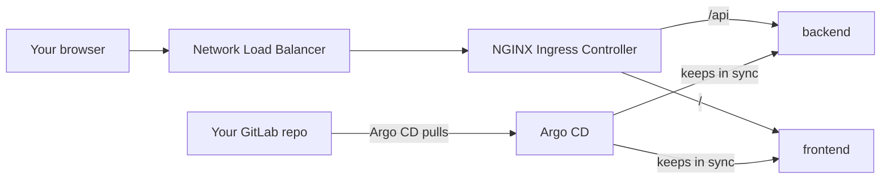
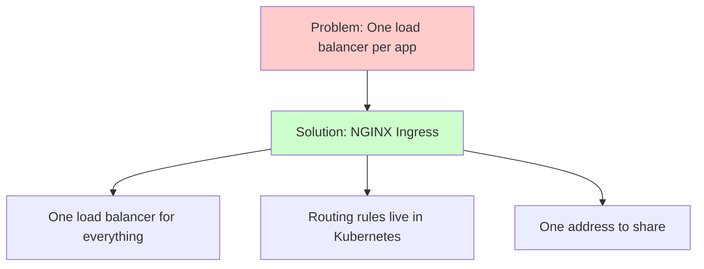
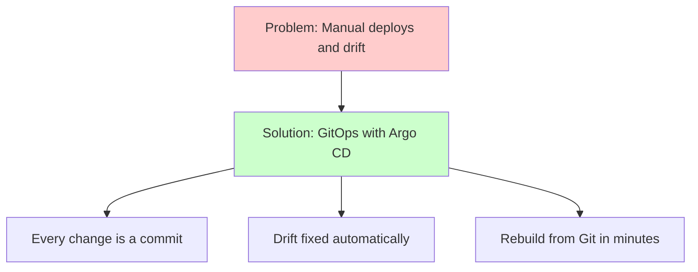

# Week 6 — Track B: NGINX Ingress & GitOps with Argo CD (M13–M14)

## Objective

This pack will help you open your app to the browser, then hand deployments
over to Git.

First, we'll install the **F5 NGINX Ingress Controller**. AWS gives it one
**Network Load Balancer (NLB)**, and an `Ingress` in your chart sends `/api`
to the backend and everything else to the frontend — all on one web address.
Then we'll install **Argo CD** and connect it to your gitlab.com repository,
so your cluster always matches what's in Git — and fixes itself when someone
changes it by hand.

What we're building:



By the end of this pack you will:

1. Use your app in a browser through one load balancer address.
2. Change the app by pushing to Git — no `kubectl apply` or `helm` from you.
3. Watch Argo CD undo a manual change to the cluster.

## Topics

- `Ingress` vs. AWS load balancers; `Service` type `LoadBalancer`
- What an ingress controller does
- F5 NGINX Ingress Controller: `ingressClassName`, Ingresses without a host, one NLB
- How traffic gets from the internet to your pod on EKS
- Removing cloud load balancers safely
- GitOps: declarative, versioned, pulled, continuously reconciled
- Argo CD: `Application`s, sync status and health
- Auto-sync, prune and self-heal; private repos with deploy tokens

## M13: Cloud Ingress Controllers (NGINX Ingress)

### Learning Objective

This guide will help you create one public entrance for your EKS app — an
NGINX Ingress Controller behind a single Network Load Balancer — using
Terraform and your Helm chart. We'll break it down into simple steps.

### Core Idea

**What is an Ingress Controller and Why Do We Need It?**

An **ingress controller** is a web server (here, NGINX) running as pods in
your cluster. It reads `Ingress` objects and routes traffic to the right
Services. You expose the controller with **one** `Service` of type
`LoadBalancer`, AWS creates **one** load balancer for it, and every app
shares that single entrance.

### Why It Matters



**Problem:** Exposing every app with its own `LoadBalancer` Service creates a
new AWS load balancer each time — more to pay for, more addresses to track.

**Solution:** One NGINX Ingress Controller behind one NLB, with `Ingress`
rules deciding which path goes to which Service.

### How It Works

#### Concepts

An ingress controller helps us expose apps by:
1. Receiving all outside traffic through one load balancer
2. Reading `Ingress` rules from the cluster
3. Routing each request to the right Service by path or host

**Session 13.1 — Kubernetes Ingress vs. AWS load balancers**

- A `LoadBalancer` Service per app → one AWS load balancer **per app**.
- One ingress controller behind one `LoadBalancer` Service → **one** NLB,
  with NGINX doing the routing from your `Ingress` rules. That's what we use.

**Session 13.2 — NGINX Ingress Controller architecture**

- The controller watches `Ingress` objects with `ingressClassName: nginx`
  and updates NGINX when they change. Its own annotations start with
  `nginx.org/`.
- Your app's `Ingress` has no `host` (there's no domain name). The
  controller only accepts that with `controller.allowEmptyIngressHost: true`,
  and only **one** Ingress without a host can be the default — anything else
  on the same load balancer (Grafana in M15) uses a `host` rule.
- `pathType: Prefix` with `/api` matches `/api` and `/api/tasks`. The longest
  match wins, so `/api` beats `/`. The path reaches Express unchanged.

**Session 13.3 — External traffic flow into EKS**

```text
your browser (your /32)
  └─► NLB (created for the controller's Service)       port 80
        └─► your node                                   (security group allows your /32)
              └─► NGINX Ingress Controller pod          reads your Ingress rules
                    ├─ /api ─► Service backend:3000 ─► backend pod
                    └─ /    ─► Service frontend:80  ─► frontend pod
```

- On EKS, a `LoadBalancer` Service gets a **Classic** load balancer unless it
  has the annotation `service.beta.kubernetes.io/aws-load-balancer-type: nlb`.
- `loadBalancerSourceRanges` limits who can connect; AWS turns it into
  security-group rules on your node.
- The Service doesn't finish deleting until AWS removes the load balancer.
  `helm_release` with `wait = true` and a long `timeout` waits for that —
  which is why the platform stack is destroyed **before** the cluster.

Key terms to know:
- **Ingress** (a set of routing rules: which path or host goes to which Service)
- **Ingress controller** (the pods that carry out those rules — here, NGINX)
- **Ingress class** (tells an Ingress which controller should handle it)
- **`LoadBalancer` Service** (a Service that asks AWS for a load balancer)
- **NLB** (Network Load Balancer — AWS's fast, layer-4 load balancer)

#### Best Practices

1. One controller, one load balancer, many `Ingress` objects — and always
   set `ingressClassName`.
2. Limit the load balancer to your IP, and check no load balancer is left
   after every `terraform destroy`.

#### Real-World Example

Think of it like:
- An nginx reverse proxy in front of several apps on one server
- The Minikube ingress add-on you used in the local phase
- But for EKS, behind an AWS load balancer!

### Supplemental Reading

- [Kubernetes Ingress](https://kubernetes.io/docs/concepts/services-networking/ingress/) and [Ingress controllers](https://kubernetes.io/docs/concepts/services-networking/ingress-controllers/).
- [Kubernetes Service — type LoadBalancer](https://kubernetes.io/docs/concepts/services-networking/service/).
- [F5 NGINX Ingress Controller](https://docs.nginx.com/nginx-ingress-controller/) and [installing it with Helm](https://docs.nginx.com/nginx-ingress-controller/installation/installing-nic/installation-with-helm/).
- [Host and listener collisions](https://docs.nginx.com/nginx-ingress-controller/configuration/host-and-listener-collisions/) and [command-line arguments](https://docs.nginx.com/nginx-ingress-controller/configuration/global-configuration/command-line-arguments/) — `-allow-empty-ingress-host`.
- [Network load balancing on EKS](https://docs.aws.amazon.com/eks/latest/userguide/network-load-balancing.html).
- [Kubernetes Gateway API](https://kubernetes.io/docs/concepts/services-networking/gateway/) — the next generation of Ingress.

## M14: Cloud GitOps Workflow with Argo CD

### Learning Objective

This guide will help you create a GitOps workflow on EKS with Argo CD, so
everything in your cluster is deployed from — and kept in line with — your
Git repository. We'll break it down into simple steps.

### Core Idea

**What is Argo CD and Why Do We Need It?**

Git holds what the cluster **should** look like. Argo CD runs **inside** the
cluster, checks your repo every few minutes, renders your Helm chart,
compares it with what's running, and fixes any difference. Nobody — not
even your CI pipeline — needs cluster credentials to deploy.

### Why It Matters



**Problem:** When people deploy by hand, the cluster slowly stops matching
anything written down — and rebuilding it every session means redoing every
step.

**Solution:** Argo CD — Git is the single source of truth, every change is a
reviewable commit, manual changes are reverted, and a fresh cluster rebuilds
itself from the repo.

### How It Works

#### Concepts

Argo CD helps us manage the cluster by:
1. Watching your Git repository for changes
2. Rendering Helm charts and manifests from it
3. Comparing that with what's running, and applying the difference
4. Undoing manual changes (self-heal) and removing deleted things (prune)

**Session 14.1 — The GitOps philosophy (pull vs. push CI/CD)**

| Push (your CI pipeline in the local phase) | Pull (GitOps) |
|---|---|
| The pipeline holds cluster credentials and deploys | A tool inside the cluster pulls from Git |
| Manual changes go unnoticed | Differences are spotted and fixed continuously |
| Undo = rerun an old pipeline | Undo = `git revert` |

The OpenGitOps principles: **declarative**, **versioned and immutable**,
**pulled automatically**, **continuously reconciled**.

**Session 14.2 — Argo CD architecture and sync states**

- Parts: API/UI server, repo server (clones Git, renders Helm), application
  controller (compares and applies) and Redis. Dex and notifications are
  optional — we turn them off to save memory.
- An **`Application`** says *where from* (repo, branch, path, values files),
  *where to* (cluster, namespace) and *how* (sync policy).
- **Sync status:** `Synced` / `OutOfSync`. **Health:** `Healthy`,
  `Progressing`, `Degraded`, `Missing`.
- **Private repos:** a GitLab **deploy token** with only `read_repository`,
  given to Argo CD as a repository `Secret` created from your shell — never
  from a file in Git.
- With self-heal on, a `kubectl edit` on something Argo CD manages is undone
  within seconds. Make changes in Git.

Key terms to know:
- **GitOps** (Git is the source of truth; the cluster pulls from it)
- **Application** (Argo CD's record of what to deploy, from where, to where)
- **Sync** (making the cluster match Git)
- **Prune** (deleting things that were removed from Git)
- **Self-heal** (undoing changes made directly in the cluster)
- **Deploy token** (a read-only GitLab credential for one project)

#### Best Practices

1. Keep `Application` files in Git too, with automated sync, prune and
   self-heal turned on.
2. Keep Argo CD's UI private (port-forward), and create the deploy-token
   Secret from your shell each session.

#### Real-World Example

Think of it like:
- Your local-phase Argo CD setup on Minikube
- A thermostat for your home — set it once, and it keeps pulling the room
  back to that temperature
- But for your EKS cluster, driven by Git!

### Supplemental Reading

- [OpenGitOps principles](https://opengitops.dev/).
- [Argo CD documentation](https://argo-cd.readthedocs.io/en/stable/), [core concepts](https://argo-cd.readthedocs.io/en/stable/core_concepts/) and [getting started](https://argo-cd.readthedocs.io/en/stable/getting_started/).
- [Automated sync policy — prune and self-heal](https://argo-cd.readthedocs.io/en/stable/user-guide/auto_sync/).
- [Declarative setup](https://argo-cd.readthedocs.io/en/stable/operator-manual/declarative-setup/) — `Application` and repository `Secret` formats.
- [Private repositories](https://argo-cd.readthedocs.io/en/stable/user-guide/private-repositories/) and [GitLab deploy tokens](https://docs.gitlab.com/user/project/deploy_tokens/).
- [Helm in Argo CD](https://argo-cd.readthedocs.io/en/stable/user-guide/helm/) and [resource hooks](https://argo-cd.readthedocs.io/en/stable/user-guide/resource_hooks/).
- [Cluster bootstrapping (app of apps)](https://argo-cd.readthedocs.io/en/stable/operator-manual/cluster-bootstrapping/).

## Hands-on lab

### M13 — Guided activity: read the Ingress spec

#### 1. See your Services

```bash
# Render the chart with EKS values and show the Services
helm template task-app deploy/charts/task-app -f deploy/charts/task-app/values-eks.yaml | grep -A12 'kind: Service'
```

#### 2. Read a sample Ingress

You'll write the real one as a chart template in the Lab exercise. Read
this one first, and answer the questions below.

```yaml
apiVersion: networking.k8s.io/v1
kind: Ingress
metadata:
  name: example
  namespace: task-app
spec:
  ingressClassName: nginx
  rules:
    - http:
        paths:
          - path: /api
            pathType: Prefix
            backend:
              service:
                name: backend
                port:
                  number: 3000
          - path: /
            pathType: Prefix
            backend:
              service:
                name: frontend
                port:
                  number: 80
```

- There's no `host:`. What must be true of the controller for this to work?
- `/api/tasks/7` matches both paths. Which one wins, and why?
- Which object makes AWS create a load balancer: this `Ingress`, or
  something else?

#### 3. Look at the AWS side (after the Lab exercise)

Open **EC2 → Load Balancers**: find the load balancer of type *network*,
scheme *internet-facing*, its listener on port 80, and the target group
pointing at your node.

### M14 — Guided activity: Argo CD's UI and a sample Application

#### 1. Open the Argo CD UI (after you install it in the Lab exercise)

Argo CD's UI is never exposed publicly — we reach it with a port-forward.

```bash
# Forward local port 8080 to Argo CD (leave this running)
kubectl -n argocd port-forward svc/argocd-server 8080:443
```

In a second terminal:

```bash
# The initial admin password
kubectl -n argocd get secret argocd-initial-admin-secret -o jsonpath='{.data.password}' | base64 -d; echo
```

Open `https://localhost:8080` (accept the self-signed certificate warning)
and log in as `admin`.

#### 2. Deploy Argo CD's public example

Save this as `/tmp/guestbook-demo.yaml` (it doesn't belong in your repo):

```yaml
apiVersion: argoproj.io/v1alpha1
kind: Application
metadata:
  name: guestbook-demo
  namespace: argocd
spec:
  project: default
  source:
    repoURL: https://github.com/argoproj/argocd-example-apps.git
    targetRevision: HEAD
    path: guestbook
  destination:
    server: https://kubernetes.default.svc
    namespace: guestbook-demo
  syncPolicy:
    automated:
      prune: true
      selfHeal: true
    syncOptions:
      - CreateNamespace=true
```

```bash
# Create the Application and watch it appear
kubectl apply -f /tmp/guestbook-demo.yaml
kubectl -n argocd get applications
```

You should see: `guestbook-demo` turn `Synced` and `Healthy` — watch it
happen in the UI too.

#### 3. Try self-heal

```bash
# Change the cluster by hand...
kubectl -n guestbook-demo scale deploy guestbook-ui --replicas=3

# ...and watch Argo CD put it back (Ctrl+C to stop watching)
kubectl -n guestbook-demo get deploy guestbook-ui -w
```

#### 4. Clean up

```bash
# Deleting the Application also removes what it created (prune)
kubectl -n argocd delete application guestbook-demo
```

#### If something goes wrong

| Symptom | Likely cause | Fix |
|---|---|---|
| Controller Service `EXTERNAL-IP` stays `<pending>` | Missing NLB annotation, or AWS still creating it | Check the annotation; wait 2–3 minutes; `kubectl describe svc` for events |
| Load balancer address times out | Your IP changed, or it isn't in `loadBalancerSourceRanges` | Re-export `TF_VAR_learner_cidr` and re-apply the platform stack |
| `404` from NGINX for every path | Ingress class wrong, or host-less Ingresses not allowed | `ingressClassName: nginx`; `controller.allowEmptyIngressHost: true` |
| `/api/tasks` returns the React page | `/api` path missing or pointing at the frontend | Check the Ingress paths |
| `terraform destroy` on the platform stack hangs | AWS is still removing the NLB | Wait — that's `wait = true` working; don't interrupt it |
| Argo CD: `repository not accessible` | Deploy token wrong or missing | Recreate the repository Secret (step 5 of the Lab exercise) |
| Application stuck `OutOfSync` after you `kubectl edit` | Self-heal fighting your manual change | Make the change in Git instead |
| Argo CD UI won't load in a Windows browser (WSL2) | Port-forward only listens inside WSL | Run `kubectl port-forward --address 0.0.0.0 …` and use the IP from `hostname -I` |

## Lab exercise

**Unguided — M13 Capstone Challenge: one load balancer for the app.**

1. In `infra/41-track-b-platform`, add a `helm_release` for the **F5 NGINX
   Ingress Controller** (`nginx-ingress` chart **2.7.3** from
   `https://helm.nginx.com/stable`, namespace `nginx-ingress`) so that:
   - the controller's Service is `type: LoadBalancer`, annotated for an
     **NLB**, and limited with `loadBalancerSourceRanges` to
     `var.learner_cidr`;
   - the ingress class is named `nginx`;
   - Ingresses without a host are allowed;
   - the release has `wait = true` and a `timeout` of at least 900 seconds,
     so `terraform destroy` waits for AWS to remove the NLB;
   - the controller has small resource requests.
2. Add `templates/ingress.yaml` to the `task-app` chart, turned on from
   `values-eks.yaml` (`ingress.enabled: true`): class `nginx`, no host,
   `/api` → `backend:3000`, `/` → `frontend:80`. Keep it off in
   `values.yaml` if your Minikube setup already has its own.
3. Apply, upgrade the chart, and use the app in a browser through the NLB
   address.

```bash
# Today's load balancer address
LB="$(kubectl -n nginx-ingress get svc -o jsonpath='{.items[0].status.loadBalancer.ingress[0].hostname}')"
echo "$LB"

# The frontend answers, and the API returns tasks
curl -s -o /dev/null -w '%{http_code}\n' "http://$LB/"
curl -s "http://$LB/api/tasks" | jq length

# It's one network load balancer
aws elbv2 describe-load-balancers --query 'LoadBalancers[].[Type,Scheme,DNSName]' --output table
```

**Prove it fails when it should:** scale the backend to 0 and show
`/api/tasks` returns a 5xx from NGINX while `/` still returns 200. Then
scale it back. (Do this **before** Argo CD manages the Deployment, or
self-heal will undo it.)

```bash
# Take the backend away, test both paths, bring it back
kubectl -n task-app scale deploy backend --replicas=0
curl -s -o /dev/null -w '%{http_code}\n' "http://$LB/api/tasks"
curl -s -o /dev/null -w '%{http_code}\n' "http://$LB/"
kubectl -n task-app scale deploy backend --replicas=1
```

**Unguided — M14 Capstone Challenge: GitOps for everything in the cluster.**

4. In `infra/41-track-b-platform`, add a `helm_release` for **Argo CD**
   (`argo-cd` chart **10.9.2** from `https://argoproj.github.io/argo-helm`,
   namespace `argocd`, `wait = true`) with Dex and notifications turned
   off. Its UI stays private (port-forward only).
5. In gitlab.com, create a **deploy token** for your project with only
   `read_repository`. Each session, create Argo CD's repository Secret from
   your shell — never from a file in Git:

```bash
# Argo CD's access to your private repo (token comes from your shell)
kubectl -n argocd create secret generic gitlab-repo \
  --from-literal=type=git \
  --from-literal=url="https://gitlab.com/<your-group>/<your-project>.git" \
  --from-literal=username="<deploy-token-username>" \
  --from-literal=password="$GITLAB_DEPLOY_TOKEN"
kubectl -n argocd label secret gitlab-repo argocd.argoproj.io/secret-type=repository
```

> **Tip:** to keep the token out of your shell history, turn on
> "ignore commands starting with a space" (bash:
> `export HISTCONTROL=ignorespace`; zsh: `setopt HIST_IGNORE_SPACE`) and
> type ` export GITLAB_DEPLOY_TOKEN=…` with a leading space.

6. In `deploy/argocd/`, write `Application` files — all with automated
   sync, `prune`, `selfHeal` and `CreateNamespace=true` — for:
   - `platform` → `deploy/platform` (your `ClusterSecretStore`s);
   - `task-app-secrets` → `deploy/apps/task-app` (your `ExternalSecret`s);
   - `task-app` → the chart at `deploy/charts/task-app` with the values file
     `values-eks.yaml`, into namespace `task-app`.
   First remove any `task-app` release you installed by hand with Helm, so
   Argo CD owns everything.
7. Prove GitOps: push a commit that changes something you can see (for
   example `backend.replicaCount: 2`) and show the Application go
   `OutOfSync` → `Synced` and the change appear — without any `kubectl
   apply` or `helm` from you.

```bash
# Sync and health of every Application
kubectl -n argocd get applications -o custom-columns=NAME:.metadata.name,SYNC:.status.sync.status,HEALTH:.status.health.status
```

**Prove it fails safely:**

1. **Self-heal:** delete the backend Deployment by hand, and show Argo CD
   recreates it.

```bash
# Delete it, then watch it come back
kubectl -n task-app delete deploy backend
kubectl -n task-app get deploy -w
```

2. **Bad commit:** push a values change that can't work (for example, a
   backend image tag that doesn't exist). Show the Application go
   `Degraded` while the previous pod keeps serving `/api/tasks`. Then
   `git revert` and show it return to `Healthy`.

### Your Track B session commands from now on

**Start of session** (after M1's settings, `10-foundation`, `20-data`):

```bash
# 1. Cluster
terraform -chdir=infra/40-track-b-cluster init -backend-config=../backend.hcl
terraform -chdir=infra/40-track-b-cluster apply
aws eks update-kubeconfig --region ap-southeast-1 --name dcta-eks

# 2. Platform: ESO, NGINX Ingress, Argo CD
terraform -chdir=infra/41-track-b-platform init -backend-config=../backend.hcl
terraform -chdir=infra/41-track-b-platform apply
```

Then create the repository Secret (step 5), and let Git rebuild everything
else:

```bash
# Hand the cluster to Argo CD
kubectl apply -f deploy/argocd/
```

**End of session — in reverse order,** checking the load balancer is gone
before the cluster goes:

```bash
# Platform first (this removes the NLB), then cluster, then database
terraform -chdir=infra/41-track-b-platform destroy

# Before removing the cluster, check the load balancer is really gone (should print 0;
# if not, wait a minute and check again — never destroy the cluster while it's there)
aws elbv2 describe-load-balancers --query 'length(LoadBalancers)'

terraform -chdir=infra/40-track-b-cluster destroy
terraform -chdir=infra/20-data destroy
```

## Checkpoint (self-assessed)

- [ ] `41-track-b-platform` installs F5 NGINX Ingress Controller `2.7.3` with an NLB annotation, my `/32` as the only allowed source, host-less Ingresses allowed, and `wait = true`.
- [ ] Track B has exactly one load balancer, of type `network`.
- [ ] My chart's `Ingress` uses `ingressClassName: nginx`, no host, `/api` → backend and `/` → frontend.
- [ ] The app works in a browser through the NLB address.
- [ ] **Failure path:** with the backend at 0 replicas, `/api/tasks` failed with a 5xx while `/` kept working.
- [ ] Argo CD `10.9.2` runs with Dex and notifications off, and its UI is only reachable by port-forward.
- [ ] The GitLab deploy token is read-only and exists only in the cluster — never in Git.
- [ ] `platform`, `task-app-secrets` and `task-app` are all `Synced` and `Healthy`, with automated sync, prune and self-heal.
- [ ] A Git commit alone changed the running app.
- [ ] **Failure path:** a deleted Deployment came back by self-heal, and a bad commit went `Degraded` without taking the app down, then recovered with `git revert`.
- [ ] After destroying all session stacks, `describe-load-balancers` returns `0`.
