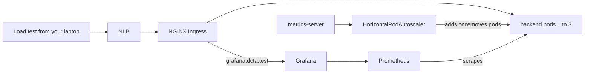
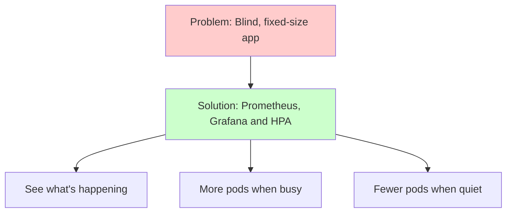

# Week 6 — Track B: Cloud Observability & Horizontal Pod Autoscaling (M15)

## Objective

This pack will help you make your EKS app **visible** and **elastic**. You set
up Prometheus and Grafana in the local phase — now we'll run them in the
cloud, deployed the GitOps way through Argo CD. Then we'll teach the backend
to add pods by itself when it gets busy, and watch it happen live in Grafana.

What we're building:



By the end, a 5-minute load test makes the backend grow from 1 to 3 pods,
and a Grafana graph shows it.

## Topics

- What Prometheus, Grafana and metrics-server each do
- Installing `kube-prometheus-stack` and `metrics-server` through Argo CD
- Sizing a monitoring stack to fit one node
- Reaching Grafana on the same load balancer with a host rule
- HorizontalPodAutoscaler (HPA): how it decides, and what it needs
- HPA vs. VPA vs. Cluster Autoscaler
- Making the HPA and Argo CD self-heal work together
- Running a load test and reading the results

## M15: Cloud Observability & Horizontal Pod Autoscaling (HPA)

### Learning Objective

This guide will help you create cloud monitoring for your EKS app with
Prometheus and Grafana, and a HorizontalPodAutoscaler that scales the
backend under load. We'll break it down into simple steps.

### Core Idea

**What is Cloud Observability and Why Do We Need It?**

Two metric pipelines live in your cluster. **metrics-server** keeps a tiny,
*current* snapshot of every pod's CPU and memory — the HPA reads it to
decide how many pods you need. **Prometheus** keeps a *history* of many
metrics, and **Grafana** turns that history into graphs, so you can *see*
what the HPA did.

### Why It Matters



**Problem:** With a fixed number of pods, the app is either too small when
it's busy or wasting the node when it's quiet — and without metrics, you
can't tell which.

**Solution:** Prometheus and Grafana to see what's happening, plus an HPA
that adds or removes backend pods to keep CPU near 70%.

### How It Works

#### Concepts

Cloud observability helps us run the app by:
1. Collecting live CPU and memory for every pod (metrics-server)
2. Keeping a history of cluster and app metrics (Prometheus)
3. Graphing that history on dashboards (Grafana)
4. Changing the number of backend pods to match the load (HPA)

**Session 15.1 — Monitoring Kubernetes with Prometheus and Grafana**

`kube-prometheus-stack` is one Helm chart that installs a whole monitoring
setup:

- **Prometheus Operator** — manages Prometheus for you.
- **Prometheus** — collects and stores metrics.
- **kube-state-metrics** — turns Kubernetes objects into metrics (like how
  many replicas an HPA wants).
- **node-exporter** — node CPU, memory and disk.
- **Grafana** — dashboards, with many Kubernetes ones built in.
- **Alertmanager** — sends alerts; we turn it **off** to save memory.

On EKS, AWS manages the control plane, so Prometheus **can't** scrape the
scheduler, controller-manager or etcd — we switch those targets off. The
chart's CRDs are very large, so Argo CD needs `ServerSideApply=true`. And
with one node, we keep Prometheus retention short (6h) and every component's
requests small.

**Reaching Grafana on the same load balancer:** your app's Ingress has no
`host`, so it answers every request that reaches the load balancer, and the
controller allows only one Ingress like that. So Grafana gets a **host
rule** — `grafana.dcta.test` — that you point at the load balancer from your
own computer.

**Session 15.2 — Autoscaling patterns: HPA vs. VPA vs. Cluster Autoscaler**

| Tool | What it changes | Used here? |
|---|---|---|
| **HPA** | The **number** of pods | Yes — backend, 1 to 3 |
| **VPA** | The CPU/memory **size** of pods | No |
| **Cluster Autoscaler / Karpenter** | The **number of nodes** | No — exactly one node |

How the HPA decides:

1. Every 15 seconds it asks metrics-server how much CPU the backend pods use.
2. It compares that with each pod's **CPU request** — 70% means "70% of what
   the pod asked for".
3. It changes the replica count to bring the average back to 70%, between 1
   and 3.
4. It adds pods quickly, but waits about 5 minutes before removing them.

Two things the backend **must** have:

- a CPU **request** — without it, the HPA shows `<unknown>` and does nothing;
- no fixed `replicas:` that Argo CD keeps putting back — when autoscaling is
  on, the Deployment template leaves `replicas` out.

Key terms to know:
- **metrics-server** (live CPU and memory numbers for pods and nodes)
- **Prometheus** (collects and stores metrics over time)
- **Grafana** (turns metrics into dashboards)
- **HPA** (HorizontalPodAutoscaler — changes the number of pods)
- **CPU request** (the CPU a pod asks for; the HPA's 100% mark)
- **Retention** (how long Prometheus keeps metrics)

#### Best Practices

1. Give the backend a real CPU request, and leave `replicas` out of the
   Deployment when an HPA owns it.
2. Install the monitoring stack through Argo CD, and keep Grafana's admin
   password out of Git.

#### Real-World Example

Think of it like:
- CloudWatch dashboards and ECS auto scaling on AWS
- The Prometheus and Grafana stack you ran on Minikube in the local phase
- But for EKS, deployed by Argo CD!

### Supplemental Reading

- [kube-prometheus-stack chart](https://github.com/prometheus-community/helm-charts/tree/main/charts/kube-prometheus-stack) — every value you'll set.
- [Prometheus Operator](https://prometheus-operator.dev/).
- [Horizontal Pod Autoscaling](https://kubernetes.io/docs/tasks/run-application/horizontal-pod-autoscale/) — the algorithm and the scale-down stabilization window.
- [HPA walkthrough](https://kubernetes.io/docs/tasks/run-application/horizontal-pod-autoscale-walkthrough/) — the same exercise on a demo app.
- [metrics-server](https://github.com/kubernetes-sigs/metrics-server).
- [Run Grafana behind a reverse proxy](https://grafana.com/tutorials/run-grafana-behind-a-proxy/).
- [EKS Best Practices — Cluster autoscaling](https://docs.aws.amazon.com/eks/latest/best-practices/cluster-autoscaling.html) — for when one node isn't enough.

## Hands-on lab

### M15 — Guided activity: see how metrics-server feeds the HPA

We'll install metrics-server through Argo CD first, then look at the numbers
the HPA will use.

#### 1. Add a metrics-server Application

This is the same pattern as your other Argo CD Applications, but the source
is a Helm **chart repository** instead of your Git repo.

`deploy/argocd/metrics-server.yaml`:

```yaml
apiVersion: argoproj.io/v1alpha1
kind: Application
metadata:
  name: metrics-server
  namespace: argocd
spec:
  project: default
  source:
    repoURL: https://kubernetes-sigs.github.io/metrics-server/
    chart: metrics-server
    targetRevision: 3.14.0
    helm:
      valuesObject:
        resources:
          requests:
            cpu: 50m
            memory: 64Mi
  destination:
    server: https://kubernetes.default.svc
    namespace: kube-system
  syncPolicy:
    automated:
      prune: true
      selfHeal: true
```

```bash
# Commit and push, so Argo CD can see the new Application file
git add deploy/argocd/metrics-server.yaml
git commit -m "feat(platform): add metrics-server"
git push

# Register it (after today, `kubectl apply -f deploy/argocd/` at session start does this)
kubectl apply -f deploy/argocd/metrics-server.yaml
```

You should see: the `metrics-server` Application become `Synced` and
`Healthy` within a couple of minutes.

#### 2. Read the live numbers

```bash
# Node CPU and memory right now
kubectl top nodes

# Pod CPU and memory in the app namespace
kubectl -n task-app top pods
```

You should see: small numbers — the backend is idle, using a few
millicores (`m`) of CPU.

#### 3. Compare usage with requests

The HPA's "70%" is measured against the **request**, so look at both:

```bash
# The backend's CPU request (the HPA's 100% mark)
kubectl -n task-app get deploy backend -o jsonpath='{.spec.template.spec.containers[0].resources.requests.cpu}{"\n"}'
```

Think about it: if the request is `100m` and the pod uses `70m`, that's
70% — right at the target.

#### 4. Tour Grafana's built-in dashboards (after the Lab exercise)

Once Grafana is up, open **Dashboards → Kubernetes / Compute Resources /
Namespace (Pods)** and pick `task-app`. This is where you'll watch the load
test.

#### If something goes wrong

| Symptom | Likely cause | Fix |
|---|---|---|
| `kubectl top` says `Metrics API not available` | metrics-server isn't ready yet | Wait a minute; check `kubectl -n kube-system get pods -l app.kubernetes.io/name=metrics-server` |
| HPA target shows `<unknown>/70%` | No CPU request on the backend, or metrics-server missing | Add `resources.requests.cpu`; check step 1 |
| `kube-prometheus-stack` Application stuck `OutOfSync` with "Too long" errors | CRDs too big for client-side apply | Add `ServerSideApply=true` to `syncOptions` |
| Grafana URL doesn't load | Your computer doesn't know `grafana.dcta.test` | Add the hosts-file line from the Lab exercise (use today's load balancer IP) |
| Pods `Pending` with `Insufficient memory` | Monitoring stack too big for the node | Lower requests; keep Alertmanager off; check `kubectl describe node` |

## Lab exercise

**Unguided — M15 Capstone Challenge: observe the app and scale it under load.**

1. **Grafana admin password, never in Git.** Each session, before Argo CD
   syncs the monitoring stack, create the namespace and a secret from your
   shell:

```bash
# Namespace for the monitoring stack
kubectl create namespace monitoring

# Random admin password, stored only in the cluster
kubectl -n monitoring create secret generic grafana-admin \
  --from-literal=admin-user=admin \
  --from-literal=admin-password="$(openssl rand -base64 18)"
```

2. **Monitoring stack through Argo CD.** Write
   `deploy/argocd/kube-prometheus-stack.yaml` — an `Application` for chart
   `kube-prometheus-stack` version **91.8.1** from
   `https://prometheus-community.github.io/helm-charts`, into namespace
   `monitoring`, with automated sync, prune, self-heal and
   **`ServerSideApply=true`**. Its values must:
   - turn Alertmanager **off**;
   - turn off scraping of the parts of the control plane EKS manages for you
     (controller-manager, scheduler, etcd) and of kube-proxy;
   - keep Prometheus retention short (6h) and give Prometheus, Grafana and
     the operator small CPU/memory requests;
   - make Grafana use the `grafana-admin` secret for its admin login;
   - give Grafana an Ingress with class `nginx` and host `grafana.dcta.test`.
3. **HPA in your chart.** Add `templates/hpa.yaml` to `task-app`
   (`autoscaling/v2`), turned on from `values-eks.yaml`: backend, min **1**,
   max **3**, target **70%** average CPU. Make sure the backend has a CPU
   request, and that the Deployment template leaves out `replicas` when
   autoscaling is on.
4. Push, let Argo CD sync, then point `grafana.dcta.test` at the load
   balancer from your computer:

```bash
# Today's load balancer hostname and one of its IP addresses
# (on Ubuntu/WSL2, dig comes from: sudo apt install dnsutils)
LB="$(kubectl -n nginx-ingress get svc -o jsonpath='{.items[0].status.loadBalancer.ingress[0].hostname}')"
dig +short "$LB" | head -1
```

Add a line like `<that-ip> grafana.dcta.test` to the hosts file **your browser** uses:

- macOS or Linux: `/etc/hosts` (edit with `sudo`).
- Windows browser (WSL2 users): `C:\Windows\System32\drivers\etc\hosts`, edited as Administrator — WSL's own `/etc/hosts` doesn't affect Windows browsers.

Then open `http://grafana.dcta.test/`. Get the
password you generated:

```bash
# Read back the Grafana admin password
kubectl -n monitoring get secret grafana-admin -o jsonpath='{.data.admin-password}' | base64 -d; echo
```

5. **Load test and capture the evidence.** In one terminal, watch the HPA;
   in another, run the load test for 5 minutes:

```bash
# Terminal 1 — watch the HPA decide
kubectl -n task-app get hpa -w
```

```bash
# ab comes with macOS; on Ubuntu/WSL2 install it first: sudo apt install apache2-utils
ulimit -n 4096

# Terminal 2 — 50 parallel requests for 300 seconds
ab -t 300 -c 50 "http://$LB/api/tasks"
```

In Grafana, **Explore** this query and take a screenshot while the test
runs and for a few minutes after:

```text
kube_horizontalpodautoscaler_status_current_replicas{namespace="task-app"}
```

Also save the HPA's own record of what it did:

```bash
# Scaling events, in the HPA's own words
kubectl -n task-app describe hpa | sed -n '/Events/,$p'
```

**Acceptance:** the HPA goes from 1 to 3 replicas during the test and back
to 1 afterwards; the Grafana graph shows both steps; all monitoring
Applications are `Synced` and `Healthy`; no password is in Git.

**Failure-path proof:** push a commit that removes the backend's CPU
request. Show the HPA target change to `<unknown>` and the event that
explains why (`missing request for cpu`), while the app keeps serving.
Then `git revert` and show the HPA working again.

End the session — platform first (this also removes the load balancer),
then cluster, then database:

```bash
# Destroy in reverse order
terraform -chdir=infra/41-track-b-platform destroy

# Before removing the cluster, check the load balancer is really gone (should print 0;
# if not, wait a minute and check again — never destroy the cluster while it's there)
aws elbv2 describe-load-balancers --query 'length(LoadBalancers)'

terraform -chdir=infra/40-track-b-cluster destroy
terraform -chdir=infra/20-data destroy
```

Remove the `grafana.dcta.test` line from your hosts file too — tomorrow's
load balancer will have a different IP.

## Checkpoint (self-assessed)

- [ ] metrics-server is installed by an Argo CD Application, and `kubectl top pods` works.
- [ ] `kube-prometheus-stack` 91.8.1 is installed by an Argo CD Application with `ServerSideApply=true`, Alertmanager off, EKS-managed control-plane targets off, and small requests.
- [ ] Grafana's admin password lives only in the `grafana-admin` secret created from my shell.
- [ ] Grafana is reachable at `grafana.dcta.test` through the **same** load balancer as the app.
- [ ] The backend has a CPU request, and the Deployment leaves out `replicas` when the HPA is on.
- [ ] My HPA (`autoscaling/v2`) scales the backend between 1 and 3 at 70% CPU.
- [ ] During the load test the HPA reached 3 replicas and later returned to 1; I saved the HPA events and a Grafana screenshot.
- [ ] **Failure path:** without a CPU request the HPA showed `<unknown>` and explained why; `git revert` fixed it.
- [ ] I destroyed `41-track-b-platform`, `40-track-b-cluster` and `20-data` in that order, and no load balancer remains.
